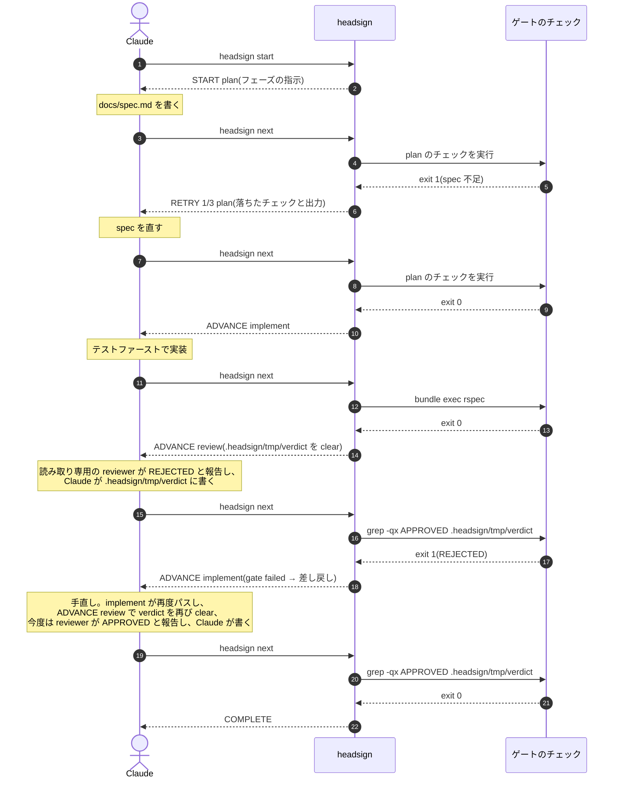

# headsign

[English](README.md)

> 方向幕(ヘッドサイン)は、列車の前面に掲げられる行先表示である。
> これはエージェントループのための方向幕だ。周回のたびにエージェントが行き先を尋ね、headsign がゲートを実行して答える。進むか、やり直すか、終点か。

コーディングエージェントは、驚くほど流暢に仕事を進めます。
テストを書き、実装し、レビューし、次のフェーズへ移ります。
その一連を、こちらが手を出さなくても回してくれます。
このまま任せておけば、うまくいくように見えます。

ところが、ループが前へ進むかどうかを分ける判断が、一つだけあります。
「このフェーズの作業は、本当に終わったのか」。
流暢さは、正しさを保証しません。
「終わりました」という報告が、まだ通っていないテストの上に立っていることがあります。
一番任せたくないのは、まさにこの一点です。

**headsign は、その一点だけを LLM の手から外す、小さなフェーズゲートです。**
作業と会話の主導権は Claude Code が握ったまま、headsign はワークフローの状態を保持して、フェーズの遷移だけを受け持ちます。
あるフェーズを通過とみなすかは、あなたが書いたチェックの exit code だけで決まります。
合否を受けて次にどこへ向かうかは、ワークフローに書いたルーティングが決めます。
どちらにも LLM は加わらず、結果を読むだけです。

エージェントに教える規律は、一文で足ります。
**迷ったら `headsign next` を実行し、答えの 1 行目に従う。**

```
$ headsign next
RETRY 2/5 implement
--- gate failed: unit tests (bundle exec rspec, exit 1) ---
Failures:
  1) Billing::Invoice#total ...
Fix the failure above, then run `headsign next` again.
```

## 設計の考え方

- **Thin Harness, Fat Skills**:賢さは、あなたが書くゲートコマンドと、ループの規律を教えるスキルに置きます。CLI 側は状態遷移機械に徹します。長時間走るプロセスはなく、毎回起動して state を読み、判定し、終了します。
- **決定論的な遷移**:「フェーズが完了した」を LLM 自身の出力で申告させる方式は、一番効いてほしい場面で精度を保証できません。exit code が相手なら、通っていないものを通ったと言い張れません。
- **質問は一つ**:status も gate も、ダッシュボードもありません。`next` が判定を返し、失敗したときは落ちたチェックとその出力を、そのまま残作業リストとして返します。
- **主導権は Claude に**:外側のランナーが LLM を従属プロセスとして呼び出すのとは逆で、headsign は Claude が問い合わせる相手であって、Claude を所有するプロセスではありません。

## インストール(Claude Code プラグイン)

```
/plugin marketplace add meganemura/headsign
/plugin install headsign@headsign
```

プラグインには三つが同梱されます。
バンドル済み CLI(npm install もビルドも不要)、規律を教える `workflow` スキル、そしてワークフロー途中の勝手な終了を押し返す Stop hook です。

### プラグインなしで使う

プラグインは、headsign を Claude Code 向けに包んだ配布形態の一つにすぎません。
道具の本体は CLI で、ゲート判定、state、`PENDING`、ロック、ログはすべてそこにあり、どのエージェントからでも、手作業でターミナルからでも使えます。
プラグインが上乗せするのは `workflow` スキルと Stop hook backstop の二つだけで、どちらにもプラグインなしの代替があります。

**CLI をインストールする。** バンドルはコミット済みなのでビルドは不要です:

```
npm install -D github:meganemura/headsign   # npm 未公開のため。公開後は: npm install -D headsign
npx headsign --help
```

**エージェントに規律を教える。** スキルの実体はただの指示文であって、仕掛けではありません。
Cursor でも自作ハーネスでも `CLAUDE.md` でも、次のルール一つでほぼ足ります:

> `npx headsign next` を実行し、答えの 1 行目に従うこと。`COMPLETE` 以外で run を終えないこと。意図的に止めるときは `npx headsign abort <reason>` を実行すること。

規律の全文は [plugin/skills/workflow/SKILL.md](plugin/skills/workflow/SKILL.md) にあります。
必要な部分をエージェントのルールに写してもよいですし、GitHub CLI で単体スキルとしてインストールすることもできます(`gh` の preview 機能で、どのエージェントに入れるかを選べます):

```
gh skill install meganemura/headsign workflow
```

Claude Code なら `.claude/skills/` にプロジェクトスキルとして置く手もあります。
これらの方法で得たスキルはプラグインの外で動くため同梱 CLI を見つけられませんが、上記のとおりパッケージをインストールしておけば `npx headsign` にフォールバックします。

**任意: プラグインなしの backstop。** 次の設定を `.claude/settings.json` に書き足します:

```json
{ "hooks": { "Stop": [ { "hooks": [
  { "type": "command", "command": "npx", "args": ["headsign", "stop-hook"] }
] } ] } }
```

## クイックスタート

1. ワークフロー定義をリポジトリにコミットします:

```yaml
# .headsign/workflow.yaml
version: 1
name: feature-dev
entry: plan

phases:
  plan:
    description: 仕様を docs/spec.md にまとめる。受け入れ基準を含めること。
    gate:
      checks:
        - name: spec exists
          run: "test -s docs/spec.md"
        - name: acceptance criteria present
          run: "grep -q '## Acceptance' docs/spec.md"
    on_pass: implement
    max_attempts: 3

  implement:
    description: spec に従ってテストファーストで実装する。
    gate:
      checks:
        - name: unit tests
          run: "bundle exec rspec"
          timeout: 300
    on_pass: review
    max_attempts: 5

  review:
    description: >
      読み取り専用の reviewer サブエージェントに APPROVED か REJECTED かを
      報告させ、その判定を自分の手で .headsign/tmp/verdict に書く。
    clear: [.headsign/tmp/verdict]
    ready: "test -f .headsign/tmp/verdict"
    gate:
      checks:
        - name: review approved
          run: "grep -qx APPROVED .headsign/tmp/verdict"
    on_pass: $end
    on_fail: implement     # 差し戻しループ
    max_attempts: 3        # 3 回却下されたら人間にエスカレート

limits:
  max_total_iterations: 20
```

上の `run:` はいずれも例です。
`bundle exec rspec` は、プロジェクトが実際に使うコマンド(`npm test`、`pytest`、`go test ./...` など)に置き換えてください。
チェックは exit code で判定される単なるシェルコマンドにすぎません。

> **信頼について:** ワークフローの `run:` は、`headsign next` があなたのマシン上で実行するシェルコマンドです。
> `Makefile` のターゲットや npm の `postinstall` と同じ扱いになります。
> 自分で書いていないリポジトリの `.headsign/workflow.yaml` は、その中の実行可能コードと同様に扱ってください。
> `headsign start` や `headsign next` を叩く前に中身を読み、信頼できないリポジトリでは headsign を実行しないでください。
> これは `.headsign/state.json` や `.headsign/lock` についても同様です。
> クローンしたリポジトリにはコミットされた state ファイルや lock が含まれている場合があるため、自分で作成していない `.headsign/` は、ワークフローと同じく信頼できない入力として扱ってください。
> これはチームのリポジトリでも同じです。`.headsign/` への変更は同僚の PR に乗って届き、あなたのループで自動実行されるため、CI の設定への変更と同じ重みでレビューしてください。

2. Claude にワークフローの開始を指示します。
   Claude は `headsign start` を実行してフェーズの作業を進め、答えが `COMPLETE` になるまで `headsign next` を尋ね続けます。
   `ESCALATE` が返ったときは、判断が人間に戻ってきます。

実行状態は `.headsign/state.json` に置かれます(自動で gitignore されます)。
状態がすべて外部にあるため、`/compact` でコンテキストが飛んでも、復帰は `headsign next` 一発です。

`headsign start`、`next`、`abort` が見るのはカレントディレクトリの `.headsign/` だけで、親ディレクトリは探索しません。
そのため、これらのコマンドはワークフローのある場所、通常はリポジトリまたは git worktree のルートで実行してください。
各 worktree はそれぞれ独立した run を持ちます。
例外は Stop hook で、こちらはセッションが深いサブディレクトリで止まっても、run のある `.headsign/` を worktree のルートまで遡って見つけます。
ただしこの遡りは上方向にしか進みません。
モノレポのルートのように run のあるディレクトリより上でセッションが止まっていると、hook は run を見つけられず沈黙するので、ワークフローのあるディレクトリかその配下で作業してください。

## 段取りとゲート

各フェーズの `description` は、そのフェーズで Claude にやってほしいことをそのまま書く欄です。
「`/foo` スキルを使う」「読み取り専用の reviewer サブエージェントにレビューさせる」といった指示も、ここに書けばそのまま Claude に渡ります。
ただしこれは段取りであって、強制ではありません。
ワークフローは、スキルやサブエージェントの仕事をゲート付きの順番に並べる緩い段取りであって、どのスキルを使うかまでは縛りません。
実際に効くのはゲートのほうで、チェックの exit code だけが結果を確かめます。
あるスキルの使用を必須にしたいなら、その成果物を確かめるゲートを書きます(たとえば、そのスキルが生むファイルを `grep` します)。
レビューのような soft gate のフェーズでは、判定ファイル(`.headsign/tmp/verdict` など)を、そのフェーズの `clear:` に挙げておくとよいでしょう。
前回の判定が残っていると、今回の判定と取り違えられてしまいます。
headsign がフェーズ進入のたびにそれを削除するので、読み取り専用の reviewer が判定を報告したあと、Claude がそのつど新しく書き直すことになります。

フェーズの意味は、そのゲートがシェルで確かめられる範囲までしかありません。
テストのゲートが証明するのは「何も壊れていない」ことであって、「機能が完成した」ことではありません。
「完成したか」を判断するのはレビューのゲートの役目であり、上のクイックスタートのワークフローが両方を備えているのはそのためです。
シェルでは判断できない仕事、設計判断や UX の判断は、チェックで確かめられる単位に切り分けるか、レビューのような soft gate に委ねる必要があります。
フェーズの粒度は、仕事の自然な区切りではなく、ゲートが実際に確かめられる範囲に合わせてください。
レビューのフェーズはエージェント自身のレビュー規律であって、人間が PR をレビューすることの代わりではありません。

## 実行の流れ

ループを回すのは三者です。
**Claude** が作業を進めてループを駆動し、**headsign** が現在のフェーズのゲートを実行してトークンで答え、**チェック**は普通のシェルなので判定は決定論的になります。
周回のたびに Claude はトークンに従います。
`RETRY` なら報告された失敗を直して再度尋ね、`ADVANCE` なら表示されたフェーズへ移り、失敗時ルーティング(`gate failed → routed to …`)なら作業が差し戻され、`COMPLETE` で run が終わります。
上のクイックスタートのワークフローを一度回すと、こう進みます。



headsign から出る矢印はすべてシェルの exit code で駆動され、LLM の自己申告では動きません。
図には出していませんが、Stop hook がバックストップです。
run が `running` の間に Claude が止まろうとすると、`headsign next` に差し戻されます。

## コマンドと出力の契約

コマンドは四つで、エージェントが日常的に使うのは一つだけです。

| コマンド | 役割 |
|---|---|
| `headsign start [name] [--workflow path]` | state を初期化し、entry フェーズの指示を表示する |
| `headsign next` | **唯一の質問。** 現在のゲートを実行し、遷移して答える |
| `headsign abort [reason]` | 人間の指示による中断を記録する |
| `headsign validate [name] [--workflow path]` | ワークフロー定義の静的検証 |

複数のワークフローは `.headsign/` 配下に別々のファイルとして置けます(1 ファイル 1 ワークフロー)。
`headsign start <name>` で選ぶと `.headsign/<name>.yaml` を使います。
明示的なパスを指定したい場合は `--workflow <path>` を使います。

`next` の答えは、1 行目が機械可読トークン、以降がエージェント向けの指示です。

| 1 行目 | exit | 意味 |
|---|---|---|
| `ADVANCE <phase>` | 0 | ゲート通過(または失敗時ルーティング)。新フェーズの指示が続く |
| `RETRY n[/max] <phase>` | 1 | ゲート失敗。落ちたチェックと出力の末尾が続く |
| `PENDING <phase>` | 1 | ゲートがまだ判定できない(`ready:`)。試行回数には数えない。作業を終えてから再度 `next` |
| `COMPLETE` | 0 | 終点 |
| `ESCALATE <reason>` | 2 | 人間の判断が必要 |
| `ABORT <reason>` | 2 | 中断済み |

exit 3 は設定または使用方法のエラーです。
終了済みの run に対する `next` は冪等で、作業ツリーが無変更のときは前回の判定を再表示するだけなので、様子見の `next` で試行回数が減ることはありません。

### ルーティング(workflow.yaml)

| フィールド | 値 | デフォルト |
|---|---|---|
| `on_pass` | フェーズ名、`$end` | なし(必須) |
| `on_fail` | `retry`、フェーズ名、`$end`、`escalate`、`abort` | `retry` |
| `max_attempts` | 正の整数。そのフェーズが最後に通過してからの失敗回数を数える | 無制限 |
| `on_exhausted` | `escalate`、`abort` | `escalate` |
| `limits.max_total_iterations` | 正の整数。全体の暴走防止 | なし |

チェックは CI で見慣れた `- name:` / `run:` / `timeout:` のステップで、`/bin/sh -c` で実行されます(最初の失敗でゲートは打ち切られます)。
フェーズには `env:` を設定できます。
`needs:` や `if:`、`${{ }}`、matrix、トリガーは意図的に持ちません。
ルーティングを決めるのはゲートの pass / fail だけです。

### 非同期レビュー(レビューに時間がかかる場合)

レビューフェーズのゲートは、ループ自身より遅い何かに依存することが多いものです。
たとえば、まだ diff を読んでいる reviewer サブエージェントや、PR を眺めている人間です。
判定がまだ無いうちに `next` を呼ぶと、`ready:` が無ければ、まだ何も判定していないゲートに対して試行回数を 1 つ消費してしまいます。
さらにそのフェーズの判定ファイルは `clear:`(上で推奨した設定)にも挙げてあるので、少し遅れて届いた判定を、その早すぎた呼び出し自身の再入場が握りつぶしてしまうことすらあります。
本物のレビューが、静かに失われるということです。
フェーズに `ready:` プローブ(たとえば `test -f .headsign/tmp/verdict`)を持たせれば、早すぎた `next` は `PENDING` を返すようになります。
試行回数は消費されず、`clear:` も走らず、判定ファイルは、実際にそれを見つける `next` のためにそのまま残ります。

### バックストップ

スキルは指示であって、強制ではありません。
そこで Stop hook が `.headsign/state.json` を読み、run が `running` の間はエージェントの終了をブロックして `headsign next` に差し戻します。
completed、escalated、aborted は正しい終わり方なので、そのまま通します。
hook は fail-open で(セッションを閉じ込めることはありません)、実評価を挟まない差し戻しが連続 3 回に達したらそこでやめます。
中断と終了は別の出口です。
日をまたいで作業を止めるだけなら、run を running のままにして停止すれば構いません。
3 回の差し戻しのあとは hook がそのまま通すので、翌日 `headsign next` を実行すれば同じフェーズから再開します。
`headsign abort <reason>` はもう一方の出口で、一時停止ではなく run を恒久的に終了させます。
run は再開できず、新しく `headsign start` すると entry フェーズからやり直しになり、すべてのフェーズのゲートを最初から再実行することになります。
その再実行を安く保つのは headsign の仕事ではなく、ワークフロー側に課された設計要求です。
早いフェーズのゲートは、ファイルの存在確認や lint のような、速くて冪等なチェックとして書いてください。
本物の副作用を持つチェックや、やり直しの効かない長い処理にはしないでください。
そうすれば abort 後の再スタートはほとんど負担になりません。
早いフェーズのゲートが遅い、あるいは冪等でないワークフローは、自分自身の再実行コストを自分で高くしているのであり、それはワークフロー作者が背負うべきコストであって、headsign が肩代わりできるものではありません。

## 作らないもの

DAG や並列フェーズ、worktree 隔離、プロバイダ抽象化、ペルソナ、テンプレートや式言語、MCP サーバー、TUI は作りません。
ハーネス側に賢さが必要になったら、それは賢さの置き場所が間違っています。

## 開発

```
npm install
npm test          # node:test。テストフレームワークの依存なし
npm run typecheck
npm run build     # esbuild → plugin/dist/headsign.mjs(コミットする成果物)
```

実行には Node 20 以上、開発には Node 22.6 以上が必要です(テストが TypeScript をそのまま実行するため)。
設計は [docs/architecture.md](docs/architecture.md) に、各判断の背景は [docs/adr/](docs/adr/README.md) にまとめてあります。

## ライセンス

MIT
