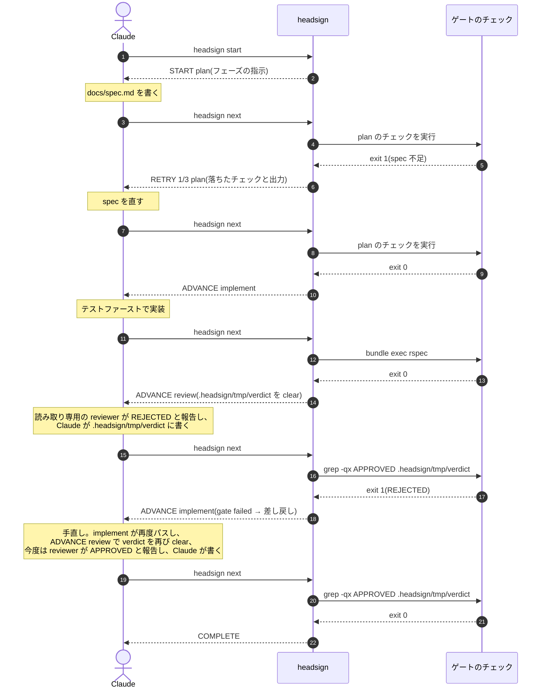
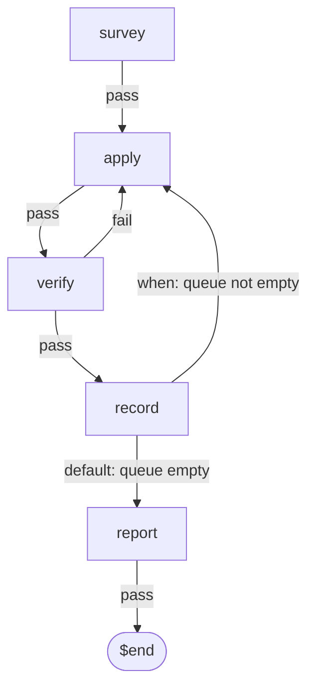

# headsign

[English](README.md) · [npm](https://www.npmjs.com/package/headsign)

[](https://www.npmjs.com/package/headsign)
[](https://github.com/meganemura/headsign/actions/workflows/ci.yml)

> 方向幕(ヘッドサイン)は、列車の前面に掲げられる行先表示である。
> これはエージェントループのための方向幕だ。周回のたびにエージェントが行き先を尋ね、headsign がゲートを実行して答える。進むか、やり直すか、終点か。

コーディングエージェントは、驚くほど流暢に仕事を進めます。
テストを書き、実装し、レビューし、次のフェーズへ移ります。
その一連を、こちらが手を出さなくても回してくれます。
このまま任せておけば、うまくいくように見えます。

ところが、ループが前へ進むかどうかを分ける判断が、一つだけあります。
「このフェーズの作業は、本当に終わったのか」。
流暢さは、正しさを保証しません。
「終わりました」という報告が、まだ通っていないテストの上に立っていることがあります。
一番任せたくないのは、まさにこの一点です。

**headsign は、その一点だけを LLM の手から外す、小さなフェーズゲートです。**
作業と会話の主導権は Claude Code が握ったまま、headsign はワークフローの状態を保持して、フェーズの遷移だけを受け持ちます。
あるフェーズを通過とみなすかは、あなたが書いたチェックの exit code だけで決まります。
合否を受けて次にどこへ向かうかは、ワークフローに書いたルーティングが決めます。
どちらの決定にも LLM は加われません。
ただし正直な但し書きが一つあります。
soft gate では、チェックが読む判定ファイルそのものは LLM が書きます。
この境界は隠さず、「headsign がやらないこと」の節と [ADR-0007](docs/adr/0007-verdict-authorship.md) に明記してあります。

エージェントに教える規律は、一文で足ります。
**作業をしたら `headsign next` を実行し、答えの 1 行目に従う。**

```
$ headsign next
RETRY 2/5 implement
--- gate failed: unit tests (bundle exec rspec, exit 1) ---
Failures:
  1) Billing::Invoice#total ...
Fix the failure above, then run `headsign next` again.
```

## 設計の考え方

- **Thin Harness, Fat Skills**:賢さは、あなたが書くゲートコマンドと、ループの規律を教えるスキルに置きます。CLI 側は状態遷移機械に徹します。長時間走るプロセスはなく、毎回起動して state を読み、判定し、終了します。
- **決定論的な遷移**:「フェーズが完了した」を LLM 自身の出力で申告させる方式は、一番効いてほしい場面で精度を保証できません。exit code が相手なら、通っていないものを通ったと言い張れません。
- **質問は一つ、駆動者も一つ**:gate も、ダッシュボードもありません。`next` が判定を返し、失敗したときは落ちたチェックとその出力を、そのまま残作業リストとして返します。この質問はリポジトリの誰もが選べるメニューではなく、*駆動している*セッションだけの質問です。もう一つのコマンド `status` は観察者のためのものです。読み取り専用で、判定も遷移も一切行いません([複数セッション](#複数セッション)を参照)。`claim` も判定しません。run の主導権をわざと持ち替える、その一瞬のためだけに、停止境界の hook を介して driver の所有権を委譲されたエージェントへ渡します([複数セッション](#複数セッション)を参照)。
- **主導権は Claude に**:外側のランナーが LLM を従属プロセスとして呼び出すのとは逆で、headsign は Claude が問い合わせる相手であって、Claude を所有するプロセスではありません。
- **ハーネスは上限ではありません**:headsign は、あなたのフェーズが何であるかについて意見を持ちません。仕事をどう形づくるべきかという見解を同梱していないからです。グラフはファイルの中にあり、run と run のあいだで書き換えられます。書き換える主体はあなたでも、あなたのエージェントでもかまいません。仕事の形づくり方についての判断が良くなっていくなら、変わるべきなのはグラフのほうであって、グラフが問い合わせる道具のほうではありません。

## インストール(Claude Code プラグイン)

```
/plugin marketplace add meganemura/headsign
/plugin install headsign@headsign
```

プラグインには三つが同梱されます。
バンドル済み CLI(npm install もビルドも不要)、規律を教える `workflow` スキル、そしてワークフロー途中の勝手な終了を押し返す停止境界の hook です。

### プラグインなしで使う

プラグインは、headsign を Claude Code 向けに包んだ配布形態の一つにすぎません。
道具の本体は CLI で、ゲート判定、state、`PENDING`、ロック、ログはすべてそこにあり、どのエージェントからでも、手作業でターミナルからでも使えます。
プラグインが上乗せするのは `workflow` スキルと停止境界 hook のバックストップの二つだけで、どちらにもプラグインなしの代替があります。

**CLI をインストールする。** バンドルはコミット済みなのでビルドは不要です:

```
npm install -D headsign
npx headsign --help
```

**エージェントに規律を教える。** スキルの実体はただの指示文であって、仕掛けではありません。
Cursor でも自作ハーネスでも `CLAUDE.md` でも、次のルール一つでほぼ足ります:

> 現在のフェーズで作業をしたら、`npx headsign next` を実行し、答えの 1 行目に従うこと。
> 判定させずに様子を見たいときは `npx headsign status` を実行すること。
> `COMPLETE` 以外で run を終えないこと。
> 意図的に止めるときは `npx headsign abort <reason>` を実行すること。

規律の全文は [plugin/skills/workflow/SKILL.md](plugin/skills/workflow/SKILL.md) にあります。
必要な部分をエージェントのルールに写してもよいですし、GitHub CLI で単体スキルとしてインストールすることもできます(`gh` の preview 機能で、どのエージェントに入れるかを選べます):

```
gh skill install meganemura/headsign workflow
```

Claude Code なら `.claude/skills/` にプロジェクトスキルとして置く手もあります。
これらの方法で得たスキルはプラグインの外で動くため同梱 CLI を見つけられませんが、上記のとおりパッケージをインストールしておけば `npx headsign` にフォールバックします。

**任意: プラグインなしの backstop。** 次の設定を `.claude/settings.json` に書き足します:

```json
{ "hooks": {
  "Stop": [ { "hooks": [
    { "type": "command", "command": "npx", "args": ["headsign", "stop-hook"] }
  ] } ],
  "SubagentStop": [ { "hooks": [
    { "type": "command", "command": "npx", "args": ["headsign", "subagent-stop-hook"] }
  ] } ]
} }
```

`Stop` はセッション自身を、`SubagentStop` はそのセッションが run の駆動を委譲したエージェントを受け持ちます([複数セッション](#複数セッション)を参照)。
run を委譲することがないなら、前者だけを登録すれば十分です。
`headsign claim` が使われていない限り、後者は何もしません。

## クイックスタート

急ぐ場合は、出来合いのワークフローを取得して `run:` を差し替えるところから始められます:

```
mkdir -p .headsign && curl -fsSL -o .headsign/workflow.yaml \
  https://raw.githubusercontent.com/meganemura/headsign/main/example.headsign/tdd-feature.yaml
```

一から書く場合も、必要なのは YAML ファイル一つです:

1. ワークフロー定義をリポジトリにコミットします:

```yaml
# .headsign/workflow.yaml
version: 0.1
name: feature-dev
entry: plan

phases:
  plan:
    description: 仕様を docs/spec.md にまとめる。受け入れ基準を含めること。
    gate:
      checks:
        - name: spec exists
          run: "test -s docs/spec.md"
        - name: acceptance criteria present
          run: "grep -q '## Acceptance' docs/spec.md"
    on_pass: implement
    max_attempts: 3

  implement:
    description: spec に従ってテストファーストで実装する。
    gate:
      checks:
        - name: unit tests
          run: "bundle exec rspec"
          timeout: 300
    on_pass: review
    max_attempts: 5

  review:
    description: >
      読み取り専用の reviewer サブエージェントに APPROVED か REJECTED かを
      報告させ、その判定を自分の手で .headsign/tmp/verdict に書く。
    clear: [.headsign/tmp/verdict]
    ready: "test -f .headsign/tmp/verdict"
    gate:
      checks:
        - name: review approved
          run: "grep -qx APPROVED .headsign/tmp/verdict"
    on_pass: $end
    on_fail: implement     # 差し戻しループ
    max_attempts: 3        # 3 回却下されたら人間にエスカレート

limits:
  max_total_iterations: 20
```

上の `run:` はいずれも例です。
`bundle exec rspec` は、プロジェクトが実際に使うコマンド(`npm test`、`pytest`、`go test ./...` など)に置き換えてください。
チェックは exit code で判定される単なるシェルコマンドにすぎません。

> **信頼について:** ワークフローの `run:` は、`headsign next` があなたのマシン上で実行するシェルコマンドです。
> `Makefile` のターゲットや npm の `postinstall` と同じ扱いになります。
> 自分で書いていないリポジトリの `.headsign/workflow.yaml` は、その中の実行可能コードと同様に扱ってください。
> `headsign start` や `headsign next` を叩く前に中身を読み、信頼できないリポジトリでは headsign を実行しないでください。
> これは `.headsign/state.json` や `.headsign/lock` についても同様です。
> クローンしたリポジトリにはコミットされた state ファイルや lock が含まれている場合があるため、自分で作成していない `.headsign/` は、ワークフローと同じく信頼できない入力として扱ってください。
> これはチームのリポジトリでも同じです。`.headsign/` への変更は同僚の PR に乗って届き、あなたのループで自動実行されるため、CI の設定への変更と同じ重みでレビューしてください。

2. Claude にワークフローの開始を指示します。
   Claude は `headsign start` を実行してフェーズの作業を進め、答えが `COMPLETE` になるまで `headsign next` を尋ね続けます。
   `ESCALATE` が返ったときは、判断が人間に戻ってきます。

実行状態は `.headsign/state.json` に置かれます(自動で gitignore されます)。
状態がすべて外部にあるため、`/compact` でコンテキストが飛んでも、復帰は `headsign next` 一発です。

`headsign start`、`next`、`abort` が見るのはカレントディレクトリの `.headsign/` だけで、親ディレクトリは探索しません。
そのため、これらのコマンドはワークフローのある場所、通常はリポジトリまたは git worktree のルートで実行してください。
各 worktree はそれぞれ独立した run を持ちます。
例外は停止境界の hook で、こちらは深いサブディレクトリでターンが終わっても、run のある `.headsign/` を worktree のルートまで遡って見つけます。
ただしこの遡りは上方向にしか進みません。
モノレポのルートのように run のあるディレクトリより上でセッションが止まっていると、hook は run を見つけられず沈黙するので、ワークフローのあるディレクトリかその配下で作業してください。

**1 worktree に 1 run**、これが headsign の worktree サポートのすべてであり、構造上そうなっています。
linked worktree の `state.json`、lock、log はいずれもその worktree 自身の `.headsign/` に置かれ、headsign は共有の `.git` ディレクトリの下には何も書きません。
そのため、同じリポジトリの二つの worktree は、それぞれ自分のフェーズで、互いに干渉することなくループを回せます。
それより先は対象外です。
worktree どうしが run の状態を共有することはなく、headsign がその中の run を協調させることも、一つのビューにまとめることもありません。
run は、それを開始したディレクトリのものです。

## 段取りとゲート

各フェーズの `description` は、そのフェーズで Claude にやってほしいことをそのまま書く欄です。
「`/foo` スキルを使う」「読み取り専用の reviewer サブエージェントにレビューさせる」といった指示も、ここに書けばそのまま Claude に渡ります。
ただしこれは段取りであって、強制ではありません。
ワークフローは、スキルやサブエージェントの仕事をゲート付きの順番に並べる緩い段取りであって、どのスキルを使うかまでは縛りません。
実際に効くのはゲートのほうで、チェックの exit code だけが結果を確かめます。
あるスキルの使用を必須にしたいなら、その成果物を確かめるゲートを書きます(たとえば、そのスキルが生むファイルを `grep` します)。
レビューのような soft gate のフェーズでは、判定ファイル(`.headsign/tmp/verdict` など)を、そのフェーズの `clear:` に挙げておくとよいでしょう。
前回の判定が残っていると、今回の判定と取り違えられてしまいます。
headsign がフェーズ進入のたびにそれを削除するので、読み取り専用の reviewer が判定を報告したあと、Claude がそのつど新しく書き直すことになります。
判定そのものを作業エージェントの手から出したい場合は、チェック自体を審査者にできます。
たとえば `claude -p '… APPROVED か REJECTED だけを返せ' | grep -qx APPROVED` なら、遷移は決定論のままペンの持ち主だけが替わります。
トレードオフは [ADR-0007](docs/adr/0007-verdict-authorship.md) にまとめてあります。

フェーズの意味は、そのゲートがシェルで確かめられる範囲までしかありません。
テストのゲートが証明するのは「何も壊れていない」ことであって、「機能が完成した」ことではありません。
「完成したか」を判断するのはレビューのゲートの役目であり、上のクイックスタートのワークフローが両方を備えているのはそのためです。
シェルでは判断できない仕事、設計判断や UX の判断は、チェックで確かめられる単位に切り分けるか、レビューのような soft gate に委ねる必要があります。
フェーズの粒度は、仕事の自然な区切りではなく、ゲートが実際に確かめられる範囲に合わせてください。
レビューのフェーズはエージェント自身のレビュー規律であって、人間が PR をレビューすることの代わりではありません。

## 実行の流れ

ループを回すのは三者です。
**Claude** が作業を進めてループを駆動し、**headsign** が現在のフェーズのゲートを実行してトークンで答え、**チェック**は普通のシェルなので判定は決定論的になります。
周回のたびに Claude はトークンに従います。
`RETRY` なら報告された失敗を直して再度尋ね、`ADVANCE` なら表示されたフェーズへ移り、失敗時ルーティング(`gate failed → routed to …`)なら作業が差し戻され、`COMPLETE` で run が終わります。
上のクイックスタートのワークフローを一度回すと、こう進みます。



headsign から出る矢印はすべてシェルの exit code で駆動され、LLM の自己申告では動きません。
図には出していませんが、停止境界の hook がバックストップです。
run が `running` の間に、その run の駆動者が止まろうとすると、`headsign next` に差し戻されます。

## コマンドと出力の契約

コマンドは六つで、駆動しているセッションが日常的に使うのは一つだけです。

| コマンド | 役割 |
|---|---|
| `headsign start [name] [--workflow path]` | state を初期化し、entry フェーズの指示を表示する |
| `headsign next` | **駆動しているセッションが尋ねる唯一の質問。** 現在のゲートを実行し、遷移して答える |
| `headsign abort [reason]` | 人間の指示による中断を記録する |
| `headsign validate [name] [--workflow path]` | ワークフロー定義の静的検証 |
| `headsign status` | 駆動していないセッションのための、現在の run の読み取り専用ビュー([複数セッション](#複数セッション)を参照) |
| `headsign claim` | `SubagentStop` hook を介して driver の所有権を委譲されたエージェントに渡す。run の駆動を誰に任せるかを委譲するためのコマンド([複数セッション](#複数セッション)を参照) |

複数のワークフローは `.headsign/` 配下に別々のファイルとして置けます(1 ファイル 1 ワークフロー)。
`headsign start <name>` で選ぶと `.headsign/<name>.yaml` を使います。
明示的なパスを指定したい場合は `--workflow <path>` を使います。
ロール別の実例(TDD 開発、バグ修正、ドキュメント執筆、リリース)は [example.headsign/](example.headsign/) にあります。
このリポジトリ自身の `.headsign` はそこへのシンボリックリンクです。

無引数の `headsign validate`(name も `--workflow` も指定しない場合)は、現在の run が実際に使っているワークフローを検証します。
`.headsign/state.json` が存在すれば(status を問わず)、固定のデフォルトファイルではなく、その run 自身の `workflow_path` を検証対象にします。
そのため `headsign start <name>` で開始した run を検証するときは、名前を繰り返さなくても正しい `.headsign/<name>.yaml` が検証されます。
run が存在しない場合は、従来どおり `.headsign/workflow.yaml` にフォールバックします。
明示的な `<name>` や `--workflow <path>` は、どちらの場合よりも常に優先されます。

`validate` はエラーと**警告**を区別します。
エラーは headsign が実行を拒むワークフローで、exit 3 になります。
警告は stderr に出力されますが、exit code は 0 のままです。
`entry` からどのルートでも到達できないフェーズは警告です。
書きかけのフェーズや、少しのあいだコメントアウトした辺のせいで、進めている最中の run が止まらないようにするためです。
`start` も警告を一度だけ表示します。
ファイルを書いた本人がまだその場にいるうちに伝えるためです。
`next` は表示しません。
毎周回尋ねられるコマンドだからです。

スキーマが定義していないキーは、ファイルのどの階層にあってもエラーです。
フェーズに `max_atempts: 3` と書かれていれば、試行回数の上限が一切効かないまま走るのではなく、`phase 'implement': unknown key 'max_atempts' (allowed: description, clear, ready, gate, on_pass, on_fail, max_attempts)` で止まります。
これまでは、この書き間違いは黙って読み飛ばされていました。
メッセージはその階層が受け付けるキーを列挙するだけで、綴りの推測は出しません。
同じ考え方は `version:` にも及び、値はちょうど `0.1` でなければなりません。
スキーマは 1.0 より前で、まだ変わり続けています。
そのため、古いスキーマ向けに書かれたファイルは、たまたま今も通るフィールドだけで読み込まれるのではなく、フィールドを現在のスキーマと突き合わせて確認するまで止まります([ADR-0015](docs/adr/0015-strict-schema-and-version-0-1.md))。

`next` の答えは、1 行目が機械可読トークン、以降がエージェント向けの指示です。

| 1 行目 | exit | 意味 |
|---|---|---|
| `ADVANCE <phase>` | 0 | ゲート通過(または失敗時ルーティング)。新フェーズの指示が続く |
| `RETRY n[/max] <phase>` | 1 | ゲート失敗。落ちたチェックと出力の末尾が続く |
| `PENDING <phase>` | 1 | ゲートがまだ判定できない(`ready:`)。試行回数には数えない。作業を終えてから再度 `next` |
| `COMPLETE` | 0 | 終点 |
| `ESCALATE <reason>` | 2 | 人間の判断が必要 |
| `ABORT <reason>` | 2 | 中断済み |

exit 3 は設定または使用方法のエラーで、終了済みの run に対する `next` は冪等です。
動いている run に対しては、`next` は様子見ではなく判定です。
そのフェーズのゲートを実行し、失敗すれば試行を 1 つ消費します(上に挙げたとおり、`ready:` プローブがまだ通っていないフェーズは、ゲートが走る手前で `PENDING` を返し、何も消費しません)。
そのため、駆動しているセッションの規律は二つのコマンドに分かれます。
**作業をしたら `next`、見たいだけなら `status`。**
`status` のほうは好きなだけ呼んでかまいません([複数セッション](#複数セッション)を参照)。

### ルーティング(workflow.yaml)

| フィールド | 値 | デフォルト |
|---|---|---|
| `on_pass` | フェーズ名、`$end`、または `when:` / `to:` のルートの並び([ルーターパターン](#ルーターパターン)を参照) | なし(必須) |
| `on_fail` | `retry`、フェーズ名、`$end`、`escalate` | `retry` |
| `max_attempts` | 正の整数。そのフェーズが最後に通過してからの失敗回数を数える。使い切ったときの答えは常に `ESCALATE` | 無制限 |
| `limits.max_total_iterations` | 正の整数。全体の暴走防止 | なし |

チェックは CI で見慣れた `- name:` / `run:` / `timeout:` のステップで、`/bin/sh -c` で実行されます(最初の失敗でゲートは打ち切られます)。
headsign が実行するコマンドはすべて headsign 自身の環境をそのまま引き継ぎます。
環境変数が必要なチェックは、プロンプトで書くのと同じように、自分の `run:` の文字列の中で設定してください(`run: "FOO=bar npm test"`)。
`needs:`、`${{ }}`、matrix、トリガー、フェーズごとの `env:` は意図的に持ちません。
ルートの `when:` も `if:` の言い換えではありません。
これは exit code で判定されるシェルコマンドであって、評価される式ではありません。
つまりルーティングの判断はどれも、あなたが書き出しておいた行き先の中から exit code が一つを選ぶ形のままです。

ゲートも上限も、run を `ABORT` で終わらせることはできません。
失敗時のルートに書けるのは `escalate`(止めて人に尋ねる)までで、「ただ止める」は書けませんし、`max_attempts` を使い切ったときは常にエスカレートします。
`ABORT` は `headsign abort <reason>` から出ます。
これは人間の判断であり、その理由も記録されます。
つまり aborted で終わった run は、必ず誰かが意図して終わらせたものです。

`on_fail` の値には、入れ替えても同じに見えて実際には違うものが二つあります。
`retry` は run をその場に留めます。
フェーズ自身の名前を書いた場合は、run はいったんそのフェーズを出て入り直すので、フェーズへの進入時に走るものがすべて走ります。

| | `on_fail: retry` | `on_fail: <自分自身>` |
|---|---|---|
| 意味 | 留まる | 出て、入り直す |
| `clear:` | 動かない | 動く |
| 答えのトークン | `RETRY` | `ADVANCE` |

つまり自分自身へのルーティングは、そのフェーズが `clear:` に挙げた成果物を削除しますが、`retry` はそれらを作業が残したままにしておきます。
入り直して仕切り直すことが狙いなら、たとえば古いレビュー判定を捨てたいのなら、これはまさに望みどおりの挙動です。
逆に、エージェントに同じ失敗の続きを直させたいだけなら、まさに望まない挙動です。
後者では `retry` を選んでください。

### ルーターパターン

仕事をどこへ送るかを決めるためだけに存在するフェーズがあります。
依頼を読み、それに合ったフェーズへ送り出す役目です。
これは `on_pass` を並びの形で書くと表現できます。
各要素は `when:`(シェルコマンド)と `to:` を持ち、`when:` を持たない最後の要素が既定の行き先になります。
動く例一式は [example.headsign/router.yaml](example.headsign/router.yaml) にあります。
形はこうなります:

```yaml
  classify:
    description: >
      依頼を読み、fix-bug、write-docs、implement のいずれか一つだけを
      .headsign/tmp/route に書く。
    clear: [.headsign/tmp/route]
    ready: "test -s .headsign/tmp/route"
    gate:
      checks:
        - name: the route names a kind this workflow knows
          run: "grep -qx -e fix-bug -e write-docs -e implement .headsign/tmp/route"
    on_pass:
      - when: "grep -qx fix-bug .headsign/tmp/route"
        to: fix-bug
      - when: "grep -qx write-docs .headsign/tmp/route"
        to: write-docs
      - to: implement          # when: なし。既定の行き先で、必ず最後に置く
```

規則は次のとおりです。

- ルートが解決されるのはゲートが**通過したあと**だけで、失敗経路では一切解決されません。ルーターのフェーズも、自分のゲートが落ちたときはただの失敗したフェーズです。
- `when:` は上から順に実行され、**最初に exit 0 になったもの**が勝ちます。どれも一致しなければ、最後の要素の `to:` が使われます。
- `when:` は任意で `timeout:`(秒、既定は 120)を取れ、headsign 自身の環境で実行されます。チェックとまったく同じ扱いです。
- `to:` にはフェーズ名か `$end` を書きます。
- `validate` は、最後の要素に `when:` がある並び(既定の行き先が無くなります)と、最後より前の要素に `when:` が無い並び(その後ろがすべて到達不能になります)を拒否します。
- `when:` が**そもそも実行できなかった**とき、つまり spawn に失敗したときやタイムアウトしたときは、headsign は既定の行き先へ流れ落ちるのではなく、exit 3 で停止してどこへも遷移しません。非 0 の exit は「これではない」という答えですが、一度も走らなかったコマンドは答えではなく、ここで決めているのは run が次にどこへ行くかそのものだからです。

この経路で出る `ADVANCE` には、通ったルートを示す行が 1 行加わります(`--- routed: when "grep -qx fix-bug .headsign/tmp/route" → fix-bug ---`、あるいは `--- routed: default → implement ---`)。
その遷移の `.headsign/log` にも同じ内容が記録されるので、run の履歴が、なぜあちらではなくこちらの枝を通ったのかを語ります。
`$end` へのルートは、いつもどおり `COMPLETE` で run を終えます。
文字列 1 個の `on_pass` は、従来とまったく同じものを表示し、同じものをログに残します。

**判断はエージェント、遷移は headsign です。**
エージェントはファイルを書くことで判断し、headsign はあなたが書いたコマンドを実行してその exit code を読むことで遷移を決めます。
エージェントの出力からも、そのファイルからも、フェーズ名がそのまま取り出されることはありません。
エージェントが書けるのは、ワークフロー定義が既に宣言している行き先のどれを選ぶかまでで、そこに無いフェーズを名指しすることはできません。
ファイルに予期しないものが書かれていたときは既定の行き先に落ちるか、上の例のようにファイルの形をそのフェーズのゲートで確かめていれば、その手前でゲートが落ちます。

**`when:` は軽い述語にして、副作用を持たせないでください。**
ルートが走るのは成功経路、つまりワークフローの速い側の道であり、一致するものが見つかるまで複数が順に走ります。
重い処理や結果を伴う処理はゲートの側に置いてください。
ゲートは一度だけ走り、何が落ちたかを報告します。
ルートがすることは、ゲートが既に確かめた安い成果物を読むだけで足ります。

### 非同期レビュー(レビューに時間がかかる場合)

レビューフェーズのゲートは、ループ自身より遅い何かに依存することが多いものです。
たとえば、まだ diff を読んでいる reviewer サブエージェントや、PR を眺めている人間です。
判定がまだ無いうちに `next` を呼ぶと、`ready:` が無ければ、まだ何も判定していないゲートに対して試行回数を 1 つ消費してしまいます。
さらにそのフェーズの判定ファイルは `clear:`(上で推奨した設定)にも挙げてあるので、少し遅れて届いた判定を、その早すぎた呼び出し自身の再入場が握りつぶしてしまうことすらあります。
本物のレビューが、静かに失われるということです。
フェーズに `ready:` プローブ(たとえば `test -f .headsign/tmp/verdict`)を持たせれば、早すぎた `next` は `PENDING` を返すようになります。
試行回数は消費されず、`clear:` も走らず、判定ファイルは、実際にそれを見つける `next` のためにそのまま残ります。

### バックストップ

スキルは指示であって、強制ではありません。
そこで 2 つの停止境界 hook が `.headsign/state.json` を読み、run が `running` の間は、その run の**駆動者**のターン終了をブロックして `headsign next` に差し戻します。
駆動者のものでないターンは、そのまま通ります。
例外は `claim` marker が構えられている間で、そのとき停止した委譲エージェントのうち自分を名乗れた最初の一つが、新しい駆動者として着席します([複数セッション](#複数セッション)を参照)。
completed、escalated、aborted も正しい終わり方なので、同じく通します。

どのターンがそれに当たるかは、その run を誰かが claim しているかどうかで決まります。
claim されていない run について、2 つの hook は意図的に逆の方向へ答えます。
`Stop` は催促します。
run のあるディレクトリで止まったセッションは、その run を駆動している可能性が高く、本物の駆動者を取り逃がすほうが余計な催促 1 回よりも痛いからです。
`SubagentStop` は通します。
近くで止まる委譲エージェントの多くは、その run に何の役目も持たないレビュアーや作業者であり、そうした相手を引き止めてしまうほうが、催促を 1 回逃すよりも痛いからです。

`headsign claim` によって駆動者が*着席した*あとは、記録されているのはエージェントの識別子です。
そのため `Stop` はすべてのセッションを無条件に通し(どのセッションもそのエージェントではありえません)、`SubagentStop` はそのエージェント 1 つだけを引き留めて、他は引き留めません。
どちらの hook が問う所有権の話も、これで全部です。
どちらもセッション識別子を比較しませんし、headsign はそれを記録もしません([複数セッション](#複数セッション)を参照)。

hook が 2 つあるのは、ターンの終わり方が 2 種類あるからです。
セッションのターン終了では `Stop` が、委譲されたエージェントのターン終了では `SubagentStop` が発火します。
委譲されたエージェントは `Stop` を一切発火させないため、2 つ目の hook が無いとバックストップを持てません。
そればかりか、run はそのエージェントを spawn しただけのセッションを催促し続けてしまいます([複数セッション](#複数セッション)を参照)。

意図的に中断するには、`.headsign/tmp/stop-note` に理由を 1 行書いてから、もう一度停止してください。
hook は即座に通り、差し戻しは不要で、`.headsign/log` に `paused` 行が残るので中断の記録が残ります。
note は読まれた瞬間に消費され(削除され)、作業ツリーは中断前とまったく同じ状態(正味無変化)に戻ります。
そのため一時停止それ自体は run に何の負担もかけず、そのフェーズの成果物は作業が残したまま置かれます。
翌日 `headsign next` を実行すれば、run は同じフェーズから拾い直され、どの `next` とも同じようにそのゲートが判定されます。
`headsign abort <reason>` はもう一方の出口で、一時停止ではなく恒久的な終了です。
run は再開できず、新しく `headsign start` すると entry フェーズからやり直しになり、すべてのフェーズのゲートを最初から再実行することになります。
その再実行を安く保つのは headsign の仕事ではなく、ワークフロー側に課された設計要求です。
早いフェーズのゲートは、ファイルの存在確認や lint のような、速くて冪等なチェックとして書いてください。
本物の副作用を持つチェックや、やり直しの効かない長い処理にはしないでください。
そうすれば abort 後の再スタートはほとんど負担になりません。
同じ性質は毎周回でも効いてきます。
`next` のたびにゲートがもう一度走るからです。
早いフェーズのゲートが遅い、あるいは冪等でないワークフローは、自分自身の再実行コストを自分で高くしているのであり、それはワークフロー作者が背負うべきコストであって、headsign が肩代わりできるものではありません。

note を書かずに停止した場合は差し戻されます。
hook は fail-open で(セッションを閉じ込めることはありません)、誰かがまだ舵を取っている証拠を挟まないまま差し戻しが連続 5 回に達すると、そこでやめます。
実評価、note の消費、claim の成立のいずれかがあれば、カウントは 0 に戻ります。
5 回目の差し戻しで `.headsign/log` に `stalled` 行が残り、それ以降の停止は静かに通ります。
この上限は行き詰まったエージェントや黙って離脱したエージェントのための保険であって、通常の中断手段は note のほうです。
外側から放置状態を見つけるには、`headsign status`(読み取り専用で、どのセッションから実行しても安全です。[複数セッション](#複数セッション)を参照)が `RUNNING` を報告し、かつ `.headsign/log` の末尾に `stalled` が見えるかを確認してください(`stop_nudges` が 5 以上でも同じです)。
両方がそろえば、駆動していたエージェントが note を残さず離脱したということです。
実際に run を駆動しているセッションから `headsign next` を実行して、再投入してください。

## 複数セッション

一つのリポジトリに、同時に複数の Claude Code セッションが開いていることはよくあります。
リードセッションと teammate たち、あるいは自分を spawn したセッションと並行して動くサブエージェントなどです。
ある run について `headsign next` に答えてよいのはそのうちの一つだけで、headsign はその一つを**駆動者(driver)**と呼びます。
それ以外はすべて**観察者(observer)**です。
この区別が効いてくるのは、停止境界の hook(前述)が、run の途中で止まろうとした駆動者を `headsign next` へ差し戻すからです。
自分宛てでない催促に従ってしまったセッションは、自分には関係のない retry を消費したりフェーズを進めたりしかねません。
しかもブロックされた停止は、誰のものであれ同じ nudge 上限を 1 つずつ消費します。
設計を導いた実戦フィードバックについては [ADR-0008](docs/adr/0008-multi-session-ownership.md) を、そこから絞り込まれた現在の形については [ADR-0013](docs/adr/0013-claim-only-driver-identity.md) を参照してください。

run が駆動者を知る経路は一つだけで、知りうる駆動者の種類も一つだけです。
`headsign claim` を実行してからターンを終えた**委譲されたエージェント**です(後述)。
それ以外に駆動者を記録するものはありません。
`start` も `next` も誰も刻印しませんし、誰かを名指しする環境変数もありません。
claim されるまで、headsign はその run を誰が駆動しているかを知らず、知らないなりにふるまいます。
run のあるディレクトリでターンを終えたセッションはすべて催促され、委譲されたエージェントは一つも催促されません。
claim されたあとは、引き留められるのはそのエージェントのターン終了だけになり、どのセッションの停止も通ります。

この二つのふるまいが、run の取りうる二つの形をそのまま覆います。
自分の run を自分で駆動しているセッションに claim は要りません。
ほかの誰も claim していないからこそ催促されるのであって、それはそのセッションが望むバックストップそのものです。
委譲されたエージェントに託された run のほうには claim が要ります。
そのエージェントは spawn 元セッションのプロセスを共有していて、ほかの方法では spawn 元と見分けられないからです。
`headsign claim` はそのためにあります(後述)。

この仕組みが意図的に*やらない*のは、二つの**セッション**を見分けることです。
run はそれが置かれたディレクトリのものであり(1 worktree に 1 run)、同じディレクトリを見ている二つ目のセッションは、その run が claim されていない間、ほかと同じように催促されます。
そうしたセッションが降りるための手段が `HEADSIGN_OBSERVER`(後述)で、ここで headsign が提供する手動の制御はこれだけです。
駆動していないセッション、つまり teammate、その run を任されていないサブエージェント、あるいは一度も `headsign start` を実行していないセッションは、`next` ではなく `headsign status` を使ってください。

### `headsign status`

読み取り専用です。
gate は実行されず、state も書き込まれず、lock も取得されません。
どのセッションからでも、いつでも、何度でも安全に実行できます。

```
$ headsign status
RUNNING implement (attempt 2/5)
workflow: feature-dev
--- last failure: unit tests (bundle exec rspec, exit 1) ---
Failures:
  1) Billing::Invoice#total ...
driver: not delegated yet — no agent has claimed this run
```

```
$ headsign status
COMPLETE
workflow: feature-dev
```

```
$ headsign status
ESCALATED
workflow: feature-dev
reason: review rejected 3 times
```

1 行目は `RUNNING` / `COMPLETE` / `ESCALATED` / `ABORTED` のいずれかです。
`next` のトークンと同じく大文字表記ですが、これは*報告*であって判定ではありません。
`status` が `ADVANCE` や `RETRY`、`PENDING` を表示することは決してありません。
判定を一切行わないためです。
`driver:` 行(`RUNNING` のときだけ表示されます)の読みは 2 通りです。
`not delegated yet — no agent has claimed this run` と、`headsign claim` による引き継ぎ(後述)が成立したあとの `a delegated agent` です。

この行は、*あなた*がそのエージェントかどうかについては何も言いませんし、言えません。
記録されている識別子は hook が書いたものであり、呼び出し元自身のエージェント識別子を解決してそれと突き合わせられるコマンドは存在しないからです。
そもそも `claim` を必要にしているのと同じ溝です。
この行の役目は、引き継ぎが成立したことを確かめられるようにすることです。
`claim` は 2 拍の手続きで、静かに失敗することがあります。
ですから確認メッセージのあとに `headsign status` を 1 回打つことが、run が本当に手を替えたかを誰でも(委譲した側のセッションでも、ユーザーでも、通りすがりの観察者でも)確かめられる方法になります。

**あなたが委譲されたエージェントなら、ターンを終えて何が起きるかを見てください。**
**`headsign next` へ差し戻されたなら、その run はあなたが駆動すべきものです。**
`SubagentStop` がエージェントを引き留めるのは、記録された駆動者と一致したときと、claim を seal するときだけです。
ですから、どちらのメッセージが返ってきたかを、その書き出しから読み分けてください。
どちらもワークフロー名とフェーズ名を挙げ、どちらも `headsign next` の実行を促し、どちらも同じ一時停止と中止の案内で終わります。
つまり書き出しが、常に両者を見分けられる唯一の箇所です。
`headsign workflow '…' is still running` で始まるものが通常の催促で、これはあなたが既に駆動者であることの確認です。
`Claim confirmed:` で始まるものはまったく別の意味です。
構えられていた marker が、いまあなたを着席させたということであり、その marker は別のエージェントが自分のために構えたものかもしれません。
`headsign claim` を実行していないのにこのメッセージが返ってきたなら、他人が求めていた座を奪っています。
その旨を報告して、相手に claim をやり直してもらってください。

ただし、この含意は一方向にしか成り立ちません。
静かに終わったことは、その逆を証明しません。
そもそも claim をしていないのかもしれません。
その場合、hook はあなたが誰かを見る前に素通しします。
nudge の上限を使い切ったのかもしれません([バックストップ](#バックストップ)を参照)。
一時停止ノートが消費された直後かもしれません。
`HEADSIGN_OBSERVER` が設定されているかもしれません。
そして探りは無償ではありません。
通常の催促が返ってきた場合は上限を 1 つ消費します。
自分の一時停止ノートを構えている状態で探りが通ると、そのノートを消費してしまいます。
*他のエージェント*の claim marker が構えられている最中に探りが当たると、その marker を消費してしまいます。
これが上に書いた `Claim confirmed` の場合で、相手は claim をやり直すことになります。
習慣にするのではなく、意図して使ってください。

*セッション*の場合、同じ試し方は何も証明しません。
`Stop` が停止を除外するのは、委譲されたエージェントがその run を握っているときだけです。
そのため、誰も claim していない間は、そのディレクトリにいるすべてのセッションが、駆動者かどうかに関わらず催促されます。
そこで引き留められたことが意味するのは、run が動いているということであって、あなたがその所有者だということではありません。

exit code は `next` とは意図的に異なる契約に従います。
`status` は `.headsign/state.json` が読めさえすれば常に exit 0 を返します。
`ESCALATED` や `ABORTED` の run も、状態エラーではなく通常の報告用出力です。
exit 3 になるのは、報告できるものが何もないとき(run がここに無い、または state が読めないとき)だけです。
そのため `status` を `set -e` でラップしたスクリプトは、観察している run がたまたま人間の判断を必要としているというだけでは落ちません。
run 自体の状態は exit code ではなく 1 行目から読み取ってください。

### 駆動者を委譲する: `headsign claim`

**委譲されたエージェント**、つまり Claude Code の agent-teams 機能における teammate や、サブエージェントは、headsign が記録できる唯一の駆動者であり、ほかの誰とも見分けられる唯一の相手です。
この種のエージェントは、自分を spawn したセッションのプロセスをそっくり共有していて(PID も環境も同一)、Bash tool の手が届く範囲のどこにも自分固有の識別子を持ちません。
そのため、そこから実行するどのコマンドも、自分が誰であるかを言えません。
唯一名乗れる瞬間が自分自身のターン終了で、Claude Code はそれを、そのエージェント固有の識別子を載せて hook に伝えます。

claim を飛ばした場合、失敗の仕方は派手ではなく静かです。
いきなり `headsign next` を呼び始めたエージェントは何も記録しないため、その run は claim されないままです。
そこで出る催促はすべて、そのディレクトリで止まった*セッション*のほうへ飛びます。
たいていは、委譲の完了を待って手が空いたまま座っているセッションです。
その一方で、実際に作業しているエージェントのほうは、引き留められないままターンを終えてしまいます。
バックストップは武装したままなのに向き先が間違っており、しかもどちらの出力もそのことを教えてくれません。
ですから、委譲されたエージェントに run を託すときは、そのエージェントの最初の headsign コマンドを `headsign claim` にしてください。
`headsign next` であってはいけません。

`headsign claim` は、記録の役目を hook に譲ることでこれを解決します。
エージェント自身の環境からは分からないことを、Claude Code は hook には教えてくれるからです。
手順は 2 拍です。

1. run を駆動させたいエージェントから `headsign claim` を実行します。
   これは一発券のマーカーを構え、ターンを終えるよう伝えるだけで、それ自体は何も記録しません。
2. そのターンを終えます。
   **駆動者が確定するのは、そのエージェント自身のターン終了です**(Claude Code が、そのエージェント固有の識別子を載せた `SubagentStop` hook を発火させます)。
   headsign はそれを `.headsign/state.json` の `driver_agent` に書き込み、`.headsign/log` に `claimed` 行を記録し、hook のメッセージでそれを確認します。
   `headsign next` を実行する前に、その確認メッセージを待ってください。
   正しいエージェントが着席したと分かるのは、それによってだけです。

典型的な委譲はこう進みます。
「この run を頼む」→ 委譲されたエージェントが `headsign claim` を実行してターンを終える → 確認メッセージが届く → そのまま `headsign next` で駆動を始める、という流れです。
そのあとに、このエージェントを黙って押しのけられるものはありません。
駆動者を記録するコマンドは一つもなく、セッション自身の停止が claim を採用することもなく、marker を構え直せるのは別の `headsign claim` だけだからです。
そのため、仕事を委ねた側のセッションが、先に停止したり自分で `next` を実行したりして座を取り戻すことはできません。

駆動者になるということは、backstop もついてくるということです。
いったん着席すれば、run が `running` の間、そのエージェント自身のターン終了は `headsign next` に差し戻され、stop-note による一時停止も `headsign abort` による終了も、セッションの場合とまったく同じように使えます。
記録された駆動者でもなく、構えられた claim marker のもとで最初に自分を名乗ったわけでもないエージェントが、引き留められることはありません。
reviewer サブエージェントも、まったく別の作業をしているエージェントも、普通に停止します。

これは lock ではなくハンドシェイクです。
マーカーを構えている間に*別の*委譲されたエージェントがターンを終え、そのエージェントが自分を名乗れた場合は、そちらが採用されてしまいます。
その場合は正しいエージェントからもう一度 `headsign claim` を実行してください。
新しい claim は marker を構え直し、そのエージェントは正当な候補になります。
そのエージェント自身のターン終了が、確定を行うイベントを確実に発火させるからです。
ただし候補であって勝者ではありません。
別の委譲されたエージェントが先に自分を名乗れば、この marker も奪われることがあります。
ですから、確認メッセージが意図したエージェントを指すまで claim をやり直してください。
仕組みの全体像、その裏付けとなった実測、そして残るレースについては [ADR-0010](docs/adr/0010-subagent-stop-identity.md) にあります。

### 環境変数

| 変数 | 設定する主体 | 意味 |
|---|---|---|
| `HEADSIGN_OBSERVER` | あなた自身が明示的に | 空でない任意の値(慣習として `=1`)を設定すると、run を誰が握っているかにかかわらず、そのセッションの停止と、そのセッションが委譲したエージェントの停止が、停止境界の hook を無条件に通過するようになります。自分がもっぱら観察しているだけだと分かっているセッション向けの手動 opt-out であり、誰が催促されるかについて headsign が提供する唯一の制御です。 |

一覧はこれで全部です。
headsign は環境からセッション識別子もエージェント識別子も読みません。
委譲されたエージェントを名指しできるものが、環境には何も無いからです。
かつてここに並んでいた二つの変数を廃止した経緯は [ADR-0013](docs/adr/0013-claim-only-driver-identity.md) にあります。

**規則:** `headsign start` を実行しておらず、run の駆動も任されていないセッションは、`headsign next` や `headsign abort` ではなく `headsign status` を使ってください。

## ノード、辺、状態

ワークフロー定義が記述するのは**制御グラフ**です。
仕事が次にどこへ行くかを述べるだけで、それ以外は何も述べません。
知識グラフではありません。
あなたのドメインについての事実は一つも持たないからです。
実行トレースでもありません。
run が始まる前に書かれるものであり、run 自身の履歴は `.headsign/log` に残るからです。
既にグラフの言葉で考えている人のために、語彙の対応を挙げておきます。

| グラフの用語 | headsign では |
|---|---|
| ノード | フェーズ |
| 辺 | `on_pass`、`on_fail` |
| 条件付きの k-way 分岐 | `on_pass` に書く `when:` / `to:` のルートの並び |
| 辺が通られる条件 | ゲート、つまりシェルの exit code |
| モデルの外に置かれた状態 | `.headsign/state.json` |
| 上限付きの閉路 | `max_attempts`、`limits.max_total_iterations` |
| 判断を人間に戻すこと | `ESCALATE` |
| run が実際に通った経路 | `.headsign/log` |

同梱のサンプルの一つ [example.headsign/sweep.yaml](example.headsign/sweep.yaml) は、機械的な変更を待ち行列の先頭から 1 周に 1 件ずつ適用していくワークフローです。
これをそのままグラフとして描くと、次の形になります。
[実行の流れ](#実行の流れ)のシーケンス図とは別物で、あちらはループを 1 周する手順、こちらは run が始まる前に決まっているワークフローの形そのものです。



ここに描かれた辺は、すべてシェルの exit code で決まります。
図に描いてあるのは run を動かす辺だけです。
ゲートが落ちただけのフェーズはその場に留まるので、ほとんどのフェーズが持つその自己ループは描いていません。
例外が `verify` で、こちらは落ちたときに留まらず `apply` へ差し戻します。
これが手直しの辺です。
分岐を持つのは `record` で、`when:` のチェックはキューに項目が残っている間は循環を回し続け、無くなれば既定のルートが `report` へ抜けます。
つまりここでの停止条件はカウンタではなくデータの方で、`limits.max_total_iterations` はその上に置いたバックストップ、キューがいつまでも尽きない場合に人間へ escalate するためのものです。

グラフであること自体は手柄ではないので、モデルが「終わった」と言うまで再投入し続けるだけのループに対してグラフが何を足しているのかを、正直に採点しておきます。

- **独立した検証:あります。ただし、あなたのチェックが独立している範囲で。** 遷移を決めるのはワークフロー定義に書かれたコマンドであって、作業しているエージェント自身の報告ではありません。レビューのフェーズなら、判定を読み取り専用の reviewer の手に委ねることもできます。それがどこまで届くのか、hard / semi / soft のゲートの話は [ADR-0007](docs/adr/0007-verdict-authorship.md) にあります。
- **人間の承認ゲート:あります。** `ESCALATE` は判断を人間に戻しますし、人間しか書かない決定ファイルをゲートが読むフェーズは、その人が書くまで run を止めておきます([example.headsign/](example.headsign/) のリリース用ワークフローがまさにそれです)。
- **並列の分岐:ありません。意図的にです。** 1 run につきアクティブなフェーズは一つで、k-way 分岐は行き先を一つ選ぶだけで、枝分かれしません。run の外側で並列を組み立てる話は [headsign がやらないこと](#headsign-がやらないこと)にあります。

仕事が一本道なら分岐は要りませんし、足しても何も得られません。
フェーズを鎖のようにつないだだけのものも、完全なワークフローです。
そこでもグラフが担っているのは、停止条件を握ることです。
`$end`、`max_attempts`、`limits.max_total_iterations` があるからこそ、ループは誰かが飽きたときではなく、述べられた理由で終わります。

## headsign がやらないこと

採用の前にここを読んでください。
この境界こそが設計です。

- **品質そのものは検証しません。** ゲートが証明するのは、そのチェックが証明することだけです。テストのゲートは硬く、結果を作文できません。レビューのゲートは柔らかく、判定ファイルを書くのは LLM です。headsign が保証するのは遷移の決定論であって、判定の賢さではありません。硬さの段階と、ペンを作業エージェントの手から外す方法は [ADR-0007](docs/adr/0007-verdict-authorship.md) にあります。
- **使うことを強制しません。** エージェントや同僚に `headsign start` を打たせる仕組みはなく、使わなかった痕跡も残りません。ループを習慣にするのはチームの規約の仕事で、headsign には代行できません。
- **オーケストレーションはしません。** 1 run につきアクティブなフェーズは一つです。DAG、並列フェーズ、worktree 管理、プロバイダ抽象化、ペルソナ、テンプレートや式言語、MCP サーバー、TUI、run 横断のダッシュボードは持ちません。ただし、worktree を*管理*しないことと、worktree の中で作業しないことは別です。worktree で開始した run は最後まで完全にその worktree だけのもので、1 worktree に独立した run 一つという関係が保たれます([クイックスタート](#クイックスタート)を参照)。分岐が入ってもこれは変わりません。[ルーター](#ルーターパターン)が選ぶ行き先は常に一つだけで、複数になることはなく、run の内側で二つのフェーズが同時に進むこともありません。本当に並列で仕事を進めたい場合は、一段上で組み立ててください。1 worktree に 1 run とし、親の run の join フェーズのゲートで、子の run が残したものを検査します。検査する相手は、子の終端状態の `.headsign/state.json` でも、書かせておいた成果物でもかまいません。ゲートから見れば、どれも調べるべきファイルにすぎません。その worktree を用意すること、子の run を開始すること、後片付けをすることは、あなたの仕事のままです。headsign はそれらを作りませんし、協調させませんし、状態をまとめもしません。ハーネス側に賢さが必要になったら、それは賢さの置き場所が間違っています。
- **ネイティブ Windows では動きません。** チェックは `/bin/sh`(POSIX)で実行します。WSL なら動きます。

代わりに保持するものは、機械的に保持します。
エージェントが言いくるめられない遷移と試行回数の会計、compaction を生き延びる実行状態、黙って辞めることを痕跡なしには許さないバックストップ、そして見たいだけの人のための読み取り専用の `status` です。

### 近縁ツールとの位置関係

- **Superpowers などのスキル集**: 磨かれた固定ワークフローを同梱します。headsign はゲートの機構だけを持ち、ワークフローは持参します([example.headsign/](example.headsign/) から始められます)。
- **ralph 系ループ**(完了まで再投入し続ける方式): 競合ではなく補完です。headsign はそのループの内側で、停止条件とフェーズの記憶として機能します。ランナーは `state.json` が終端になるまでエージェントを呼び直すだけです。
- **takt**: エージェントを自ら走らせる本格的なオーケストレーターで、worktree 並列やペルソナまで備えます。headsign は関係を反転させ、エージェントが主導してゲートに問い合わせる形を取ります。この道具の出発点は takt を実際に使った経験にあり、単一エージェントが自走する一片には意図的に小さな道具が合う、と教えてくれたのは takt でした。
- **jdi**: 最も軽い隣人で、フェーズの遷移をエージェント自身が出力へ印すことで進めます。headsign はその軽さを保ったまま、いちばん大事な一点である遷移の判定だけを、LLM の文章から exit code へ移したものです。

### 採用すべきか、あなたのエージェントに診断させる

headsign が効くのは、「終わった」を機械的に確かめられる場所だけです。
自分のリポジトリを測ってみてください。
次のプロンプトをコーディングエージェントに貼るだけです(読み取り専用で、何も変更しません):

```text
このリポジトリが、エージェント作業のフェーズゲート(シェルのチェックが通った
ときだけ工程を先へ進めるツール)の恩恵を受けるかを、読み取り専用で診断せよ。
1. 機械的なシグナルの棚卸し: 作業の状態を証明できるコマンド(テストスイート、
   型チェック、lint、ビルド)は何があるか。主要なものの所要時間も概算せよ。
2. 直近のマージ済み PR(依存更新や chore は除く)から、典型的な作業単位を
   復元せよ。それは 2〜5 個の工程に分割でき、各工程に機械的に確認できる完了
   (テスト green、成果物の存在)と、シェルには判定できない判断(レビュー)
   があるか。
3. このツールが存在する理由となる事故を探せ: 完了と申告されたのに終わって
   いなかった痕跡(初回 push で赤い CI、fixup コミット、revert)。
4. 報告せよ: シグナル一覧と所要時間、作業がゲート可能な工程に分割できるか、
   「終わった」が嘘だった頻度の概算、そして High/Medium/Low の適合判定と
   3 行の根拠。
```

**High**(チェック可能なシグナルがあり、「終わった」に裏切られた実績がある)なら採用し、example のワークフローから始めてください。
**Medium** なら、繰り返しの多い作業種別を一つ選んで導入してください。
**Low**(走らせられるチェックが無い)なら見送ってください。
機械的なシグナルが無ければゲートが握るものは何も無いので、先にそちらを整えるのが順序です。
どの判定でも、エージェントが返すシグナル一覧はそのままゲートの下書きになります。

## 開発

```
npm install
npm test          # node:test。テストフレームワークの依存なし
npm run typecheck
npm run build     # esbuild → plugin/dist/headsign.mjs(コミットする成果物)
```

実行には Node 20 以上、開発には Node 22.6 以上が必要です(テストが TypeScript をそのまま実行するため)。
設計は [docs/architecture.md](docs/architecture.md) に、各判断の背景は [docs/adr/](docs/adr/README.md) にまとめてあります。
リリースとメンテナンスの手順は [docs/maintenance.md](docs/maintenance.md) にあります。

## ライセンス

MIT
