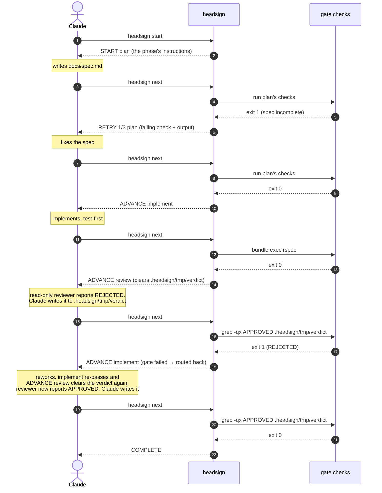

# headsign

[日本語](README.ja.md) · [npm](https://www.npmjs.com/package/headsign)

[](https://www.npmjs.com/package/headsign)
[](https://github.com/meganemura/headsign/actions/workflows/ci.yml)

> A headsign is the destination display on the front of a train. This one is
> for agent loops: each iteration, the agent asks where it's bound; headsign
> runs the gates and answers — proceed, retry, or terminus.

**headsign is a tiny phase gate for coding agents.** Claude Code drives the
work and keeps the conversation; headsign holds the workflow state and decides
phase transitions. Transitions are always deterministic — shell exit codes
and the routing you wrote, never the LLM's say-so. One honest caveat comes
with that: what a check *reads* can still be LLM-authored (a review verdict,
say) — that boundary is named, not hidden, in
[What headsign is not](#what-headsign-is-not) and
[ADR-0007](docs/adr/0007-verdict-authorship.md).

The whole discipline an agent needs fits in one sentence: **when in doubt, run
`headsign next` and obey the first line of the answer.**

```
$ headsign next
RETRY 2/5 implement
--- gate failed: unit tests (bundle exec rspec, exit 1) ---
Failures:
  1) Billing::Invoice#total ...
Fix the failure above, then run `headsign next` again.
```

## Why

- **Thin harness, fat skills.** The intelligence lives in your workflow's gate
  commands (shell you write) and the skill that teaches the loop discipline.
  The CLI is a state machine — no long-running process; each invocation reads
  state, judges, writes state, exits.
- **Deterministic transitions.** Tools that let the LLM signal "phase done" in
  its own output can't guarantee the one decision that matters. Here the
  checks' exit codes decide pass/fail and your routing decides the move — an
  agent cannot talk its way through a failing gate.
- **One question, one driver.** No `gate`, no dashboard. `next` both judges
  and, on failure, prints the remaining-work list — the failing check and its
  output — and it's the *driving* session's question, not a menu everyone
  in the repository gets to pick from. `status` is the observer's: read-only,
  it never judges or transitions anything. `claim` doesn't judge either — it
  hands driver ownership to a delegated agent via a stop-boundary hook, for
  the one moment a run needs to change hands on purpose (see
  [Multiple sessions](#multiple-sessions)).
- **Claude stays in charge.** Unlike outer-loop runners that invoke the LLM as
  a subordinate, headsign is a place Claude asks a question, not a process
  that owns Claude.

## Install (Claude Code plugin)

```
/plugin marketplace add meganemura/headsign
/plugin install headsign@headsign
```

The plugin ships three things: the bundled CLI (no npm install, no build), a
`workflow` skill teaching the discipline, and the stop-boundary hooks that
keep the agent from silently quitting mid-workflow.

### Using without the plugin

The plugin is just one way headsign ships, packaged for Claude Code. The
tool itself is the CLI: gate judgment, state, `PENDING`, locking, logging
all live in it, and it works from any agent — or by hand at a terminal. The plugin adds exactly
two things on top: the `workflow` skill and the stop-boundary hook
backstop. Both have plugin-free equivalents below.

**Install the CLI.** The bundle is committed, so there is nothing to build:

```
npm install -D headsign
npx headsign --help
```

**Teach your agent the discipline.** The skill is plain instructions, not
machinery. For Cursor, a custom harness, or a `CLAUDE.md`, this one rule
carries most of it:

> Run `npx headsign next` and obey the first line of the answer. Never end
> the run on anything but `COMPLETE`; to stop deliberately, run
> `npx headsign abort <reason>`.

The full discipline is in
[plugin/skills/workflow/SKILL.md](plugin/skills/workflow/SKILL.md). Copy
what you need into your agent's rules, or install it as a standalone skill
with the GitHub CLI (a preview `gh` feature that lets you pick which agent
to install into):

```
gh skill install meganemura/headsign workflow
```

Claude Code users can also drop it into `.claude/skills/` as a project
skill. A skill obtained any of these ways runs outside the plugin and can't
find its bundled CLI, so install the package as above and it falls back to
`npx headsign`.

**Optional: the backstop without the plugin.** Add this to
`.claude/settings.json`:

```json
{ "hooks": {
  "Stop": [ { "hooks": [
    { "type": "command", "command": "npx", "args": ["headsign", "stop-hook"] }
  ] } ],
  "SubagentStop": [ { "hooks": [
    { "type": "command", "command": "npx", "args": ["headsign", "subagent-stop-hook"] }
  ] } ]
} }
```

`Stop` covers the session itself; `SubagentStop` covers an agent the
session delegated the run to (see [Multiple sessions](#multiple-sessions)).
Register just the first if you never delegate a run — the second is
inert unless a delegated agent is driving.

## Quick start

In a hurry? Grab a ready-made workflow and adapt its `run:` commands:

```
mkdir -p .headsign && curl -fsSL -o .headsign/workflow.yaml \
  https://raw.githubusercontent.com/meganemura/headsign/main/example.headsign/tdd-feature.yaml
```

Or write one from scratch — it is one YAML file:

1. Commit a workflow to your repository:

```yaml
# .headsign/workflow.yaml
version: 1
name: feature-dev
entry: plan

phases:
  plan:
    description: Write the spec to docs/spec.md, including acceptance criteria.
    gate:
      checks:
        - name: spec exists
          run: "test -s docs/spec.md"
        - name: acceptance criteria present
          run: "grep -q '## Acceptance' docs/spec.md"
    on_pass: implement
    max_attempts: 3

  implement:
    description: Implement per the spec, test-first.
    gate:
      checks:
        - name: unit tests
          run: "bundle exec rspec"
          timeout: 300
    on_pass: review
    max_attempts: 5

  review:
    description: >
      Have a read-only reviewer subagent report APPROVED or REJECTED, then
      write that verdict yourself to .headsign/tmp/verdict.
    clear: [.headsign/tmp/verdict]
    ready: "test -f .headsign/tmp/verdict"
    gate:
      checks:
        - name: review approved
          run: "grep -qx APPROVED .headsign/tmp/verdict"
    on_pass: $end
    on_fail: implement     # rejection loops back
    max_attempts: 3        # three rejections → escalate to the human

limits:
  max_total_iterations: 20
```

The `run:` commands above are examples. Replace `bundle exec rspec` with whatever your project actually uses (`npm test`, `pytest`, `go test ./...`, …); a check is just a shell command judged by its exit code.

> **Trust:** a workflow's `run:` commands are shell that `headsign next` executes on your machine, exactly like a `Makefile` target or an npm `postinstall` script. Treat a `.headsign/workflow.yaml` from a repository you didn't write as you would any other executable code in it: read it before running `headsign start` or `headsign next`, and don't run headsign in a repository you don't trust. The same goes for `.headsign/state.json` and `.headsign/lock`: a cloned repository can contain a committed state file or lock, so a `.headsign/` you didn't create is untrusted input, just like the workflow. The same holds on a team: a change to `.headsign/` arrives on a teammate's PR and runs automatically in your loop, so weigh it as heavily as a change to CI configuration.

2. Ask Claude to start the workflow. It runs `headsign start`, works the
   phase, and keeps asking `headsign next` until the answer is `COMPLETE` —
   or `ESCALATE`, which means the decision comes back to you.

Run state lives in `.headsign/state.json` (auto-gitignored). Because all
state is external, the loop survives context compaction: recovery is just
`headsign next`.

`headsign start`, `next`, and `abort` resolve `.headsign/` in the current
directory only — they never search parent directories — so run them from the
repo or git-worktree root; each worktree then keeps its own independent run.
The exceptions are the stop-boundary hooks, which walk up to find the run's
`.headsign/` (bounded by the worktree root) so the backstop still fires when
the turn ended in a subdirectory. That walk only goes up, though, so from
a directory above the run — a monorepo root, say — the hook won't find it and
stays silent; keep the session at the workflow's directory or below.

**One worktree, one run** is the whole of headsign's worktree support, and it
holds by construction: a linked worktree's `state.json`, lock, and log all
live in that worktree's own `.headsign/`, and headsign writes nothing under
the shared `.git` directory — so two worktrees of the same repository can each
drive a loop, at their own phase, without either one disturbing the other.
Anything past that is out of scope: worktrees never share run state, and
headsign neither coordinates the runs in them nor aggregates them into one
view. A run belongs to the directory it was started in.

## Instructions vs. the gate

A phase's `description` is where you write what the agent should do in that
phase — including "use the `/foo` skill" or "have a read-only reviewer
subagent check it"; headsign hands it to Claude verbatim. A workflow
*choreographs* skills and subagent work into a gated sequence — it doesn't
*orchestrate* them, and it never forces which skill the agent uses. Only the
gate is enforced: the checks' exit codes are the sole thing that verifies the
result. To require a skill's use, gate its output (e.g. `grep` the file that
skill produces). A review/soft-gate phase should list its verdict file (e.g.
`.headsign/tmp/verdict`) under that phase's `clear:` so a verdict left over
from a previous pass can't be mistaken for the current one — headsign
deletes it on entry, and Claude writes a fresh one after the read-only
reviewer subagent reports its verdict. And when the judgment itself must
live outside the working agent's hands, make the check the judge — e.g.
`claude -p '… Reply exactly APPROVED or REJECTED.' | grep -qx APPROVED`
keeps the transition deterministic while the pen changes hands; trade-offs
in [ADR-0007](docs/adr/0007-verdict-authorship.md).

A phase is only as meaningful as what its gate can check in shell. A test
gate proves nothing broke, not that the feature is done — judging "done" is
what a review gate is for, which is why the Quick start workflow above
carries both. Work a shell command can't judge — a design call, a UX
decision — needs either slicing into units a check can verify, or a
review-style soft gate to carry it. Size your phases to what the gate can
actually check, not to how the work naturally breaks down. And a review phase
is the agent's own review discipline, not a substitute for a human reviewing
the resulting PR.

## How a run flows

Three roles turn the loop: the agent (Claude) does the work and drives;
**headsign** runs the current phase's gate and answers with a token; the
**checks** are ordinary shell, so the verdict is deterministic. Each turn,
Claude obeys the token — `RETRY` means fix the reported failure and ask
again, `ADVANCE` means move to the printed phase, a fail-route (`gate failed
→ routed to …`) sends the work back, and `COMPLETE` ends the run. One pass
through the Quick start workflow:



Every arrow from headsign is driven by a shell exit code, never the LLM's
own say-so. The stop-boundary hooks (not shown) are the backstop: if the
run's driver tries to stop while the run is `running`, it's pointed back to
`headsign next`.

## The contract

Six commands; a driving session routinely uses one:

| Command | Role |
|---|---|
| `headsign start [name] [--workflow path]` | initialize state, print the entry phase's instructions |
| `headsign next` | **the only question a driving session asks.** Run the current gate, transition, answer |
| `headsign abort [reason]` | record a human-directed stop |
| `headsign validate [name] [--workflow path]` | static check of the workflow file |
| `headsign status` | read-only view of the current run, for a session that isn't driving it — see [Multiple sessions](#multiple-sessions) |
| `headsign claim` | hand driver ownership to a delegated agent via the `SubagentStop` hook — for delegating who drives a run; see [Multiple sessions](#multiple-sessions) |

Multiple workflows can live as separate files under `.headsign/` (one
workflow per file); pick one with `headsign start <name>` (→
`.headsign/<name>.yaml`), or pass `--workflow <path>` for an explicit path.
Ready-made examples for several roles — TDD features, bug fixing, docs,
releases — live in [example.headsign/](example.headsign/); this repo's own
`.headsign` is a symlink to it.

A bare `headsign validate` (no name, no `--workflow`) checks whichever
workflow the current run is actually using: if `.headsign/state.json`
exists — whatever its status — it validates that run's own
`workflow_path`, not just a fixed default file, so validating a run
started with `headsign start <name>` checks the right `.headsign/<name>.yaml`
without having to repeat the name. With no run present, it falls back to
`.headsign/workflow.yaml`, as before. An explicit `<name>` or
`--workflow <path>` always wins over both.

`next` answers with a machine-readable first line, then instructions:

| First line | Exit | Meaning |
|---|---|---|
| `ADVANCE <phase>` | 0 | gate passed (or fail-routed) — new phase instructions follow |
| `RETRY n[/max] <phase>` | 1 | gate failed — failing check + output tail follow |
| `PENDING <phase>` | 1 | the gate can't be judged yet (`ready:`) — attempt not counted; do the work, then `next` again |
| `COMPLETE` | 0 | terminus |
| `ESCALATE <reason>` | 2 | human judgment needed |
| `ABORT <reason>` | 2 | run was aborted |

Exit 3 is a configuration/usage error. `next` is idempotent on finished runs,
and calling it on an unchanged working tree just reprints the last verdict —
probing never costs an attempt.

### Routing (workflow.yaml)

| Field | Values | Default |
|---|---|---|
| `on_pass` | phase name, `$end` | — (required) |
| `on_fail` | `retry`, phase name, `$end`, `escalate`, `abort` | `retry` |
| `max_attempts` | positive int; counts failures of this phase since it last passed | unlimited |
| `on_exhausted` | `escalate`, `abort` | `escalate` |
| `limits.max_total_iterations` | positive int; global runaway backstop | none |

Checks are CI-familiar `- name:` / `run:` / `timeout:` steps run with
`/bin/sh -c` (first failure stops the gate); phases may set `env:`.
Deliberately absent: `needs:`, `if:`, `${{ }}`, matrices, triggers — routing
is decided by pass/fail and nothing else.

### Async review (when review takes a while)

A review phase's gate often depends on something slower than the loop
itself — a reviewer subagent still reading the diff, a human glancing at a
PR. Calling `next` before that verdict exists would, without `ready:`,
burn a counted attempt on a gate that had nothing to judge yet — and since
that phase's verdict file is also listed under `clear:` (recommended
above), a verdict that lands a moment later could be discarded by that
same early call's next re-entry, silently losing a real review. Give the
phase a `ready:` probe (e.g. `test -f .headsign/tmp/verdict`) and an early
`next` answers `PENDING` instead: no attempt spent, `clear:` not run,
verdict left intact for the `next` that actually finds it. Everything
under `.headsign/` — including `tmp/`, where the verdict file lives — is
watched by the tree-hash regardless of `.gitignore`, so a verdict written
there is always detected, never mistaken for "nothing changed".

### The backstop

Skills are instructions, not guarantees. Two stop-boundary hooks read
`.headsign/state.json`; while a run is `running`, whichever one fires for
the run's **driver** blocks that turn from ending and points it back to
`headsign next`. A turn that can be *shown* not to be the driver's — its
identifier resolves and disagrees with the stamped one — passes straight
through instead. Escalated, aborted, and completed runs pass through too;
those are correct endings.

The two hooks resolve the "can't tell" case in opposite directions, on
purpose. If either end fails to produce an identifier — the stopping turn's
or the stamped one's — `Stop` still nudges: a session stopping in the run's
own directory is probably its driver, and missing the real one is worse
than one stray reminder. `SubagentStop` passes instead, because most
delegated agents stopping nearby are reviewers and workers with no role in
the run at all, and holding one of those hostage is worse than a missed
reminder.

One case never reaches that question: once a run's driver was seated by
`headsign claim`, what's stamped is an agent identifier, so `Stop`
passes every session through unconditionally without comparing anything —
no session can be that agent. See
[Multiple sessions](#multiple-sessions).

Two hooks, because a driver can be either kind of turn loop: `Stop` fires
when a session's turn ends, `SubagentStop` when a delegated agent's does.
A delegated agent never fires `Stop` at all, so without the second hook it
would have no backstop — and, worse, the run would keep pushing the
session that merely spawned it (see
[Multiple sessions](#multiple-sessions)).

**To pause deliberately**, write one line explaining why to
`.headsign/tmp/stop-note` and stop again: the hook passes immediately, no
nudges needed, and leaves a `paused` line in `.headsign/log` so the pause
has a record. The note is consumed (deleted) the moment it's read, and the
working tree returns to exactly what it was before — net zero — so the
cache stays intact: tomorrow, `headsign next` resumes from the same phase
and, if nothing else changed, reprints the cached verdict rather than
burning an attempt. `headsign abort <reason>` is the other exit, and it is
permanent, not a pause: the run can't be resumed, and a fresh `headsign
start` begins again from the entry phase, replaying every phase's gate
from scratch. Keeping that replay cheap is a design requirement on the
workflow, not something headsign does for you: write early phases' gates
as fast, idempotent checks (does a file exist, does lint pass) rather than
ones with real side effects or long unrepeatable work, and a fresh start
after an abort costs almost nothing. A workflow whose early gates are slow
or non-idempotent makes its own re-runs expensive — that's the workflow
author's cost to manage, by writing cheap gates, not a cost headsign can
absorb on its behalf.

Stopping *without* a note is pushed back — the hook fails open (never
traps a session) after 5 consecutive nudges with no real evaluation and no
note in between; the 5th nudge leaves a `stalled` line in `.headsign/log`,
and every stop after that passes silently. That cap is a safety net for a
stuck or silently departed agent, not the normal way to pause — the note
above is. To spot an unattended stall from the outside: `headsign status`
(read-only, safe to run from any session — see
[Multiple sessions](#multiple-sessions)) reports `RUNNING`, and
`.headsign/log`'s tail shows `stalled` (equivalently, `stop_nudges >= 5`) —
together they mean the driving agent has walked away without a note.
Re-drive the run with `headsign next` from the session that's actually
driving it.

## Multiple sessions

A repository often has more than one Claude Code session open on it at
once — a lead session plus teammates, or a subagent working alongside the
session that spawned it. Only one of them should ever be answering
`headsign next` for a given run; headsign calls that one the **driver**.
Everyone else is an **observer**. The distinction exists because the Stop
hook (above) used to nudge *every* session that stopped while a run was
`running`, driver and observer alike — an observer that obeyed the nudge
could burn a retry or advance a phase it had no business touching, and
every blocked stop, from any session, consumed the same shared nudge-cap
counter, so a handful of bystander turn-endings alone could exhaust it and
silently disable the backstop for the real driver. See
[ADR-0008](docs/adr/0008-multi-session-ownership.md) for the full design
and the field feedback that drove it.

`start` and `next` stamp `driver_session` in `.headsign/state.json` from
whichever session identifier the environment resolves at the time (never
overwriting it with "nothing" if the environment can't resolve one), so
ownership always tracks whichever session most recently drove the run. The
Stop hook compares its own idea of who just stopped against that stamp and
lets a confirmed non-driver's stop pass straight through — untouched, no
nudge, no state write — while falling back to its previous behavior
whenever either side can't be resolved, so the change never creates a new
way to block an innocent session, only new ways to let one go.
`HEADSIGN_OBSERVER` (below) is the manual override for environments where
no identifier resolves at all.

That automatic stamping is the whole story whenever the driver is a
*session* — one session working alone, or several in separate terminals.
Nothing needs claiming there. The one case it can't cover is a run driven
by an agent the session **delegated** it to, which is what `headsign
claim` is for (below).

Because ownership simply follows whoever last drove the run, a driver that
stepped away and comes back reclaims it with a single `headsign next` —
there's no separate reclaim step. Every other session — teammates, a
subagent that wasn't delegated the run, or any session that never ran
`headsign start` — should reach for `headsign status` instead.

### `headsign status`

Read-only: no gate runs, no state is written, no lock is taken. Safe to run
from any session, at any time, as often as you like.

```
$ headsign status
RUNNING implement (attempt 2/5)
workflow: feature-dev
--- last failure: unit tests (bundle exec rspec, exit 1) ---
Failures:
  1) Billing::Invoice#total ...
driver: this session, or an agent it delegated to
```

```
$ headsign status
COMPLETE
workflow: feature-dev
```

```
$ headsign status
ESCALATED
workflow: feature-dev
reason: review rejected 3 times
```

The first line is one of `RUNNING` / `COMPLETE` / `ESCALATED` / `ABORTED` —
capitalized like `next`'s tokens, but it's a *report*, not a verdict:
`status` never prints `ADVANCE`, `RETRY`, or `PENDING`, because it never
judges anything. The `driver:` line (shown only while `RUNNING`) reads
`this session, or an agent it delegated to` when your own resolved
identifier matches the stamped driver, `another session` when both resolve
but disagree, and `unknown` whenever either side can't be resolved. After a
`headsign claim` handoff (below), it instead reads `driver: a delegated
agent` — `status` deliberately does not guess this-session-or-another for a
claimed run, because what's stored then isn't a session identifier at all,
and the same resolution gap that makes `claim` necessary in the first place
is exactly what stops the CLI from telling whether that agent is the caller.
The line states the fact it has, and nothing more.

That first reading is wordy on purpose. A delegated agent shares its
spawning session's identifier, so a match narrows the driver down to *that
session or any agent under it* and stops there — it cannot tell one of them
from another. `status` compares identifiers the environment hands it, and no
such identifier separates a session from what it delegated to — that gap is
exactly why `headsign claim` exists.

**If you are a delegated agent, end your turn and watch what happens: being
pushed back to `headsign next` proves this run is yours to drive.**
`SubagentStop` holds an agent only on a positive match with the stamped
driver, so a delegated agent that gets held is the driver, full stop. The
implication runs one way only. Ending quietly does *not* prove the reverse:
the nudge cap may have been reached (five held turns with no evaluation
between them, after which the hook falls open and logs `stalled`), a pause
note may have been consumed, or `HEADSIGN_OBSERVER` may be set. And each
check costs one nudge from that cap, so it is a probe to spend
deliberately, not a habit.

For a *session*, the same test is weaker. `Stop` only passes a stop it can
positively rule out — both identifiers resolved and disagreeing — so on a
run where no identifier was ever stamped, every session in the directory is
nudged, driver or not. Being held there says the run is running, not that
you own it.

Exit code follows a deliberately different contract from `next`'s: `status`
exits 0 whenever `.headsign/state.json` could be read at all — an
`ESCALATED` or `ABORTED` run is normal, informative output, not a status
error — and exits 3 only when there's nothing to report (no run here, or
state unreadable). A script that wraps `status` in `set -e` therefore never
dies just because the run it's watching happens to need a human; read the
run's own state from line 1, not from the exit code.

### Delegating who drives: `headsign claim`

A **delegated agent** — a teammate under Claude Code's agent-teams
feature, or a subagent — is the one driver the automatic stamping above
cannot handle. Such an agent shares its spawning session's process
outright (same pid, same environment) and carries no identifier of its
own anywhere its Bash tool can reach, so its `headsign next` calls stamp
the *spawning session's* identifier. Simply asking it to drive the run
therefore records the wrong driver, quietly.

The damage from skipping the claim is not just a misleading field. Once a
delegated agent's plain `headsign next` has stamped the spawning session,
every nudge that run produces goes to *that* session — which is typically
sitting idle, waiting on the delegation — while the agent actually doing
the work ends its turns unheld. The backstop stays armed and points at the
wrong party, and nothing in either one's output says so. So when you hand a
run to a delegated agent, that agent's first headsign command is `headsign
claim`, never `headsign next`.

`headsign claim` fixes that by letting a hook do the stamping, because
Claude Code tells the hook what the agent's own environment cannot. Two
beats:

1. From the agent you want driving the run, run `headsign claim`. It arms
   a one-shot marker and tells you to end your turn — it stamps nothing
   itself.
2. End that turn. **That agent's own turn end is where the seal
   happens** (Claude Code fires a `SubagentStop` hook for it, carrying an
   identifier for that agent specifically): headsign writes it into
   `driver_session`/`driver_source` in `.headsign/state.json`, records a
   `claimed` line in `.headsign/log`, and confirms it in the hook's
   message. Wait for that confirmation before running `headsign next` —
   it is how you know the right agent got seated.

A typical delegation: "please drive this run" → the delegated agent runs
`headsign claim` and ends its turn → the confirmation arrives → it
proceeds with `headsign next`. Ownership claimed this way is sticky: an
unrelated `next` call from the same shared environment cannot silently
reclaim it the way plain env-based stamping could. A session's own stop
never adopts a claim at all, so the session that handed the work off
cannot take the seat by stopping first.

Being the driver also brings the backstop with it: once seated, that
agent's own turn endings are pushed back to `headsign next` while the run
is `running`, and pausing with a stop-note or ending with `headsign
abort` works from there exactly as it does for a session. Agents that
aren't the run's driver are never held — a reviewer subagent, or an agent
working on something else entirely, stops normally.

This is a handshake, not a lock: if some *other* delegated agent happens
to end a turn while the marker is armed, it gets adopted instead. Run
`headsign claim` again from the right one — a new claim always wins, and
this time it lands, because that agent's own turn end is guaranteed to
fire the event that seals. The full mechanism, the measurements behind
it, and the race that remains are in
[ADR-0010](docs/adr/0010-subagent-stop-identity.md).

### Environment variables

| Variable | Set by | Meaning |
|---|---|---|
| `HEADSIGN_SESSION_ID` | you, explicitly | The session identifier headsign uses for driver ownership. Works with any harness — export a stable, per-session value and headsign uses it. Checked first. |
| `CLAUDE_CODE_SESSION_ID` | Claude Code, automatically | Used only if `HEADSIGN_SESSION_ID` isn't set. This is **not** a documented, public part of Claude Code's interface — headsign relies on it only because no public equivalent exists today. If a future release removes or changes it, headsign simply stops resolving a driver identifier automatically: `driver_session` stops being stamped, and the Stop hook falls back to nudging every stop on a running run, driver and observer alike — exactly the behavior a repository had before this feature existed. Nothing breaks; the feature just stops narrowing who gets nudged. |
| `HEADSIGN_OBSERVER` | you, explicitly | Set to any non-empty value (`=1` is the convention) to make a session's stops — and those of any agent it delegates to — pass the stop-boundary hooks unconditionally, regardless of driver ownership. The manual opt-out for a session you know is only observing — especially useful when no session identifier resolves at all. |

**The rule:** a session that hasn't run `headsign start` and hasn't been
asked to drive the run should reach for `headsign status`, never `headsign
next` or `headsign abort`.

## What headsign is not

Read this before adopting — the boundaries are the design.

- **It doesn't verify quality by itself.** A gate proves whatever its check
  proves. Test gates are hard: their outcome cannot be authored. Review
  gates are soft: the verdict file is written by an LLM, and headsign
  guarantees the *transition* is deterministic, not that the verdict is
  wise. The hardness scale — and how to take the pen out of the working
  agent's hand when it matters — is
  [ADR-0007](docs/adr/0007-verdict-authorship.md).
- **It doesn't force anyone to use it.** Nothing makes an agent or a
  teammate run `headsign start`, and skipping the tool leaves no trace.
  Making the loop a habit is convention work headsign cannot do for you.
- **It doesn't orchestrate.** One active phase per run: no DAGs, no
  parallel phases, no worktree management, no provider abstraction, no
  personas, no template/expression language, no MCP server, no TUI, no
  cross-run dashboard. Not *managing* worktrees isn't the same as not
  working in one, though: a run started in a worktree stays entirely its
  own — one worktree, one independent run (see
  [Quick start](#quick-start)). If the harness needs to be clever, the
  cleverness is in the wrong place.
- **It doesn't run on native Windows.** Checks execute via `/bin/sh`
  (POSIX); WSL works fine.

What it does hold, it holds mechanically: transitions and attempt accounting
an agent cannot sweet-talk, run state that survives compaction, a backstop
that makes quitting silently impossible without leaving a trace, and probing
that never costs an attempt.

### Where it sits among neighbors

- **Curated skill packs** (Superpowers and kin) — those ship polished,
  fixed workflows; headsign ships the gate machinery, and you bring the
  workflow (or start from [example.headsign/](example.headsign/)).
- **ralph-style loops** (re-prompting until done) — complementary, not
  competing: headsign works as the stop condition and phase memory *inside*
  such a loop. The runner just re-invokes the agent until `state.json` goes
  terminal.
- **takt** — a full-featured orchestrator that runs agents itself, with
  worktree parallelism and personas. headsign flips the relationship — the
  agent drives and consults the gate — and it owes takt its starting
  point: working with takt is what made clear which single, agent-driven
  slice of the problem wanted a deliberately smaller tool.
- **jdi** — the lightest neighbor: the agent marks phase transitions in
  its own output. headsign keeps that lightness while moving the one
  decision that matters — the transition — out of the LLM's text and into
  exit codes.

### Should you adopt it? Let your agent decide

headsign pays off only where "done" can be checked mechanically. Measure
your own repository — paste this into your coding agent (read-only,
changes nothing):

```text
Assess (read-only) whether this repository would benefit from a phase gate
for agent work — a tool that only lets a work phase advance when shell
checks pass.
1. Inventory the mechanical signals: which commands here can prove work
   state (test suite, typecheck, lint, build)? Note roughly how long the
   main one takes.
2. From recent merged PRs (skip deps/chore), reconstruct the typical unit
   of work: does it decompose into 2-5 phases, each with a checkable
   outcome (tests green, artifact exists), plus judgments no shell can
   make (review)?
3. Look for the failure this tool exists for: work declared finished that
   was not — red CI on first push, fixup commits, reverts.
4. Report: the signal inventory with runtimes; whether work decomposes
   into gateable phases; roughly how often "done" was not; and a
   High/Medium/Low fit with a 3-line rationale.
```

**High** (checkable signals exist, and "done" has lied before) → adopt;
start from an example workflow. **Medium** → adopt for one recurring kind
of work first. **Low** (no runnable checks) → don't: without mechanical
signals there is nothing for gates to hold — build those first. Either
way, the signal inventory the agent hands back is the first draft of your
gates.

## Development

```
npm install
npm test          # node:test, no framework
npm run typecheck
npm run build     # esbuild → plugin/dist/headsign.mjs (committed artifact)
```

Node ≥ 20 to run; Node ≥ 22.6 to develop (tests run TypeScript natively).
The design is documented in [docs/architecture.md](docs/architecture.md),
with the rationale for each decision in [docs/adr/](docs/adr/README.md);
release and maintenance procedures live in
[docs/maintenance.md](docs/maintenance.md).

## License

MIT
