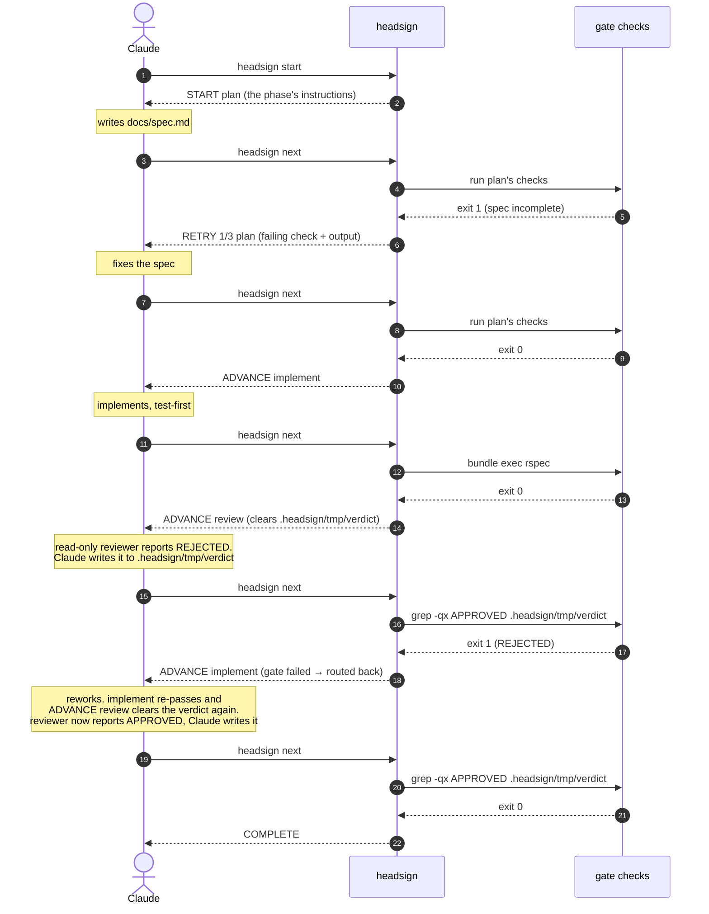

# headsign

[日本語](README.ja.md) · [npm](https://www.npmjs.com/package/headsign)

[](https://www.npmjs.com/package/headsign)
[](https://github.com/meganemura/headsign/actions/workflows/ci.yml)

> A headsign is the destination display on the front of a train. This one is
> for agent loops: each iteration, the agent asks where it's bound; headsign
> runs the gates and answers — proceed, retry, or terminus.

**headsign is a tiny phase gate for coding agents.** Claude Code drives the
work and keeps the conversation; headsign holds the workflow state and decides
phase transitions. Transitions are always deterministic — shell exit codes
and the routing you wrote, never the LLM's say-so. One honest caveat comes
with that: what a check *reads* can still be LLM-authored (a review verdict,
say) — that boundary is named, not hidden, in
[What headsign is not](#what-headsign-is-not) and
[ADR-0007](docs/adr/0007-verdict-authorship.md).

The whole discipline an agent needs fits in one sentence: **when in doubt, run
`headsign next` and obey the first line of the answer.**

```
$ headsign next
RETRY 2/5 implement
--- gate failed: unit tests (bundle exec rspec, exit 1) ---
Failures:
  1) Billing::Invoice#total ...
Fix the failure above, then run `headsign next` again.
```

## Why

- **Thin harness, fat skills.** The intelligence lives in your workflow's gate
  commands (shell you write) and the skill that teaches the loop discipline.
  The CLI is a state machine — no long-running process; each invocation reads
  state, judges, writes state, exits.
- **Deterministic transitions.** Tools that let the LLM signal "phase done" in
  its own output can't guarantee the one decision that matters. Here the
  checks' exit codes decide pass/fail and your routing decides the move — an
  agent cannot talk its way through a failing gate.
- **One question.** No `status`, no `gate`, no dashboard. `next` both judges
  and, on failure, prints the remaining-work list — the failing check and its
  output.
- **Claude stays in charge.** Unlike outer-loop runners that invoke the LLM as
  a subordinate, headsign is a place Claude asks a question, not a process
  that owns Claude.

## Install (Claude Code plugin)

```
/plugin marketplace add meganemura/headsign
/plugin install headsign@headsign
```

The plugin ships three things: the bundled CLI (no npm install, no build), a
`workflow` skill teaching the discipline, and a Stop hook that keeps the agent
from silently quitting mid-workflow.

### Using without the plugin

The plugin is just one way headsign ships, packaged for Claude Code. The
tool itself is the CLI: gate judgment, state, `PENDING`, locking, logging
all live in it, and it works from any agent — or by hand at a terminal. The plugin adds exactly
two things on top: the `workflow` skill and the Stop hook backstop. Both
have plugin-free equivalents below.

**Install the CLI.** The bundle is committed, so there is nothing to build:

```
npm install -D headsign
npx headsign --help
```

**Teach your agent the discipline.** The skill is plain instructions, not
machinery. For Cursor, a custom harness, or a `CLAUDE.md`, this one rule
carries most of it:

> Run `npx headsign next` and obey the first line of the answer. Never end
> the run on anything but `COMPLETE`; to stop deliberately, run
> `npx headsign abort <reason>`.

The full discipline is in
[plugin/skills/workflow/SKILL.md](plugin/skills/workflow/SKILL.md). Copy
what you need into your agent's rules, or install it as a standalone skill
with the GitHub CLI (a preview `gh` feature that lets you pick which agent
to install into):

```
gh skill install meganemura/headsign workflow
```

Claude Code users can also drop it into `.claude/skills/` as a project
skill. A skill obtained any of these ways runs outside the plugin and can't
find its bundled CLI, so install the package as above and it falls back to
`npx headsign`.

**Optional: the backstop without the plugin.** Add this to
`.claude/settings.json`:

```json
{ "hooks": { "Stop": [ { "hooks": [
  { "type": "command", "command": "npx", "args": ["headsign", "stop-hook"] }
] } ] } }
```

## Quick start

In a hurry? Grab a ready-made workflow and adapt its `run:` commands:

```
mkdir -p .headsign && curl -fsSL -o .headsign/workflow.yaml \
  https://raw.githubusercontent.com/meganemura/headsign/main/example.headsign/tdd-feature.yaml
```

Or write one from scratch — it is one YAML file:

1. Commit a workflow to your repository:

```yaml
# .headsign/workflow.yaml
version: 1
name: feature-dev
entry: plan

phases:
  plan:
    description: Write the spec to docs/spec.md, including acceptance criteria.
    gate:
      checks:
        - name: spec exists
          run: "test -s docs/spec.md"
        - name: acceptance criteria present
          run: "grep -q '## Acceptance' docs/spec.md"
    on_pass: implement
    max_attempts: 3

  implement:
    description: Implement per the spec, test-first.
    gate:
      checks:
        - name: unit tests
          run: "bundle exec rspec"
          timeout: 300
    on_pass: review
    max_attempts: 5

  review:
    description: >
      Have a read-only reviewer subagent report APPROVED or REJECTED, then
      write that verdict yourself to .headsign/tmp/verdict.
    clear: [.headsign/tmp/verdict]
    ready: "test -f .headsign/tmp/verdict"
    gate:
      checks:
        - name: review approved
          run: "grep -qx APPROVED .headsign/tmp/verdict"
    on_pass: $end
    on_fail: implement     # rejection loops back
    max_attempts: 3        # three rejections → escalate to the human

limits:
  max_total_iterations: 20
```

The `run:` commands above are examples. Replace `bundle exec rspec` with whatever your project actually uses (`npm test`, `pytest`, `go test ./...`, …); a check is just a shell command judged by its exit code.

> **Trust:** a workflow's `run:` commands are shell that `headsign next` executes on your machine, exactly like a `Makefile` target or an npm `postinstall` script. Treat a `.headsign/workflow.yaml` from a repository you didn't write as you would any other executable code in it: read it before running `headsign start` or `headsign next`, and don't run headsign in a repository you don't trust. The same goes for `.headsign/state.json` and `.headsign/lock`: a cloned repository can contain a committed state file or lock, so a `.headsign/` you didn't create is untrusted input, just like the workflow. The same holds on a team: a change to `.headsign/` arrives on a teammate's PR and runs automatically in your loop, so weigh it as heavily as a change to CI configuration.

2. Ask Claude to start the workflow. It runs `headsign start`, works the
   phase, and keeps asking `headsign next` until the answer is `COMPLETE` —
   or `ESCALATE`, which means the decision comes back to you.

Run state lives in `.headsign/state.json` (auto-gitignored). Because all
state is external, the loop survives context compaction: recovery is just
`headsign next`.

`headsign start`, `next`, and `abort` resolve `.headsign/` in the current
directory only — they never search parent directories — so run them from the
repo or git-worktree root; each worktree then keeps its own independent run.
The one exception is the Stop hook, which walks up to find the run's
`.headsign/` (bounded by the worktree root) so the backstop still fires when
the session stopped in a subdirectory. That walk only goes up, though, so from
a directory above the run — a monorepo root, say — the hook won't find it and
stays silent; keep the session at the workflow's directory or below.

## Instructions vs. the gate

A phase's `description` is where you write what the agent should do in that
phase — including "use the `/foo` skill" or "have a read-only reviewer
subagent check it"; headsign hands it to Claude verbatim. A workflow
*choreographs* skills and subagent work into a gated sequence — it doesn't
*orchestrate* them, and it never forces which skill the agent uses. Only the
gate is enforced: the checks' exit codes are the sole thing that verifies the
result. To require a skill's use, gate its output (e.g. `grep` the file that
skill produces). A review/soft-gate phase should list its verdict file (e.g.
`.headsign/tmp/verdict`) under that phase's `clear:` so a verdict left over
from a previous pass can't be mistaken for the current one — headsign
deletes it on entry, and Claude writes a fresh one after the read-only
reviewer subagent reports its verdict. And when the judgment itself must
live outside the working agent's hands, make the check the judge — e.g.
`claude -p '… Reply exactly APPROVED or REJECTED.' | grep -qx APPROVED`
keeps the transition deterministic while the pen changes hands; trade-offs
in [ADR-0007](docs/adr/0007-verdict-authorship.md).

A phase is only as meaningful as what its gate can check in shell. A test
gate proves nothing broke, not that the feature is done — judging "done" is
what a review gate is for, which is why the Quick start workflow above
carries both. Work a shell command can't judge — a design call, a UX
decision — needs either slicing into units a check can verify, or a
review-style soft gate to carry it. Size your phases to what the gate can
actually check, not to how the work naturally breaks down. And a review phase
is the agent's own review discipline, not a substitute for a human reviewing
the resulting PR.

## How a run flows

Three roles turn the loop: the agent (Claude) does the work and drives;
**headsign** runs the current phase's gate and answers with a token; the
**checks** are ordinary shell, so the verdict is deterministic. Each turn,
Claude obeys the token — `RETRY` means fix the reported failure and ask
again, `ADVANCE` means move to the printed phase, a fail-route (`gate failed
→ routed to …`) sends the work back, and `COMPLETE` ends the run. One pass
through the Quick start workflow:



Every arrow from headsign is driven by a shell exit code, never the LLM's
own say-so. The Stop hook (not shown) is the backstop: if Claude tries to
stop while the run is `running`, it's pointed back to `headsign next`.

## The contract

Four commands; the agent routinely uses one:

| Command | Role |
|---|---|
| `headsign start [name] [--workflow path]` | initialize state, print the entry phase's instructions |
| `headsign next` | **the only question.** Run the current gate, transition, answer |
| `headsign abort [reason]` | record a human-directed stop |
| `headsign validate [name] [--workflow path]` | static check of the workflow file |

Multiple workflows can live as separate files under `.headsign/` (one
workflow per file); pick one with `headsign start <name>` (→
`.headsign/<name>.yaml`), or pass `--workflow <path>` for an explicit path.
Ready-made examples for several roles — TDD features, bug fixing, docs,
releases — live in [example.headsign/](example.headsign/); this repo's own
`.headsign` is a symlink to it.

`next` answers with a machine-readable first line, then instructions:

| First line | Exit | Meaning |
|---|---|---|
| `ADVANCE <phase>` | 0 | gate passed (or fail-routed) — new phase instructions follow |
| `RETRY n[/max] <phase>` | 1 | gate failed — failing check + output tail follow |
| `PENDING <phase>` | 1 | the gate can't be judged yet (`ready:`) — attempt not counted; do the work, then `next` again |
| `COMPLETE` | 0 | terminus |
| `ESCALATE <reason>` | 2 | human judgment needed |
| `ABORT <reason>` | 2 | run was aborted |

Exit 3 is a configuration/usage error. `next` is idempotent on finished runs,
and calling it on an unchanged working tree just reprints the last verdict —
probing never costs an attempt.

### Routing (workflow.yaml)

| Field | Values | Default |
|---|---|---|
| `on_pass` | phase name, `$end` | — (required) |
| `on_fail` | `retry`, phase name, `$end`, `escalate`, `abort` | `retry` |
| `max_attempts` | positive int; counts failures of this phase since it last passed | unlimited |
| `on_exhausted` | `escalate`, `abort` | `escalate` |
| `limits.max_total_iterations` | positive int; global runaway backstop | none |

Checks are CI-familiar `- name:` / `run:` / `timeout:` steps run with
`/bin/sh -c` (first failure stops the gate); phases may set `env:`.
Deliberately absent: `needs:`, `if:`, `${{ }}`, matrices, triggers — routing
is decided by pass/fail and nothing else.

### Async review (when review takes a while)

A review phase's gate often depends on something slower than the loop
itself — a reviewer subagent still reading the diff, a human glancing at a
PR. Calling `next` before that verdict exists would, without `ready:`,
burn a counted attempt on a gate that had nothing to judge yet — and since
that phase's verdict file is also listed under `clear:` (recommended
above), a verdict that lands a moment later could be discarded by that
same early call's next re-entry, silently losing a real review. Give the
phase a `ready:` probe (e.g. `test -f .headsign/tmp/verdict`) and an early
`next` answers `PENDING` instead: no attempt spent, `clear:` not run,
verdict left intact for the `next` that actually finds it. Everything
under `.headsign/` — including `tmp/`, where the verdict file lives — is
watched by the tree-hash regardless of `.gitignore`, so a verdict written
there is always detected, never mistaken for "nothing changed".

### The backstop

Skills are instructions, not guarantees. A Stop hook reads
`.headsign/state.json`; while a run is `running` it blocks the agent from
stopping and points it back to `headsign next`. Escalated, aborted, and
completed runs pass through — those are correct endings.

**To pause deliberately**, write one line explaining why to
`.headsign/tmp/stop-note` and stop again: the hook passes immediately, no
nudges needed, and leaves a `paused` line in `.headsign/log` so the pause
has a record. The note is consumed (deleted) the moment it's read, and the
working tree returns to exactly what it was before — net zero — so the
cache stays intact: tomorrow, `headsign next` resumes from the same phase
and, if nothing else changed, reprints the cached verdict rather than
burning an attempt. `headsign abort <reason>` is the other exit, and it is
permanent, not a pause: the run can't be resumed, and a fresh `headsign
start` begins again from the entry phase, replaying every phase's gate
from scratch. Keeping that replay cheap is a design requirement on the
workflow, not something headsign does for you: write early phases' gates
as fast, idempotent checks (does a file exist, does lint pass) rather than
ones with real side effects or long unrepeatable work, and a fresh start
after an abort costs almost nothing. A workflow whose early gates are slow
or non-idempotent makes its own re-runs expensive — that's the workflow
author's cost to manage, by writing cheap gates, not a cost headsign can
absorb on its behalf.

Stopping *without* a note is pushed back — the hook fails open (never
traps a session) after 5 consecutive nudges with no real evaluation and no
note in between; the 5th nudge leaves a `stalled` line in `.headsign/log`,
and every stop after that passes silently. That cap is a safety net for a
stuck or silently departed agent, not the normal way to pause — the note
above is. To spot an unattended stall from the outside: if `status` is
`"running"` and the log's tail shows `stalled` (equivalently,
`stop_nudges >= 5`), the agent has walked away without a note — re-drive
the run with `headsign next`.

## What headsign is not

Read this before adopting — the boundaries are the design.

- **It doesn't verify quality by itself.** A gate proves whatever its check
  proves. Test gates are hard: their outcome cannot be authored. Review
  gates are soft: the verdict file is written by an LLM, and headsign
  guarantees the *transition* is deterministic, not that the verdict is
  wise. The hardness scale — and how to take the pen out of the working
  agent's hand when it matters — is
  [ADR-0007](docs/adr/0007-verdict-authorship.md).
- **It doesn't force anyone to use it.** Nothing makes an agent or a
  teammate run `headsign start`, and skipping the tool leaves no trace.
  Making the loop a habit is convention work headsign cannot do for you.
- **It doesn't orchestrate.** One active phase per run: no DAGs, no
  parallel phases, no worktree management, no provider abstraction, no
  personas, no template/expression language, no MCP server, no TUI, no
  cross-run dashboard. If the harness needs to be clever, the cleverness is
  in the wrong place.
- **It doesn't run on native Windows.** Checks execute via `/bin/sh`
  (POSIX); WSL works fine.

What it does hold, it holds mechanically: transitions and attempt accounting
an agent cannot sweet-talk, run state that survives compaction, a backstop
that makes quitting silently impossible without leaving a trace, and probing
that never costs an attempt.

### Where it sits among neighbors

- **Curated skill packs** (Superpowers and kin) — those ship polished,
  fixed workflows; headsign ships the gate machinery, and you bring the
  workflow (or start from [example.headsign/](example.headsign/)).
- **ralph-style loops** (re-prompting until done) — complementary, not
  competing: headsign works as the stop condition and phase memory *inside*
  such a loop. The runner just re-invokes the agent until `state.json` goes
  terminal.
- **takt** — a full-featured orchestrator that runs agents itself, with
  worktree parallelism and personas. headsign flips the relationship — the
  agent drives and consults the gate — and it owes takt its starting
  point: working with takt is what made clear which single, agent-driven
  slice of the problem wanted a deliberately smaller tool.
- **jdi** — the lightest neighbor: the agent marks phase transitions in
  its own output. headsign keeps that lightness while moving the one
  decision that matters — the transition — out of the LLM's text and into
  exit codes.

### Should you adopt it? Let your agent decide

headsign pays off only where "done" can be checked mechanically. Measure
your own repository — paste this into your coding agent (read-only,
changes nothing):

```text
Assess (read-only) whether this repository would benefit from a phase gate
for agent work — a tool that only lets a work phase advance when shell
checks pass.
1. Inventory the mechanical signals: which commands here can prove work
   state (test suite, typecheck, lint, build)? Note roughly how long the
   main one takes.
2. From recent merged PRs (skip deps/chore), reconstruct the typical unit
   of work: does it decompose into 2-5 phases, each with a checkable
   outcome (tests green, artifact exists), plus judgments no shell can
   make (review)?
3. Look for the failure this tool exists for: work declared finished that
   was not — red CI on first push, fixup commits, reverts.
4. Report: the signal inventory with runtimes; whether work decomposes
   into gateable phases; roughly how often "done" was not; and a
   High/Medium/Low fit with a 3-line rationale.
```

**High** (checkable signals exist, and "done" has lied before) → adopt;
start from an example workflow. **Medium** → adopt for one recurring kind
of work first. **Low** (no runnable checks) → don't: without mechanical
signals there is nothing for gates to hold — build those first. Either
way, the signal inventory the agent hands back is the first draft of your
gates.

## Development

```
npm install
npm test          # node:test, no framework
npm run typecheck
npm run build     # esbuild → plugin/dist/headsign.mjs (committed artifact)
```

Node ≥ 20 to run; Node ≥ 22.6 to develop (tests run TypeScript natively).
The design is documented in [docs/architecture.md](docs/architecture.md),
with the rationale for each decision in [docs/adr/](docs/adr/README.md);
release and maintenance procedures live in
[docs/maintenance.md](docs/maintenance.md).

## License

MIT
