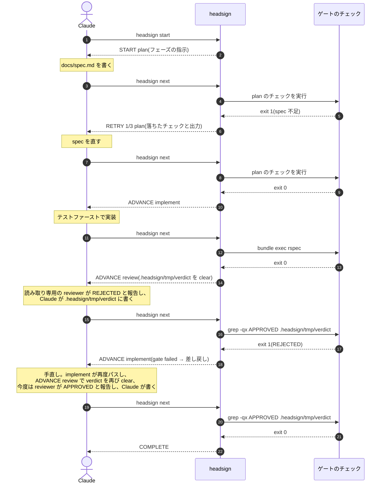
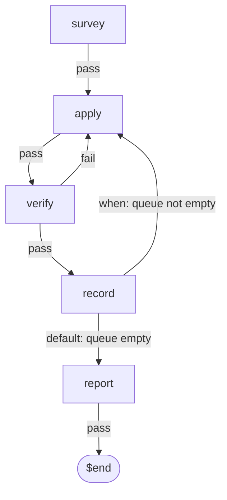

# ワークフローリファレンス

[English](workflow-reference.md)

`.headsign/workflow.yaml` の書き方と、CLI がそれをどう扱うか。

[README](../README.ja.md) は headsign を採用する前に読むページで、こちらはワークフローを書きながら読むページです。
run の*最中*にエージェントが従う規律はプラグインに同梱されていて、[plugin/skills/workflow/SKILL.md](../plugin/skills/workflow/SKILL.md) にあります。
内部構造は [architecture.md](architecture.md) に、各判断の背景は [ADR](adr/README.md) にあります。

このページは人のために書かれた 1 枚で、書き方と運転の両方を持っていますが、エージェントが書くその瞬間に読む抜粋のほうは [`design-workflow` スキル](../plugin/skills/design-workflow/SKILL.md) とその [スキーマリファレンス](../plugin/skills/design-workflow/references/schema.md) としてプラグインと一緒に配られます(このページはどこにも同梱されないため。[ADR-0020](adr/0020-writing-the-workflow-as-its-own-skill.md))。

## リポジトリ全体でプラグインを有効にする

[README](../README.ja.md#インストール) の二つのコマンドは、プラグインを一人ぶんインストールするものです。
そうではなく、そのリポジトリを開く全員に向けて宣言することもできます。
コードと一緒にコミットする `.claude/settings.json` がそれです:

```json
{
  "extraKnownMarketplaces": {
    "headsign": {
      "source": { "source": "github", "repo": "meganemura/headsign" }
    }
  },
  "enabledPlugins": { "headsign@headsign": true }
}
```

`extraKnownMarketplaces` は、そのリポジトリのメンバーに必要なプラグインの供給元を、リポジトリの側から名指しする場所です。
スキーマ自身の説明は "Additional marketplaces to make available for this repository. Typically used in repository .claude/settings.json to ensure team members have required plugin sources" です。
キーの `headsign` はマーケットプレイスの名前で、[`.claude-plugin/marketplace.json`](../.claude-plugin/marketplace.json) から来ています。
その `source` は、そのマーケットプレイスがどこにあるかを述べます。
`enabledPlugins` のキーは `plugin@marketplace` の形なので、`headsign@headsign` は「`headsign` という名前のマーケットプレイスの中の、`headsign` という名前のプラグイン」です(後者は [`plugin/.claude-plugin/plugin.json`](../plugin/.claude-plugin/plugin.json) から来ています)。
両方が同じ語なのは、このプロジェクトが同梱するプラグインが一つだからであって、形式上の決まりではありません。

この二つのキーは headsign のものではなく Claude Code のものです。
そのため以下に書くのは、このファイルが何を*宣言*しているかです。
その宣言に出会った各人の Claude Code が何をするかを説明するのは Claude Code 自身のドキュメントであり、スキーマが動いたときに追随するのもそちらです。
このページはどこにも同梱されませんが、README のほうは npm のキャッシュや fork の中で凍りつきます。
動く部分をこちら側に置いてあるのは、そのためです。

**固定(pin)。** マーケットプレイスの `source` は `ref`(ブランチまたはタグ)も取ります。
全員を一つのバージョンに揃えたいチームは、既定ブランチのままにせず、リリースタグを指します:

```json
{
  "extraKnownMarketplaces": {
    "headsign": {
      "source": {
        "source": "github",
        "repo": "meganemura/headsign",
        "ref": "v0.4.0"
      }
    }
  },
  "enabledPlugins": { "headsign@headsign": true }
}
```

これが買うのは、チーム全体で一つのゲートのふるまいです。
ワークフローのスキーマは 1.0 より前で、定義していないキーを拒否します([ADR-0015](adr/0015-strict-schema-and-version-0-1.md))。
そのため固定していないチームでは、あるメンバーの手元で走るワークフローが、別のメンバーの手元では validate に通らない、ということが起こりえます。
それはハーネスの差でありながら、仕事の差として届きます。
これが支払わせるのは、誰かが pin を動かし続ける手間です。
しかも古びた pin は目に見えません。
固定したバージョンに無いものをワークフローが使うまで、どこもおかしく見えず、そのときには「三つ前のリリースにいる」ではなく「headsign が壊れている」という形で届きます。
同じエントリには `autoUpdate` というフラグもあります。
pin と自動更新は同じ問いに逆向きに答えるものなので、どちらかが成り行きで決まるより、リポジトリが意図して片方を選ぶほうが良いはずです。

**個人単位での解除。** 設定の優先順位は user < project < local なので、project の設定に勝つのは、同じリポジトリにあるその人自身の `.claude/settings.local.json` です:

```json
{ "enabledPlugins": { "headsign@headsign": false } }
```

これはコミットするファイルではなく個人用のファイルなので、解除は手元だけの行為で、リポジトリの宣言はそのまま残ります。
プロジェクトはプラグインを宣言できますが、使い続けることを強制はできません。
これは [headsign が使うことを誰にも強制しない](../README.ja.md#headsign-がやらないこと)のと同じ境界を、一段下でなぞったものです。

**更新。** バージョンを宣言することと、それが手元にあることは、別々の出来事です。
配布する側から見たそれは [maintenance.md](maintenance.md) の distribution map にあり、サードパーティのマーケットプレイスは既定で auto-update が無効で、更新は利用者自身が実行する、と記録されています。
つまり、コミットしたファイルの `ref` を動かすことは更新の開始であって、完了ではありません。

Claude Code で完了させるのは 1 コマンドですが、名前を修飾する必要があります:

```
claude plugin update headsign@headsign
```

Codex では 2 コマンドで、しかも 1 つ目は誰も思いつかないほうです:

```
codex plugin marketplace upgrade
codex plugin add headsign@headsign
```

`codex plugin add` は、Codex がディスクに保持しているマーケットプレイスのスナップショットからインストールします。
これだけを実行すると、そのスナップショットが持っているものを入れ直すだけになります。
スナップショットを取った後に公開されたリリースは見えず、**コマンドは成功して何も変わりません**。
スナップショットを取り直すのが `marketplace upgrade` で、そのあとの `add` が新しいバージョンを見つけられるようになります。

修飾しない `claude plugin update headsign` は `Plugin "headsign" not found` と答えます。
`update` が解決するのは `claude plugin list` が表示するもので、そこに出るのは `plugin@marketplace` の対だからです。
これは[リポジトリ全体でプラグインを有効にする](#リポジトリ全体でプラグインを有効にする)が `enabledPlugins` について説明しているのと同じ形です。
セッションの中からなら、`/plugin` が同じ操作にメニュー経由で届きます。

どちらの経路でも、取ってきた複製はそのホストを再起動するまで使われません。
つまり更新を適用することは、宣言することと手元に持つことに続く三つ目の出来事です。
その再起動までは、`headsign version` が答えるのは実際に動いている複製、つまり古いほうです。
この答えはホストごとに出るので、1 台のマシンに 2 つのホストが在れば、両方を再起動するまで食い違ったままになります。

**プロジェクトが固定したバージョンは、run が使うバージョンとは限りません。** インストール済みのプラグインの複製はバージョンごとに分かれた場所に置かれます。
1 バージョンに 1 ディレクトリで、そのパスは [maintenance.md](maintenance.md#live-patching-an-installed-plugin-local-testing) にあります。
そのため、プロジェクトが新しいリリースへ移ったからといって、古いまま入っている複製のふるまいは、その複製が更新されるまで変わりません。
コミットしたファイルが述べるのはチームが欲しいバージョンで、そのマシンで `headsign next` が実際に走らせるのは、そのマシンにある複製です。
「修正が入っていない」「一人だけゲートのふるまいが違う」という報告が来たら、ワークフローのファイルを読むより先に、ゲートを読むより先に、いま動いているバージョンを突き止めてください。
それに答えるのが `headsign version`(同じものを表示する `headsign --version` でも構いません)で、いま実際に動いているその複製自身が答えます。
この番号は実行時に `package.json` を読むのではなく、バンドルのビルド時に焼き込まれます。マーケットプレイスからキャッシュされた複製には、その上に `package.json` が無いからです。
なぜそうしたのか、そして報告される番号とパッケージの番号を実際に噛み合わせているのが何なのかは、[ADR-0002](adr/0002-single-question-and-output-contract.md) にあります。
これまでの二つの手がかりも、引き続き持っておく価値があります。
そちらが答えるのは別の問い、複製が*どこに*あってどの経路で来たのかで、入っている二つの複製を見分けるのはそちらだからです。
インストール済みのプラグインの複製を識別するのは、それが入っているバージョンのディレクトリ名で、npm から入れた CLI のほうは `npm ls headsign` が答えるものです。

**このリポジトリがやっていないこと。** headsign 自身には、headsign プラグインを有効にする `.claude/settings.json` は置いていません。
これは意図的です。
headsign の開発とは、いま編集している CLI(`src/` からビルドされる `node plugin/dist/headsign.mjs`)を、このリポジトリ自身の `.headsign/` にあるワークフローに対して走らせることです。
ここでリリース済みのプラグインを有効にすれば、次のバージョンを書いている最中に前のバージョンを運転席に座らせることになります。
そうなると、何か想定外のことが起きるたびに、原因の候補が二つになります。
いま加えた変更か、ゲートを走らせている複製か。
これが「headsign を*使う*プロジェクト」と「headsign *である*プロジェクト」の違いです。
前者は固定された、全員で同一のリリース版を求めるもので、ここまでの内容はすべてそちらに当てはまります。
後者にとっては、そのファイルが無いことが設定です。

## プラグインなしで使う

プラグインは、headsign を Claude Code 向けに包んだ配布形態の一つにすぎません。
道具の本体は CLI で、ゲート判定、state、`PENDING`、ロック、ログはすべてそこにあり、どのエージェントからでも、手作業でターミナルからでも使えます。
プラグインが上乗せするのは `workflow` スキルと停止境界 hook のバックストップの二つだけで、どちらにもプラグインなしの代替があります。

**CLI をインストールする。** バンドルはコミット済みなのでビルドは不要です:

```
npm install -D headsign
npx headsign --help
```

**エージェントに規律を教える。** スキルの実体はただの指示文であって、仕掛けではありません。
Cursor でも自作ハーネスでも `CLAUDE.md` でも、次のルール一つでほぼ足ります:

> 現在のフェーズで作業をしたら、`npx headsign next` を実行し、答えの 1 行目に従うこと。
> 判定させずに様子を見たいときは `npx headsign status` を実行すること。
> `COMPLETE` 以外で run を終えないこと。
> 意図的に止めるときは `npx headsign abort <reason>` を実行すること。

規律の全文は [plugin/skills/workflow/SKILL.md](../plugin/skills/workflow/SKILL.md) にあります。
必要な部分をエージェントのルールに写してもよいですし、GitHub CLI で単体スキルとしてインストールすることもできます(`gh` の preview 機能で、どのエージェントに入れるかを選べます):

```
gh skill install meganemura/headsign workflow
```

Claude Code なら `.claude/skills/` にプロジェクトスキルとして置く手もあります。
これらの方法で得たスキルはプラグインの外で動くため同梱 CLI を見つけられませんが、上記のとおりパッケージをインストールしておけば `npx headsign` にフォールバックします。

**任意: プラグインなしの backstop。** 次の設定を `.claude/settings.json` に書き足します:

```json
{ "hooks": {
  "Stop": [ { "hooks": [
    { "type": "command", "command": "HS=\"${CLAUDE_PROJECT_DIR}/node_modules/.bin/headsign\"; [ -x \"$HS\" ] || HS=$(command -v headsign) || exit 0; command -v node >/dev/null 2>&1 || exit 0; exec \"$HS\" stop-hook" }
  ] } ],
  "SubagentStop": [ { "hooks": [
    { "type": "command", "command": "HS=\"${CLAUDE_PROJECT_DIR}/node_modules/.bin/headsign\"; [ -x \"$HS\" ] || HS=$(command -v headsign) || exit 0; command -v node >/dev/null 2>&1 || exit 0; exec \"$HS\" subagent-stop-hook" }
  ] } ]
} }
```

`Stop` はセッション自身を、`SubagentStop` はそのセッションが run の駆動を委譲したエージェントを受け持ちます([複数セッション](#複数セッション)を参照)。
run を委譲することがないなら、前者だけを登録すれば十分です。
`headsign claim` が使われていない限り、後者は何もしません。

どちらの行も、まずプロジェクト内のインストールを探し、次に `PATH` 上のものを探し、最後に `node` を探します。
**どれか一つでも無ければ、何も出力せず exit 0 します**。
そのため、headsign を入れていないチェックアウトでも、アンインストールした後でも、同じ `settings.json` をそのまま置いておけます。
インタプリタを別に確かめるのは、CLI が見つかることと実行できることが別だからです。
`node_modules/.bin/headsign` は `#!/usr/bin/env node` のスクリプトへの symlink なので、node をバージョンマネージャの shim で入れていて対話シェルでしかその shim が張られないマシンでは、ファイルは在って実行可能で、それでも exit 127 になります。
プラグイン自身の hook も同じ理由で同じガードを持ちます([ADR-0005](adr/0005-distribution-and-toolchain.md) を参照)。
どちらも同じ代償を受け入れています——CLI が無いとき backstop は黙って外れ、run はエージェント自身の `headsign next` の呼び出しに頼ることになります。
hook の exit 2 を Claude Code まで返すのは `exec` なので、これは省かないでください。

## ワークフローを書く

ワークフローは、リポジトリにコミットする YAML ファイル一つです:

```yaml
# .headsign/workflow.yaml
version: 0.1
name: feature-dev
entry: plan

phases:
  plan:
    description: 仕様を docs/spec.md にまとめる。受け入れ基準を含めること。
    gate:
      checks:
        - name: spec exists
          run: "test -s docs/spec.md"
        - name: acceptance criteria present
          run: "grep -q '## Acceptance' docs/spec.md"
    on_pass: implement
    max_attempts: 3

  implement:
    description: spec に従ってテストファーストで実装する。
    gate:
      checks:
        - name: unit tests
          run: "bundle exec rspec"
          timeout: 300
    on_pass: review
    max_attempts: 5

  review:
    description: >
      読み取り専用の reviewer サブエージェントに APPROVED か REJECTED かを
      報告させ、その判定を自分の手で .headsign/tmp/verdict に書く。
    clear: [.headsign/tmp/verdict]
    ready: "test -f .headsign/tmp/verdict"
    gate:
      checks:
        - name: review approved
          run: "grep -qx APPROVED .headsign/tmp/verdict"
    on_pass: $end
    on_fail: implement     # 差し戻しループ
    max_attempts: 3        # 3 回却下されたら人間にエスカレート

limits:
  max_total_iterations: 20
```

上の `run:` はいずれも例です。
`bundle exec rspec` は、プロジェクトが実際に使うコマンド(`npm test`、`pytest`、`go test ./...` など)に置き換えてください。
チェックは exit code で判定される単なるシェルコマンドにすぎません。

> **信頼について:** ワークフローの `run:` は、`headsign next` があなたのマシン上で実行するシェルコマンドです。
> `Makefile` のターゲットや npm の `postinstall` と同じ扱いになります。
> 自分で書いていないリポジトリの `.headsign/workflow.yaml` は、その中の実行可能コードと同様に扱ってください。
> `headsign start` や `headsign next` を叩く前に中身を読み、信頼できないリポジトリでは headsign を実行しないでください。
> これは `.headsign/state.json` や `.headsign/lock` についても同様です。
> クローンしたリポジトリにはコミットされた state ファイルや lock が含まれている場合があるため、自分で作成していない `.headsign/` は、ワークフローと同じく信頼できない入力として扱ってください。
> これはチームのリポジトリでも同じです。`.headsign/` への変更は同僚の PR に乗って届き、あなたのループで自動実行されるため、CI の設定への変更と同じ重みでレビューしてください。

そのうえで、Claude にワークフローの開始を指示します。
Claude は `headsign start` を実行してフェーズの作業を進め、答えが `COMPLETE` になるまで `headsign next` を尋ね続けます。
`ESCALATE` が返ったときは、判断が人間に戻ってきます。

ロール別の出来合いのワークフロー(TDD 開発、バグ修正、ドキュメント執筆、リリース)は [example.headsign/](../example.headsign/) にあります。
自分で下書きしたワークフローと突き合わせて読むと、出来上がったものが同じフェーズをどう扱っているかが分かります。

### 実行状態と、headsign がそれを探す場所

実行状態は `.headsign/state.json` に置かれます(自動で gitignore されます)。
状態がすべて外部にあるため、コンテキストの compaction を挟んでもループは生き延び、復帰は `headsign next` 一発です。

`headsign start`、`next`、`abort` が見るのはカレントディレクトリの `.headsign/` だけで、親ディレクトリは探索しません。
そのため、これらのコマンドはリポジトリまたは git worktree のルートで実行してください。
各 worktree はそれぞれ独立した run を持ちます。
例外は停止境界の hook で、こちらは深いサブディレクトリでターンが終わっても、run のある `.headsign/` を worktree のルートまで遡って見つけます。
この探索は上へしか進まず、最初に出会った `.git`(無ければファイルシステムのルート)で打ち切られます。
モノレポのルートのように run のあるディレクトリより*上*でセッションが止まっていると、hook は run を見つけられません。
*別のチェックアウトの中* — 姉妹クローン、ドキュメント用のリポジトリ — でも同じで、探索はそのリポジトリのルートで打ち切られます。

最初の探索が何も見つけられなかったとき、hook はもう一度、同じ境界付きのやり方で、Claude Code の `CLAUDE_PROJECT_DIR` から探します。
これはセッションに渡されたプロジェクトのルートで、cwd がそのあとどこへ迷い出ても変わりません。
そこで見つかった run を、このセッションが最後に動かしていれば——あるいはまだ誰も動かしていなければ——hook は1行書いてターンを終えさせます。引き留めはしませんが、無言でもありません。
`.headsign/log` には `by=CLAUDE_PROJECT_DIR` を伴う `unheld` 行が残り、`headsign status` の `last stop:` 行も同じ理由を名指しします — Claude Code 自身の already-continuing フラグが作る文言とは違う言い回しです。
これで、この問題のありふれた形は塞がります。すなわち、run 自身の git 境界の外へ `cd` した、あるいはその外で立ち上がったが、Claude Code が伝えてきたプロジェクトの内側にはまだいる、というセッションです。

最後に動かしたのが*別の*セッションである run は、ここでも、最初の探索が与えたはずの沈黙のまま通されます。理由も同じです。
その行はターン終了の記録であり、run を一度も駆動していないセッションの記録を、run は必要としません。
これは [ADR-0027](adr/0027-recording-who-drove-a-run.md) が部外者に渡すのをやめた2本の `unheld` 行のうちの2本目で、これを失うと、この形は下にある完全な沈黙の形とまったく同じに見えます——見分けるのは `headsign status` の `last moved:` です。

すべてを塞ぐわけではありません。
`CLAUDE_PROJECT_DIR` が名指すのはルートであり、この2度目の探索も最初のものと同じく上にしか進みません。
そのため、そのルートから*上へ*たどる経路に乗っていない run には届かず、hook は何も書きません — ログ行も `last stop:` も残りません。
ルートより*下*にある run(monorepo のパッケージ)も、*横*にある run(`git worktree add ../wt-feature` のようにチェックアウトの外へ足した linked worktree)も同じです — どちらも上ではないからです。
この無言は、セッション自身のプロジェクトにそもそも run が無い場合にも、どこに立っていようと同じように及びます。
そして、もともと無言ではなかった形が1つあり、この変更はそれをそのまま残します。
セッションが迷い込んだチェックアウトが*自分自身の* headsign ワークフローを実行している場合、最初の探索がその run を見つけて、そちらについて催促します — 形式としては正しいのに、対象が違う run です。
`headsign status` はこの2つを見分けてくれません。見分けられるのは、セッションが実際にどこに立っていたかを知っていることだけです。

そもそもセッションがそこに立ちうる経路は見た目より狭く、それを知っておく価値があります。自分の環境で起こりうるのかどうかが決まるからです。
hook のペイロードの `cwd` は、ターン中の `cd` に追随します(2026-08-01 実測)。ただし Claude Code は、セッションの**許可された作業ディレクトリ**の外への `cd` を拒否し、拒否のメッセージでその一覧を示します。
つまり1つのディレクトリに閉じたセッションは、そこから出られません。
別のチェックアウトへ到達するには、セッションが複数のディレクトリを持っている必要があります — 起動時に、あるいは後から追加されたものです。
1つのセッションでプロジェクトと、その隣のノート用リポジトリを同時に扱うような、ごく普通の構成がこれにあたります。
そのターン単体の証拠だけで話が完結するかどうかは、いまや `CLAUDE_PROJECT_DIR` 次第です。
それが run に届いていれば `last stop:` がそう述べますが、届いていなければ、バックストップが入っていない状態と見分ける手掛かりは依然としてありません — ただし run のディレクトリで `headsign status` を叩けば1つ前の停止は見えますし、そのラン中にナッジが1度でも届いていれば hook が配線されていることの証明になります。
ワークフローのあるディレクトリかその配下で作業してください。
そして引き留められずにターンが終わり、その理由が説明できないときは、終わった時点でセッションがどこに立っていたかを疑い、`last stop:` がどちらを名指ししているかを確かめてください。
なぜ信号を出さずに文書で済ませているのか、そしてなぜこの fallback がこの分岐を閉じるのではなく狭めるだけなのかは、[ADR-0006](adr/0006-stop-hook-backstop.md) の bounded walk-up の節と [ADR-0026](adr/0026-a-second-place-to-look.md) にあります。

### run が畳むもの、run を超えて残るもの

run には境界があり、それがどこに落ちているかを知っていることが、何かをその境界のどちら側に置くかをワークフローの書き手が決められる理由です。

**`start` が走ると畳んで消えるもの。** `.headsign/tmp/` は run 単位の作業領域です。
`start` はそれをまるごと削除し、空のまま作り直すので、前の run がそこに残したものを、この run のものとして読むことはできません。
フェーズの `clear:` も、そのフェーズに入るたびに、そこに挙げたファイルを畳んで消します。
それ以外にこの二つをリセットするものはありません。
そのおかげで `tmp/` は、run ごとに新しくなければならないものを置く場所になります。
entry フェーズが採番する識別子は、ワークフロー側で何も手当てしなくても、run のたびに新しくなります。

**残り、増えていくもの。** `tmp/` の外にワークフローが書くものはすべて、それを書いた run より長く残ります。
それが、それをスクラッチではなく成果物にしています。
`.headsign/log` も残ります。
しかも、そこに追記されるだけです。
`start` はこれを消さないので、新しい run の最初の行は、前の run の最後の行の続きに来ます。

**ツリー単位ではなく、run 単位。** `limits.max_total_iterations` が数えるのはこの run の周回で、`start` はその数を 0 に戻します。
そのため、同じツリーの上でもう一度 run を始めると、その二回目の run はまっさらな持ち分をもらい、フェーズの `max_attempts` もそこから数え直します。
**同じツリーの上でワークフローを何度も、順に走らせることは headsign が想定している形です。同時に二本走らせることは想定していません。**
この二つは別の答えなので、分けておく価値があります。
同時のほうは決まっていて、強制されています。`start` は `running` な状態を上書きせず、`next` か `abort` を先に済ませるよう促して exit 3 で終わります。一方、終わった run の状態は次の `start` が何も言わずに上書きします。
通算のほうは何も縛っていません。そしてそれは、抜けているのではなく決定です。run をまたいで数える天井は無く、`start` を何回呼べるかにも上限がありません。
そのため天井が抑えるのは一回の歩みだけで、あるディレクトリでの作業全体の総量ではありません。

抑えたいのが一回の歩みではなく仕事全体なら、その上限はワークフロー自身が数えるものになります。
run が畳めない場所——つまり `.headsign/tmp/` の外——に置いた集計を読む検査を書いてください。
そして仕事が分割で届く形なら、走り直すか一つの run の中でループするかの分かれ目は一つの問いに落ちます。**次の周は、前の周の試行回数と作業ファイルを見る必要があるか。**
見る必要があるなら、それらを保つのはループのほうです——一つの予算、一つのログ、一組の周回数。
分割のそれぞれを単独で判定できるなら、走り直すほうが持ち越す状態が小さくなります。

**`abort` が費やさせるもの。** `abort` は run を終わらせます。
立っていたフェーズも、試行回数も、グラフ上の位置も、すべて失われ、あとから来るどのコマンドもそれを再開しません。
それ以外には何も費やしません。
`state.json` は gitignore されているので、run を終わらせても、リポジトリの追跡対象ファイルはそれまでどおりのままです。
`headsign abort <reason>` に打ち込んだ理由は `.headsign/log` に追記され、run より長く残ります。
すでに書かれた成果物は無傷のままで、コミット済みのものは定義からして安全です。
あとで実行する `headsign start` は `state.json` をまるごと書き直し、entry フェーズから始めます——引き継ぐのは abort された run からそのログだけで、ほかには何もありません。
だから abort する前に問うべきなのは、いつも*ここまで歩き直すのにどれだけかかるか*だけであり、その答えはワークフローの早いゲートを再び通すのにどれだけ費用がかかるかにあります([コマンドと出力の契約](#コマンドと出力の契約)に、それを安く保っておく理由があります)。

### 1 worktree に 1 run

**1 worktree に 1 run**、これが headsign の worktree サポートのすべてであり、構造上そうなっています。
linked worktree の `state.json`、lock、log はいずれもその worktree 自身の `.headsign/` に置かれ、headsign は共有の `.git` ディレクトリの下には何も書きません。
そのため、同じリポジトリの二つの worktree は、それぞれ自分のフェーズで、互いに干渉することなくループを回せます。
それより先は対象外です。
worktree どうしが run の状態を共有することはなく、headsign がその中の run を協調させることも、一つのビューにまとめることもありません。
run は、それを開始したディレクトリのものです。

### 分岐して、合流する

この性質さえあれば、headsign に機能を一つも足さないまま、その上に fan-out を組み立てられます。
[example.headsign/fan-out.yaml](../example.headsign/fan-out.yaml) がその形を書き下したものです。
`split` フェーズの `description` がエージェントに、仕事を独立した項目に割り、項目ごとに `git worktree add` して、その中で `headsign start` を実行するよう指示します。
続く `gather` フェーズがその子 run を待ち、`integrate` フェーズが成果を取り込んで worktree を片付けます。

そこで headsign が何をしているかをよく読んでください。
見た目より少ないからです。
headsign は子 run を開始しませんし、その worktree を作りませんし、待ちもしません。
そもそも子 run が存在することを知りません。
分岐が起きるのは、フェーズの `description` がエージェントにそう頼んだからであって、それは「`/foo` スキルを使え」「レビュー用のサブエージェントに確認させろ」と書くのと同じ種類の指示です([段取りとゲート](#段取りとゲート))。
description は段取りであり、強制されるのはゲートだけです。
親の run は相変わらず一度に一つのフェーズしか動かしていません。
並列性はその一段下、headsign からは見えないところにあり、親の attempt と反復の天井が数えるのは親自身のゲート評価だけです。
worktree を作ることも、片付けることも、最初から最後までエージェントの仕事です。
worktree を*管理しない*ことは、worktree の中で働かないことと同じではありません。

headsign が足しているのは合流の判定だけです。
「全部そろったか」に答えるシェルコマンド一つです。
`gather` はそれを二つの別々の問いとして尋ねていて、真似する値打ちがあるのはその点です。
`ready:` が尋ねるのは「子が全員、終端状態に達したか」です。
一つでも `RUNNING` のままなら `next` は `PENDING` と答え、attempt を消費しません。
待つことにコストはかからず、待ちは失敗ではないということです。
そのうえでゲートが尋ねるのは「子が全員 `COMPLETE` か」で、そうでない子がいれば `on_fail: escalate` が run を人に渡します。
escalate や abort で終わった子は、すでに誰かの判断が要る状態だからです。
どちらも子の `state.json` を覗くのではなく `headsign status` で子を読みます。
その 1 行目が `RUNNING` / `COMPLETE` / `ESCALATED` / `ABORTED` という文書化された契約だからです。

つまり、オーケストレータがモードとして提供する合流の方策 — 全部そろう、どれか一つそろう、N 個の定足数 — は、headsign に足りていない設定ではありません。
どれも同じループのテストを差し替えただけのもので、`fan-out.yaml` はその三通りをコメントに書き出しています。
[ADR-0003](adr/0003-workflow-yaml-vocabulary.md) が `needs:` と DAG 的な並列を拒否した判断を、見直さなくてよい理由もこれです。
DAG で表すはずだったものは一段上で表せますし、それを一段上に置いたままにしておくことが、headsign を「なるまい」と決めたオーケストレータに育てないための歯止めになっています。

## 段取りとゲート

各フェーズの `description` は、そのフェーズでエージェントにやってほしいことをそのまま書く欄です。
「`/foo` スキルを使う」「読み取り専用の reviewer サブエージェントにレビューさせる」といった指示も、ここに書けばそのまま Claude に渡ります。
ワークフローは、スキルやサブエージェントの仕事をゲート付きの順番に並べる*段取り*であって、それらを*オーケストレーション*するものではなく、どのスキルを使うかまでは縛りません。
実際に効くのはゲートのほうで、チェックの exit code だけが結果を確かめます。
あるスキルの使用を必須にしたいなら、その成果物を確かめるゲートを書きます(たとえば、そのスキルが生むファイルを `grep` します)。
レビューのような soft gate のフェーズでは、判定ファイル(`.headsign/tmp/verdict` など)を、そのフェーズの `clear:` に挙げておくとよいでしょう。
前回の判定が残っていると、今回の判定と取り違えられてしまいます。
headsign がフェーズ進入のたびにそれを削除するので、読み取り専用の reviewer が判定を報告したあと、Claude がそのつど新しく書き直すことになります。
**`clear:` が消すのはファイルで、ディレクトリは消しません。**
ディレクトリだった要素はそのまま残り、フェーズ進入時に `not cleared:` の行でそう告げられます。
ツリーが空になることを期待していたフェーズは、何周かしたあとではなく最初の進入でそれを知ることになります。
`headsign validate` も同じことを先に警告します。対象は末尾が `/` で書かれた要素で、ファイルシステムに触らない検査で見分けられる唯一の書き方です。
ディレクトリを消したいワークフローは、フェーズの作業として消せます。そこには意図を書けますし、フェーズ進入のたびに黙って消える欄に書くことにもなりません。
判定そのものを作業エージェントの手から出したい場合は、チェック自体を審査者にできます。
たとえば `claude -p '… APPROVED か REJECTED だけを返せ' | grep -qx APPROVED` なら、遷移は決定論のままペンの持ち主だけが替わります。
トレードオフは [ADR-0007](adr/0007-verdict-authorship.md) にまとめてあります。

フェーズの意味は、そのゲートがシェルで確かめられる範囲までしかありません。
テストのゲートが証明するのは「何も壊れていない」ことであって、「機能が完成した」ことではありません。
「完成したか」を判断するのはレビューのゲートの役目であり、上の例のワークフローが両方を備えているのはそのためです。
シェルでは判断できない仕事、たとえば設計判断や UX の判断は、チェックで確かめられる単位に切り分けるか、レビューのような soft gate に委ねる必要があります。
フェーズの粒度は、仕事の自然な区切りではなく、ゲートが実際に確かめられる範囲に合わせてください。
そしてレビューのフェーズはエージェント自身のレビュー規律であって、人間が PR をレビューすることの代わりではありません。

## 実行の流れ

ループを回すのは三者です。
エージェント(Claude)が作業を進めてループを駆動し、**headsign** が現在のフェーズのゲートを実行してトークンで答え、**チェック**は普通のシェルなので判定は決定論的になります。
周回のたびに Claude はトークンに従います。
`RETRY` なら報告された失敗を直して再度尋ね、`ADVANCE` なら表示されたフェーズへ移り、失敗時ルーティング(`gate failed → routed to …`)なら作業が差し戻され、`COMPLETE` で run が終わります。
上の例のワークフローを一度回すと、こう進みます。



headsign から出る矢印はすべてシェルの exit code で駆動され、LLM の自己申告では動きません。
図には出していませんが、停止境界の hook がバックストップです。
run が `running` の間に、その run の駆動者が止まろうとすると、`headsign next` に差し戻されます。

## コマンドと出力の契約

コマンドは六つで、駆動しているセッションが日常的に使うのは一つだけです。

| コマンド | 役割 |
|---|---|
| `headsign start [name] [--workflow path]` | state を初期化し、entry フェーズの指示を表示する |
| `headsign next` | **駆動しているセッションが尋ねる唯一の質問。** 現在のゲートを実行し、遷移して答える |
| `headsign abort [reason]` | 人間の指示による中断を記録する |
| `headsign validate [name] [--workflow path]` | ワークフロー定義の静的検証 |
| `headsign status` | 駆動していないセッションのための、現在の run の読み取り専用ビュー([複数セッション](#複数セッション)を参照) |
| `headsign claim` | `SubagentStop` hook を介して driver の所有権を委譲されたエージェントに渡す。run の駆動を誰に任せるかを委譲するためのコマンド([複数セッション](#複数セッション)を参照) |

もう二つのコマンドはこの契約の外にあります。答えるのが run についてではなく、道具そのものについてだからです。
`headsign version` は動いている複製のバージョンだけを表示し(`--version` も同じものを表示します)、`headsign help` は使い方の文面を表示します(`-h`、`--help`、引数なしの `headsign` も同じものを表示します)。
どちらも常に exit 0 です。
どちらも判定ではないので、判定と取り違えられることがありません。

複数のワークフローは `.headsign/` 配下に別々のファイルとして置けます(1 ファイル 1 ワークフロー)。
`headsign start <name>` で選ぶと `.headsign/<name>.yaml` を使います。
明示的なパスを指定したい場合は `--workflow <path>` を使います。
ロール別の実例(TDD 開発、バグ修正、ドキュメント執筆、リリース)は [example.headsign/](../example.headsign/) にあります。
このリポジトリは headsign を自分自身に対して、自前の `.headsign/` から走らせています。
そこにあるワークフローはこのプロジェクトのパスと道具を読むため、サンプルとは分けてあります。

無引数の `headsign validate`(name も `--workflow` も指定しない場合)は、現在の run が実際に使っているワークフローを検証します。
`.headsign/state.json` が存在すれば(status を問わず)、固定のデフォルトファイルではなく、その run 自身の `workflow_path` を検証対象にします。
そのため `headsign start <name>` で開始した run を検証するときは、名前を繰り返さなくても正しい `.headsign/<name>.yaml` が検証されます。
run が存在しない場合は、従来どおり `.headsign/workflow.yaml` にフォールバックします。
明示的な `<name>` や `--workflow <path>` は、どちらの場合よりも常に優先されます。

`validate` はエラーと**警告**を区別します。
エラーは headsign が実行を拒むワークフローで、exit 3 になります。
警告は stderr に出力されますが、exit code は 0 のままです。
`entry` からどのルートでも到達できないフェーズは警告です。
書きかけのフェーズや、少しのあいだコメントアウトした辺のせいで、進めている最中の run が止まらないようにするためです。
`start` も警告を一度だけ表示します。
ファイルを書いた本人がまだその場にいるうちに伝えるためです。
`next` は表示しません。
毎周回尋ねられるコマンドだからです。

もう一つの警告は、到達ではなく**停止**についてのものです。
あるフェーズの集まりが **pass 辺だけ**で循環でき、かつ `limits.max_total_iterations` が宣言されていないとき、その run を止めるものは何もありません。
`max_attempts` は「そのフェーズが最後に pass してからの失敗回数」なので、pass で回る閉路は毎周それを消してしまうからです。
[example.headsign/sweep.yaml](../example.headsign/sweep.yaml) のような掃引がまさにその形で、だからこそ上限を宣言しています。
**失敗**辺を通って閉じる閉路は警告しません。そちらは失敗するフェーズの `max_attempts` が実際に上限として効くからです([ADR-0022](adr/0022-validate-checks-that-a-run-can-end.md))。

スキーマが定義していないキーは、ファイルのどの階層にあってもエラーです。
フェーズに `max_atempts: 3` と書かれていれば、試行回数の上限が一切効かないまま走るのではなく、`phase 'implement': unknown key 'max_atempts' (allowed: description, clear, ready, gate, on_pass, on_fail, max_attempts)` で止まります。
これまでは、この書き間違いは黙って読み飛ばされていました。
メッセージはその階層が受け付けるキーを列挙するだけで、綴りの推測は出しません。
同じ考え方は `version:` にも及び、値はちょうど `0.1` でなければなりません。
スキーマは 1.0 より前で、まだ変わり続けています。
そのため、古いスキーマ向けに書かれたファイルは、たまたま今も通るフィールドだけで読み込まれるのではなく、フィールドを現在のスキーマと突き合わせて確認するまで止まります([ADR-0015](adr/0015-strict-schema-and-version-0-1.md))。

`next` の答えは、1 行目が機械可読トークン、以降が指示です。

| 1 行目 | exit | 意味 |
|---|---|---|
| `ADVANCE <phase>` | 0 | ゲート通過(または失敗時ルーティング)。新フェーズの指示が続く |
| `RETRY n[/max] <phase>` | 1 | ゲート失敗。落ちたチェックと出力の末尾が続く |
| `PENDING <phase>` | 1 | ゲートがまだ判定できない(`ready:`)。試行回数には数えない。作業を終えてから再度 `next` |
| `COMPLETE` | 0 | 終点 |
| `ESCALATE <reason>` | 2 | 人間の判断が必要 |
| `ABORT <reason>` | 2 | 中断済み |

**`RETRY` を返すゲートの失敗、および `on_fail` で先へ回される失敗は、どの検査に届かなかったかを言います。**
検査は順に走り、ゲートは最初の失敗で止まるので、その後ろの検査は 1 本も走りません。そして**落ちた周は、そのゲートが最も薄く検査した周**です。
ブロックはそれを名指します —— `--- 2 of 3 checks ran; 1 not run: deferrals tracked ---`。同じ数は `.headsign/log` の retry 行と routed-fail 行にも `ran=2/3` として載るので、run が終わったあとでも答えられます。
落ちたのが最後の検査だったときは、どちらも出ません。
**`max_attempts` を使い切る失敗は例外です。** それは run を終わらせる `ESCALATE` で、その行が持つのは理由だけなので、`max_attempts: 1` のフェーズではこれは 1 度も報告されません。そのフェーズについては、検査の本数はワークフローファイルを見る側にあります。
これがいちばん効くのは、落ちた周でループが終わった場合です。失敗の後ろにある検査は、その走行の中で 1 度も走っていないことがあり、**「通った」と「走っていない」は、そうでなければ同じ沈黙**になります。

**`RETRY` は、それが同じ失敗の繰り返しであることを言います。**
2 回目以降の同一の失敗——前の周と同じ検査、同じコマンド、同じ exit code、同じ出力——では、何回連続しているかを名指す行が 1 本増え、締めの助言も変わります。
「上の失敗を直してください」は、その失敗が直せるものであることを前提にした助言です。
代わりに、実際に残っている二つの読みを書きます。何かを変えたのにこの検査がそれを読んでいないのか、それとも何も変わっていないので、残りの試行を使う前に**このゲートがそもそも通りうるのか**を確かめるべきなのか。
使い切りの理由文も同じことを言うので、動いている的に 3 回使ったのか、動いていない的に 3 回使ったのかが、同じ言葉で届くことはなくなります。

そのどれも「このゲートは通れない」とは主張していません。
検査は任意のシェルなので、それを判定できるものはここにありません。
連続回数は**すでに起きたことについての事実**であり、それを出しているのは、通れないゲートとまだ直していないゲートが、検査そのものを読むまで見分けられないからです。

**通った検査の出力は破棄されます。**
出力を保持するのは失敗の枝だけで、だから上の表でも出力が続くのは `RETRY` の行だけです。exit 0 で終わった検査の stdout と stderr は落ち、どこにも記録されません。
これが効くのは 1 つの形です —— **検査するものが無かったから通った検査**。
「35 件すべて正しかった」と「対象が 1 件も無かった」は、同じ exit code で、記録の上でも同じ 1 行になります。
件数を stdout に書いても助けになりません。落ちるのはまさにその出力だからです。
空振りしうる検査は、**何件を検査したかを、後段の検査が読む場所に書いてください** —— この run が使うだけなら `.headsign/tmp/` の下、走行の成果物の一部なら追跡されるファイルへ。
そうすると件数は語られるのではなく**ゲートに掛かる**ようになり、「何も検査しなかった」がゲートで落とせる事実になります。

exit 3 は設定または使用方法のエラーで、ここには check や `ready:` プローブが**そもそも実行できなかった**場合(コマンドが起動しなかった、あるいは headsign が終わる前に止めざるを得なかった場合)も含まれます。
それはゲートの失敗ではありません。
exit code が得られていない以上 headsign には判定が無いので、そのラップは何も動かしません — 試行も反復も消費せず、state も書きません。
コマンドを直して、もう一度尋ねてください([ADR-0021](adr/0021-a-command-that-never-ran-is-not-an-answer.md))。
走った上で**タイムアウトした** check は別物で、従来どおり通常の失敗です。実際に走っており、超えた制限時間はあなた自身が書いたものだからです。
終了済みの run に対する `next` は冪等です。
動いている run に対しては、`next` は様子見ではなく判定です。
そのフェーズのゲートを実行し、失敗すれば試行を 1 つ消費します(上に挙げたとおり、`ready:` プローブがまだ通っていないフェーズは、ゲートが走る手前で `PENDING` を返し、何も消費しません)。
そのため、駆動しているセッションの規律は二つのコマンドに分かれます。
**作業をしたら `next`、見たいだけなら `status`。**
`status` のほうは好きなだけ呼んでかまいません([複数セッション](#複数セッション)を参照)。

### ルーティング(workflow.yaml)

| フィールド | 値 | デフォルト |
|---|---|---|
| `on_pass` | フェーズ名、`$end`、または `when:` / `to:` のルートの並び([ルーターパターン](#ルーターパターン)を参照) | なし(必須) |
| `on_fail` | `retry`、フェーズ名、`$end`、`escalate` | `retry` |
| `max_attempts` | 正の整数。そのフェーズが最後に通過してからの失敗回数を数える。使い切ったときの答えは常に `ESCALATE` | 無制限 |
| `limits.max_total_iterations` | 正の整数。全体の暴走防止。到達したときの答えは `ESCALATE` ですが、run は**終わりません**(下記) | なし |

チェックは CI で見慣れた `- name:` / `run:` / `timeout:` のステップで、`/bin/sh -c` で実行されます(最初の失敗でゲートは打ち切られます)。
headsign が実行するコマンドはすべて headsign 自身の環境をそのまま引き継ぎます。
環境変数が必要なチェックは、プロンプトで書くのと同じように、自分の `run:` の文字列の中で設定してください(`run: "FOO=bar npm test"`)。
`needs:`、`${{ }}`、matrix、トリガー、フェーズごとの `env:` は意図的に持ちません。
ルートの `when:` も `if:` の言い換えではありません。
これは exit code で判定されるシェルコマンドであって、評価される式ではありません。
つまりルーティングの判断はどれも、あなたが書き出しておいた行き先の中から exit code が一つを選ぶ形のままです。
その継承した環境には、macOS ならではの落とし穴があります。
そこでの `/bin/sh` は bash 3.2 で、変数の直後に非ASCII文字が続く `run:` の文字列(`"$now foo"` ではなく `"$now→"` のような形)を書くと、そのシェルでは変数が空に展開されるだけでなく、直後の文字の先頭バイトまで一緒に飲み込まれます。
その結果、壊れた文字列がそのままコマンドの残りに渡ります。
これは日本語や全角記号に限った問題ではありません。
アクセント付きの文字や矢印、絵文字を含め、非ASCII文字全般が対象です。
危険なのは変数の直後にある1文字だけで、変数の手前を含め、それ以外の場所にある非ASCII文字は問題なく展開されます。
これはシェルとロケールにも依存します。
`zsh` と `dash` は同じ入力を正しく展開し、`LC_ALL=C` でも回避できます。
チェックは headsign 自身の環境をそのまま引き継ぐので、実際に効くのはあなたが headsign を動かしている `LANG` です。
変数を波括弧で囲む(`${now}`)と、確認した範囲ではすべて回避できます(2026-08-01 実測)。
headsign 側でロケールを強制してこの穴をふさぐことはしません。
それをすると、この罠を踏むチェックだけでなく、すべてのチェックのシェルコマンドが多バイト出力をどう扱うかまで変わってしまうからです。

ゲートも上限も、run を `ABORT` で終わらせることはできません。
失敗時のルートに書けるのは `escalate`(止めて人に尋ねる)までで、「ただ止める」は書けませんし、`max_attempts` を使い切ったときは常にエスカレートします。
`ABORT` は `headsign abort <reason>` から出ます。
これは人間の判断であり、その理由も記録されます。
つまり aborted で終わった run は、必ず誰かが意図して終わらせたものです。

**`ESCALATE` に至る四つの経路のうち、二つは run を終わらせますが、天井とグラフの変化は終わらせません。**
フェーズの `max_attempts` を使い切ったときと、`on_fail: escalate` のルートを通ったときは、どちらも「何かがおかしい」ことを意味します。
エージェントがそのフェーズのゲートを満たせていないということなので、run はそこで終わります。
残る二つは run を `running` のまま残し、答えを待ちます。run の足元でグラフが変わった場合([run が歩いているグラフ](#run-が歩いているグラフ))と、下記の天井です。
`limits.max_total_iterations` への到達が意味するのは別のことです。
この run は誰かが書いた数より大きかった、というだけで、何も悪いことをしていない run でも起こりえます。
そのため答えは `ESCALATE`(exit 2、人に尋ねている)のままですが、run は `running` のまま残り、メッセージがその答え方を書きます。

```
$ headsign next
ESCALATE build: max_total_iterations (15) reached — the run is still open: raise limits.max_total_iterations in .headsign/workflow.yaml and run `headsign next` to continue from this phase, or run `headsign abort <reason>` to end it
Human judgment needed. Report the situation to the user and ask for instructions.
```

workflow ファイルの数を上げれば、`headsign next` は同じフェーズから run を拾い直します。
そのときの試行回数も `.headsign/tmp/` もそのままです。
これ以上の周回に値しないと判断したなら、`headsign abort <reason>` で終わらせてください。
この検査はゲートより手前で走るので、壁の前に立っている run は、何度尋ねられても周回も試行も消費しません。
暴走防止はそのままですし、`headsign status` の答えも `RUNNING` のままです([ADR-0017](adr/0017-three-budgets-and-the-recoverable-ceiling.md))。
run が本当にまだ終わっていない以上、停止境界の hook は駆動役を `headsign next` へ押し戻し続けます。
天井を報告して席を立つエージェントは、その前に一時停止のメモを書いてください([バックストップ](#バックストップ)を参照)。

この三つの予算には共通点があります。どれも headsign が `next` 一回の中で、誰にも尋ねずに自分で数えられるものだ、ということです。
トークンと料金は数えられません。headsign はモデルを起動していないので、直前のターンが何を使ったのかを見る手段がそもそもありません。
これは欠落ではなく層の境界で、それらの数字が存在する場所はあなたのハーネスの側です。仕込めばチェックが読みにいくことはできますが、代償としてワークフローが特定のベンダーのインターフェースに結合します。
経過時間だけは headsign にも数えられます(`.headsign/log` は遷移のたびに時刻を打っています)。それでも数えないのは判断です。遅い run は間違った run ではありませんし、ループが支払う単位は周回だからです。

`on_fail` の値には、入れ替えても同じに見えて実際には違うものが二つあります。
`retry` は run をその場に留めます。
フェーズ自身の名前を書いた場合は、run はいったんそのフェーズを出て入り直すので、フェーズへの進入時に走るものがすべて走ります。

| | `on_fail: retry` | `on_fail: <自分自身>` |
|---|---|---|
| 意味 | 留まる | 出て、入り直す |
| `clear:` | 動かない | 動く |
| 答えのトークン | `RETRY` | `ADVANCE` |

つまり自分自身へのルーティングは、そのフェーズが `clear:` に挙げた成果物を削除しますが、`retry` はそれらを作業が残したままにしておきます。
入り直して仕切り直すことが狙いなら、たとえば古いレビュー判定を捨てたいのなら、これはまさに望みどおりの挙動です。
逆に、エージェントに同じ失敗の続きを直させたいだけなら、まさに望まない挙動です。
後者では `retry` を選んでください。

### ルーターパターン

仕事をどこへ送るかを決めるためだけに存在するフェーズがあります。
依頼を読み、それに合ったフェーズへ送り出す役目です。
これは `on_pass` を並びの形で書くと表現できます。
各要素は `when:`(シェルコマンド)と `to:` を持ち、`when:` を持たない最後の要素が既定の行き先になります。
動く例一式は [example.headsign/router.yaml](../example.headsign/router.yaml) にあります。
形はこうなります:

```yaml
  classify:
    description: >
      依頼を読み、fix-bug、write-docs、implement のいずれか一つだけを
      .headsign/tmp/route に書く。
    clear: [.headsign/tmp/route]
    ready: "test -s .headsign/tmp/route"
    gate:
      checks:
        - name: the route names a kind this workflow knows
          run: "grep -qx -e fix-bug -e write-docs -e implement .headsign/tmp/route"
    on_pass:
      - when: "grep -qx fix-bug .headsign/tmp/route"
        to: fix-bug
      - when: "grep -qx write-docs .headsign/tmp/route"
        to: write-docs
      - to: implement          # when: なし。既定の行き先で、必ず最後に置く
```

規則は次のとおりです。

- ルートが解決されるのはゲートが**通過したあと**だけで、失敗経路では一切解決されません。ルーターのフェーズも、自分のゲートが落ちたときはただの失敗したフェーズです。
- `when:` は上から順に実行され、**最初に exit 0 になったもの**が勝ちます。どれも一致しなければ、最後の要素の `to:` が使われます。
- `when:` は任意で `timeout:`(秒、既定は 120)を取れ、headsign 自身の環境で実行されます。チェックとまったく同じ扱いです。
- `to:` にはフェーズ名か `$end` を書きます。
- `validate` は、最後の要素に `when:` がある並び(既定の行き先が無くなります)と、最後より前の要素に `when:` が無い並び(その後ろがすべて到達不能になります)を拒否します。
- `when:` が**そもそも実行できなかった**とき、つまり spawn に失敗したときやタイムアウトしたときは、headsign は既定の行き先へ流れ落ちるのではなく、exit 3 で停止してどこへも遷移しません。非 0 の exit は「これではない」という答えですが、一度も走らなかったコマンドは答えではなく、ここで決めているのは run が次にどこへ行くかそのものだからです。

この経路で出る `ADVANCE` には、通ったルートを示す行が 1 行加わります(`--- routed: when "grep -qx fix-bug .headsign/tmp/route" → fix-bug ---`、あるいは `--- routed: default → implement ---`)。
その遷移の `.headsign/log` にも同じ内容が記録されるので、run の履歴が、なぜあちらではなくこちらの枝を通ったのかを語ります。
`$end` へのルートは、いつもどおり `COMPLETE` で run を終えます。
文字列 1 個の `on_pass` は、従来とまったく同じものを表示し、同じものをログに残します。

**判断はエージェント、遷移は headsign です。**
エージェントはファイルを書くことで判断し、headsign はあなたが書いたコマンドを実行してその exit code を読むことで遷移を決めます。
エージェントの出力からも、そのファイルからも、フェーズ名がそのまま取り出されることはありません。
エージェントが書けるのは、ワークフロー定義が既に宣言している行き先のどれを選ぶかまでで、そこに無いフェーズを名指しすることはできません。
ファイルに予期しないものが書かれていたときは既定の行き先に落ちるか、上の例のようにファイルの形をそのフェーズのゲートで確かめていれば、その手前でゲートが落ちます。

**`when:` は軽い述語にして、副作用を持たせないでください。**
ルートが走るのは成功経路、つまりワークフローの速い側の道であり、一致するものが見つかるまで複数が順に走ります。
重い処理や結果を伴う処理はゲートの側に置いてください。
ゲートは一度だけ走り、何が落ちたかを報告します。
ルートがすることは、ゲートが既に確かめた安い成果物を読むだけで足ります。

### 非同期レビュー(レビューに時間がかかる場合)

レビューフェーズのゲートは、ループ自身より遅い何かに依存することが多いものです。
たとえば、まだ diff を読んでいる reviewer サブエージェントや、PR を眺めている人間です。
判定がまだ無いうちに `next` を呼ぶと、`ready:` が無ければ、まだ何も判定していないゲートに対して試行回数を 1 つ消費してしまいます。
さらにそのフェーズの判定ファイルは `clear:`(上で推奨した設定)にも挙げてあるので、少し遅れて届いた判定を、その早すぎた呼び出し自身の再入場が握りつぶしてしまうことすらあります。
本物のレビューが、静かに失われるということです。
フェーズに `ready:` プローブ(たとえば `test -f .headsign/tmp/verdict`)を持たせれば、早すぎた `next` は `PENDING` を返すようになります。
試行回数は消費されず、`clear:` も走らず、判定ファイルは、実際にそれを見つける `next` のためにそのまま残ります。

### バックストップ

スキルは指示であって、強制ではありません。
そこで 2 つの停止境界 hook が `.headsign/state.json` を読み、run が `running` の間は、その run の**駆動者**のターン終了をブロックして `headsign next` に差し戻します。
駆動者のものでないターンは、そのまま通ります。
例外は `claim` marker が構えられている間で、そのとき停止した委譲エージェントのうち自分を名乗れた最初の一つが、新しい駆動者として着席します([複数セッション](#複数セッション)を参照)。
escalated、aborted、completed の run も通します。
どれも正しい終わり方だからです。

どのターンがそれに当たるかは、その run を誰かが claim しているかどうかで決まります。
claim されていない run について、2 つの hook は意図的に逆の方向へ答えます。
`Stop` は催促しますが、誰を催促するかは、run のディレクトリで止まったかどうかではなく、`last_drive` に何が記録されているかで決まります。
記録されているセッションは引き留められ、それ以外のセッションは通り、何も記録されていない run では止まったセッションが誰であれ催促されます。
本物の駆動者を取り逃がすほうが、余計な催促 1 回よりも痛いからです([複数セッション](#複数セッション)に両方が書いてあります)。
`SubagentStop` は通します。
近くで止まる委譲エージェントの多くは、その run に何の役目も持たないレビュアーや作業者であり、そうした相手を引き止めてしまうほうが、催促を 1 回逃すよりも痛いからです。

`headsign claim` によって駆動者が*着席した*あとは、記録されているのはエージェントの識別子です。
そのため `Stop` はすべてのセッションを無条件に通し(どのセッションもそのエージェントではありえません)、`SubagentStop` はそのエージェント 1 つだけを引き留めて、他は引き留めません。
run が claim される前は、`Stop` はセッション識別子の比較を一つだけ行います。
`last_drive` にセッションが記録されていれば、payload のセッション ID をそれと突き合わせ、一致しなければ通します。
[複数セッション](#複数セッション)を参照してください。

hook が 2 つあるのは、ターンの終わり方が 2 種類あるからです。
セッションのターン終了では `Stop` が、委譲されたエージェントのターン終了では `SubagentStop` が発火します。
委譲されたエージェントは `Stop` を一切発火させないため、2 つ目の hook が無いとバックストップを持てません。
そればかりか、run はそのエージェントを spawn しただけのセッションを催促し続けてしまいます([複数セッション](#複数セッション)を参照)。

**意図的に中断するには**、`.headsign/tmp/stop-note` に理由を 1 行書いてから、もう一度停止してください。
hook は即座に通り、差し戻しは不要で、`.headsign/log` に `paused` 行が残るので中断の記録が残ります。
note は読まれた瞬間に消費され(削除され)、作業ツリーは中断前とまったく同じ状態(正味無変化)に戻ります。
そのため一時停止それ自体は run に何の負担もかけず、そのフェーズの成果物は作業が残したまま置かれます。
ログに残るのは note の 1 行目を 120 文字までに切ったもので、それが note 全文と一致しない場合は末尾に `…` が付くので、途中で終わった note を完結した note と読み違えることはありません。
note 1 つが覆うのはターン終了 1 回ぶんなので、待ちが何度かのやり取りにまたがる場合は、その都度書き直してください。
翌日 `headsign next` を実行すれば、run は同じフェーズから拾い直され、どの `next` とも同じようにそのゲートが判定されます。
`headsign abort <reason>` はもう一方の出口で、一時停止ではなく恒久的な終了です。
run は再開できず、新しく `headsign start` すると entry フェーズからやり直しになり、すべてのフェーズのゲートを最初から再実行することになります。
丸ごと書き換えられるのは `state.json` のほうで、`.headsign/log` は書き換えられません。
入力した理由も、それ以前に記録されたものも残ります([ログの読み方](#ログの読み方)に仕組みがあります)。
つまり意図的に run を終わらせても、失うのは run であって履歴ではありません。
その再実行を安く保つのは headsign の仕事ではなく、ワークフロー側に課された設計要求です。
早いフェーズのゲートは、ファイルの存在確認や lint のような、速くて冪等なチェックとして書いてください。
本物の副作用を持つチェックや、やり直しの効かない長い処理にはしないでください。
そうすれば abort 後の再スタートはほとんど負担になりません。
同じ性質は毎周回でも効いてきます。
`next` のたびにゲートがもう一度走るからです。
早いフェーズのゲートが遅い、あるいは冪等でないワークフローは、自分自身の再実行コストを自分で高くしているのであり、それはワークフロー作者が背負うべきコストであって、headsign が肩代わりできるものではありません。

note を*書かずに*停止した場合は差し戻されます。
hook は fail-open で(セッションを閉じ込めることはありません)、誰かがまだ舵を取っている証拠を挟まないまま差し戻しが連続 5 回に達すると、そこでやめます。
実評価、note の消費、claim の成立のいずれかがあれば、カウントは 0 に戻ります。
差し戻しは 1 回ごとに `.headsign/log` に `held` 行を残し、その行にはそのとき使ったカウント(`nudges=3`)が載ります。
5 回目は、その `held` の代わりに `stalled` 行を書きます。
どちらにしてもターン終了 1 回につき 1 行なので、`stalled` の `nudges=5` は上限が切れた瞬間であると同時に、5 回目の差し戻しそのものです。
それ以降の停止は静かに通り、何も書きません。
この上限は行き詰まったエージェントや黙って離脱したエージェントのための保険であって、通常の中断手段は上の note のほうです。
外側から放置状態を見つけるには、`headsign status`(読み取り専用で、どのセッションから実行しても安全です。[複数セッション](#複数セッション)を参照)が `RUNNING` を報告し、かつ `.headsign/log` の末尾に `stalled` が見えるか、`status` 自身の `last stop:` 行が `not held — the nudge cap is spent` と読めるかを確認してください。
両方がそろえば、駆動していたエージェントが note を残さず離脱したということです。
この判定はその 2 つから読んでください。`.headsign/state.json` の上限カウンタからではありません。あれは実際の `headsign next` ごとに 0 に戻るので、駆動されている run ではほとんど何も教えてくれません。
実際に run を駆動しているセッションから `headsign next` を実行して、再投入してください。

ターン終了は、Claude Code がそのターンを**すでに再開させている**ときにも通ります。
hook がターンを引き留めると、Claude Code はその継続に印を付けます。
そのターン自身の終了で発火する hook の入力に `stop_hook_active` が載るということで、headsign はそこで手を引きます。
その終了はブロックされず、一発券も何一つ消費されません。
一時停止ノートも、構えられた `claim` marker も、そのまま残ります。
催促がターン終了 1 回ごとではなく、おおよそやり取り 1 回につき 1 度届くのはこのためです。
窓の幅はターン 1 つぶんで、そのターンが終わると閉じます。
これは上の nudge 上限とは別の仕組みで、外から見える結果だけが同じです。
そしていまは、両者が何を残すかで見分けられます。
上限を使い切ったほうには `stalled` 行があり、覆されたターン終了のほうは `.headsign/log` に `unheld` 行(告げられたフィールド名を `by=stop_hook_active` として載せます)と、`headsign status` の `last stop:` 行を残します。
どちらの書き込みも best-effort で、run の lock が握られている間は省かれます。
ですから `unheld` 行が*無い*ことは、hook が動かなかったことの証明にはなりません。
覆された差し戻しのほうも自分の行を残すので、`unheld` は直前の行から読みます([ログの読み方](#ログの読み方))。

### run が歩いているグラフ

`next` は毎周回ワークフローファイルを読み直すので、実行中の編集はそのまま効きます。
天井を上げて続行できるのも、run が既に通り過ぎたフェーズを改善できるのも、そのためです。
headsign が加えるのは、**その変化が黙って起きないようにする**ことだけです。

`start` の時点で、run は自分が歩いている**規則**の fingerprint を記録します。
対象は、現在地から到達可能なすべてのフェーズと `limits` です。
規則であって指示ではありません — フェーズの `description` は意図的に対象外なので、エージェントへの指示を書き換えても何も起きませんが、`gate` / `ready` / `clear` / `on_pass` / `on_fail` / `max_attempts` は対象です。
(`clear:` が規則に入るのは、それを外すことが、前のパスの `APPROVED` をレビューゲートに通す手口そのものだからです。)
コメントや整形も不可視です。fingerprint はバイト列ではなくパース後の構造から取ります。

**pin が届くのはファイルまでです。** check の `run:` 文字列は規則の一部で、pin の対象です。
ただし、その文字列が実行する先までは対象ではありません。
`run: "sh checks/coverage.sh"` と書かれたゲートが pin するのは、その五語だけです。
`checks/coverage.sh` を書き換えて判定を逆にすると、fingerprint はそのままなのに、ゲートが下す判定は変わります——次の周回は新しい規則で判定し、何も報告しません。
これは頑張れば塞げる穴ではありません。
`run:` は任意のシェル文字列であり、そこからコマンドが何を読むかを知る方法はないからです。
だから、その代わりにここで述べておきます。
その先にあるのは、駆動者自身が下すべき判断だからです。
**run の途中でゲートが呼ぶスクリプトを書き換えることは、その run の足元で規則を変えることです。**
ワークフローファイルを編集したときのような報告は、いっさい伴いません。
その変更を記録に残したいなら、abort してからもう一度 start してください。
すでに書かれた成果物は、やり直しの代償には入りません([run が畳むもの](#run-が畳むものrun-を超えて残るもの)を参照)。

ある周回でその規則が変わっていたとき、headsign は**一度だけ**そう言います。
run を `running` のまま残す `ESCALATE` で、試行も反復も消費せず、動いたフェーズを名指しします。
そこから先の道は二つです。

- **ファイルを元に戻す。**次の `next` は再び fingerprint と一致し、何も言わず、何も要求しません。戻すことは無料です。
- **`headsign next --accept-graph-change` を実行する。**これが受け入れで、run はそのまま進みます。受け入れた変更は計上され、`COMPLETE` がその回数を言います。`.headsign/log` は gitignore されていて PR には届きませんが、最後の答えは報告を受ける人が読むからです。

**`headsign status` は、記録だけでなく目の前のファイルについても答えます。**
差分が `state.json` に届くのは周回がそれを報告したときだけなので、編集してから次の `headsign next` までのあいだ、記録はその編集について何も持っていません。
`status` はディスク上の規則を読んだその場でハッシュし、pin と突き合わせることでその窓を塞ぎます。
ファイルが記録の知らないことを言っている二つの場合に、`graph:` の行が出ます。

```
graph: the file no longer matches the rules this run pinned — `headsign next` will report it before it runs the gate
graph: the file matches the rules this run pinned again — `headsign next` will clear the line above and cost nothing
```

前者は、どの周回もまだ見ていない編集です。
後者は、報告が立っているあいだにファイルを元に戻した状態で、上に書いた「戻すことは無料」が `next` を叩く前に見える唯一の場所です。
ファイルと記録が一致しているときはどちらの行も出ず、出力は以前と 1 バイトも変わりません。
そのため、読む側は行だけで判定できます。ファイルが pin と食い違っているのは、`graph: the file no longer matches …` が出ているとき、または `graph: changed since this run accepted it …` が出ていてその下に `graph: the file matches … again` が無いときです。
これを `--- phase: ---` ブロックと合わせて読んでください。ワークフローが読めないときそのブロックは出ません。読めるファイルが無いことは比較対象が無いことなので、`status` は推測せず何も言いません。
この比較はゲートを走らせず、プロセスを起こさず、何も書かず、ロックも取りません。`status` は見るための道具のままです([ADR-0029](adr/0029-status-answers-for-the-file.md))。

**素の `next` は、何回叩いても受け入れません。**同じ変更をもう一度報告し、何も計上せず、試行も反復も消費しません。
これは意図的です。受け入れと再試行は以前**同じコマンド**だったので、途中で出力を読まずに `next` を 2 回以上発行するもの——バッチ、ループ、非ゼロで再試行するラッパー——は、**誰も報告を見ないまま規則の変更を受け入れられました。**
このフラグは「人が実行した」ことの主張ではありません(headsign にそれは分かりません)。**2 つの行為を別の入力にするためのもの**です。
習慣で付けておくこともできません。報告されている変更が無い状態では、素の `next` として振る舞うのではなく exit 3 で断ります。

意図的に黙っているものが二つあります。
その run がもう到達できないフェーズへの変更は、そもそも報告されません(run はそれに依存していないからです)。
そして `limits` だけの変更は報告なしで受け入れられます。天井に当たってから上げるまでが二度ではなく一度で済むようにするためで、計上はされるので「余裕を与えられた run」であることは最後に分かります。

これは錠前ではなく手すりです。
ワークフローを編集できるものは `.headsign/state.json` も編集できますし、headsign はそれについて何も言いません。
やっているのは、**緩められたゲートと、ドキュメントが勧める編集とを切り分ける**ことです。今まではそれが同じ行為でした([ADR-0023](adr/0023-pinning-the-graph-a-run-is-walking-under.md))。

## 複数セッション

一つのリポジトリに、同時に複数の Claude Code セッションが開いていることはよくあります。
リードセッションと teammate たち、あるいは自分を spawn したセッションと並行して動くサブエージェントなどです。
ある run について `headsign next` に答えてよいのはそのうちの一つだけで、headsign はその一つを**駆動者(driver)**と呼びます。
それ以外はすべて**観察者(observer)**です。
この区別が効いてくるのは、停止境界の hook(前述)が、run の途中で止まろうとした駆動者を `headsign next` へ差し戻すからです。
自分宛てでない催促に従ってしまったセッションは、自分には関係のない retry を消費したりフェーズを進めたりしかねません。
しかもブロックされた停止は、誰のものであれ同じ nudge 上限を 1 つずつ消費します。
設計を導いた実戦フィードバックについては [ADR-0008](adr/0008-multi-session-ownership.md) を、そこから絞り込まれた現在の形については [ADR-0013](adr/0013-claim-only-driver-identity.md) を参照してください。

run が駆動者を知る経路は一つだけで、知りうる駆動者の種類も一つだけです。
`headsign claim` を実行してからターンを終えた**委譲されたエージェント**です(後述)。
それはいまも駆動者への唯一の経路です。
`start` も `next` も、いまや呼ばれるたびに何かを刻印します。
ただし刻むのは `last_drive`——もっとも最近そのどちらかを実行したセッションであって、駆動者ではありません。
この語を使い回せば、そのフィールドが実際には持っていない意味を語ることになります([ADR-0027](adr/0027-recording-who-drove-a-run.md))。
claim されるまで、headsign はいまも誰が駆動しているかを知りません。
ただしいまは、その run を動かしたことのあるセッションと、一度も動かしていないセッションを見分けられます。
`last_drive` にセッションが記録されていない run——このリリース以前に始まった run すべて、Claude Code の外から駆動している run(そこにはセッションを名指すものが無いので、`start` も `next` も記録するものを持ちません)、および人が手で編集した state——では、headsign は従来どおりにふるまいます: そのディレクトリで止まったセッションはすべて催促されます。
いずれかのセッションがその run に対して `start` か `next` を実行したあとは、そのセッションのターン終了だけが引き留められます。
それ以外のセッションの停止はすべて無言で通り、委譲されたエージェントはどちらの場合も一つも引き留められません。
run が claim されたあとは、引き留められるのはそのエージェントのターン終了だけになり、どのセッションの停止も通ります——claim された run では `last_drive` はそもそも読まれません。

この二つのふるまいが、run の取りうる二つの形をそのまま覆います。
自分の run を自分で駆動しているセッションに claim は要りません。
`start` が run の始まった瞬間にそのセッションを「動かした者」として刻印するので、最初のターンから `last_drive` はそのセッションを名指し、ほかの誰も claim していない間はそのぶんずっと催促され続けます——それがまさにそのセッションが望むバックストップです。
委譲されたエージェントに託された run のほうには claim が要ります。
そのエージェントは spawn 元セッションのプロセスを共有していて、ほかの方法では spawn 元と見分けられないからです。
`headsign claim` はそのためにあります(後述)。

この仕組みがいま新しくやるようになったのは——以前は意図的にやらなかったことですが——その run を動かしたことのあるセッションと、同じディレクトリにただ立っているだけの二つ目のセッションを見分けることです。
run はいまもそれが置かれたディレクトリのものです(1 worktree に 1 run)。
ただし最初のセッションが `start` か `next` を実行したあとは、そのディレクトリを見ている二つ目のセッションはもう催促されません: その停止は無言で通り、上限を1つも消費せず、どこにも1行も書きません——claim された run で駆動者でないセッションの停止が通るのと同じです。
これには人が開いたのではないセッションも含まれます。
何らかの目的でプログラムが Claude Code を子プロセスとして起こすと、その子は呼び出し元のいた場所に立つセッションになり——別のディレクトリを与えていなければ run のディレクトリです——その run がすでに他の誰かによって動かされていれば、その子プロセスの停止も同じように通ります。
これはまさに [ADR-0027](adr/0027-recording-who-drove-a-run.md) が直した不具合です。
直る前は、その子プロセスには催促が自分宛てでないと知る手立てが無いので応えようとし、呼び出し元に返ってくるのは、起動した目的の出力ではなく headsign についての散文でした——その途中で、run の本当の駆動者が必要としていた上限も1つ消費していました。

一つだけ穴が残ります。しかもそれは逆側の当事者に降りかかります。
誰かが始めた run を引き継いだセッション——**ハンドオーバー**——も、自分自身が最初に止まった瞬間から、自分の最初の `next` がそのセッションを刻印するまでの間は催促されません。
これは部外者ではなく、その run の次の駆動者です。
それでもその間はバックストップを失います。不一致の停止と、その run に一度も触れていないセッションの停止とが `Stop` からはまったく同じに見えるからです——どちらを催促しても部外者まで催促してしまい、スタンプは何も買いません。
この代償はバックストップだけでなく発見の手段にも及びます: run が既にあるリポジトリを開いたセッションは、これまで催促されることでそれに気づいていました。それは近くにいる全員を催促する副作用にすぎず、バックストップ本来の役目ではありません。
代わりに使うのが `headsign status` で、読み取り専用であり、どこからでも安全に実行できます。
`HEADSIGN_OBSERVER`(後述)は、自分が観察するだけだと分かっているセッションが、上の修正に頼らず明示的に降りるための手段です。
ここで headsign が提供する手動の制御はいまもこれだけですが、その位置づけは「そうしたセッションが催促を免れる唯一の方法」から「意図的で、より確実な opt-out」へと変わりました: 多くの部外者は、いまや放っておかれるためにこれを必要としません。
駆動していないセッション、つまり teammate、その run を任されていないサブエージェント、あるいは一度も `headsign start` を実行していないセッションは、`next` ではなく `headsign status` を使ってください——それは以前にも増して当てはまります: 他の誰かがすでに動かした run は、近くで止まった者を催促することでは自分から知らせてくれなくなったので、`headsign status` が見つけるための唯一の手段です。

### `headsign status`

読み取り専用です。
gate は実行されず、state も書き込まれず、lock も取得されません。
どのセッションからでも、いつでも、何度でも安全に実行できます。

run が `RUNNING` のあいだは、最後に現フェーズの指示が付きます。`start` や `next` が出すのと同じ `--- phase: <name> ---` のブロックです。
判定せずにフェーズの要求を読み直せるのはここだけです。`next` はゲートを走らせるので、試行を 1 回消費しうるからです。
これがいちばん効くのは作業を委譲しているときです。headsign を一度も呼ばないエージェントには、ゲートの要求が見える経路がありません。
だから渡すのはこのブロックそのもので、記憶から書き直したものではありません。
ワークフローファイルが読めない場合や、その run が居るフェーズが今のワークフローに無い場合は、このブロックは出ず、出力は従来とまったく同じです。

```
$ headsign status
RUNNING implement (attempt 2/5)
workflow: feature-dev
--- last failure: unit tests (bundle exec rspec, exit 1 in 12.3s) ---
Failures:
  1) Billing::Invoice#total ...
driver: not delegated yet — no agent has claimed this run
```

```
$ headsign status
COMPLETE
workflow: feature-dev
```

```
$ headsign status
ESCALATED
workflow: feature-dev
reason: review rejected 3 times
```

```
$ headsign status
RUNNING decide (attempt 0/5)
workflow: design-grilling
driver: not delegated yet — no agent has claimed this run
last stop: not held — Claude Code had already resumed the turn (stop_hook_active) — at 2026-07-30T23:06:51+09:00
last moved: 2026-08-01T19:45:29+09:00 — turn ends from any other session pass without a nudge
observer: HEADSIGN_OBSERVER is set here — turn ends from this environment are never held
```

1 行目は `RUNNING` / `COMPLETE` / `ESCALATED` / `ABORTED` のいずれかです。
`next` のトークンと同じく大文字表記ですが、これは*報告*であって判定ではありません。
`status` が `ADVANCE` や `RETRY`、`PENDING` を表示することは決してありません。
判定を一切行わないためです。
`driver:` 行(`RUNNING` のときだけ表示されます)の読みは 2 通りです。
`not delegated yet — no agent has claimed this run` と、`headsign claim` による引き継ぎ(後述)が成立したあとの `a delegated agent` です。

この行は、*あなた*がそのエージェントかどうかについては何も言いませんし、言えません。
記録されている識別子は hook が書いたものであり、呼び出し元自身のエージェント識別子を解決してそれと突き合わせられるコマンドは存在しないからです。
そもそも `claim` を必要にしているのと同じ溝です。
この行の役目は、引き継ぎが成立したことを確かめられるようにすることです。
`claim` は 2 拍の手続きで、静かに失敗することがあります。
ですから確認メッセージのあとに `headsign status` を 1 回打つことが、run が本当に手を替えたかを誰でも(委譲した側のセッションでも、ユーザーでも、通りすがりの観察者でも)確かめられる方法になります。

`RUNNING` の run には、これに加えて 3 行が出ることがあります。
上の最後の例に出ている 3 行で、どれも run の現在地ではなく、ターンの*終わり方*か run の*動いた時刻*についての行であり、どれも条件付きです。
`last stop:` は、この run のものだと帰属できる停止を headsign が 1 回でも処理したあとに現れ、そのターン終了をどう扱ったかを、次の 5 通りのいずれかで述べます。

- `held, and pointed back to headsign next` — 通常の催促です。同じ停止が `.headsign/log` の `held` 行です。
- `paused by a note` — `.headsign/tmp/stop-note` が消費されました。
- `not held — the nudge cap is spent` — バックストップはすでにこの run を見放していました([バックストップ](#バックストップ)を参照)。
- `not held — Claude Code had already resumed the turn (stop_hook_active)` — そのターン終了で headsign は覆されました。同じ停止が `.headsign/log` の `unheld` 行です。
- `not held — the session was not standing in the run's tree (CLAUDE_PROJECT_DIR)` — セッション自身のディレクトリからの探索は run を見つけられず、代わりに `CLAUDE_PROJECT_DIR` からの探索が見つけました。hook は書いて、引き留めずに戻ります。同じ停止は `.headsign/log` でも `unheld` 行ですが、detail は `by=stop_hook_active` ではなく `by=CLAUDE_PROJECT_DIR` です — disposition は同じで、原因になった upstream の事実だけが違います。この行が書かれるのは、通常経路なら催促されていたはずの当事者に限られます。この run の `last_drive` が別のセッションを名指していれば、通常経路と同じ判定によってこちらでも行が差し止められます([ADR-0027](adr/0027-recording-who-drove-a-run.md) §9)——その停止は代わりに下の表の5行目に落ち、`.headsign/log` には何も残りません。

いずれのあとにも ` — at <タイムスタンプ>` が続き、記録されたとおりに、オフセットまで含めてそのまま表示されます。
この文言が述べるのは、渡されたフィールドを headsign がどう扱ったかであって、そのフィールドについて Claude Code 自身のドキュメントが何と書いているかについては、何も主張しません。
disposition はタイムスタンプと一緒に読んでください。
headsign が帰属できないターン終了(無関係なエージェントのもの、あるいは opt-out した環境からのもの)は、この行を空にするのではなく、以前の停止についての記述のまま残します。
つまり古い disposition が残っていることはあり、それを見抜く手掛かりがタイムスタンプです。

`last moved:` は、その run の `last_drive` にセッションが記録されているときにだけ現れます——このリリース以前に始まった run、Claude Code の外から駆動している run、人が手で state を編集した run では出ません。
この行が名指すのは、この run が最後に**動いた**時刻で、最も最近そこに `start` か `next` を実行したセッションのものです。

```
last moved: 2026-08-01T19:45:29+09:00 — turn ends from any other session pass without a nudge
```

`last stop:` と `last moved:` は別々の問いに答えていて、それぞれ独立に古くなりえます。
前者は、あるターン終了が最後に**帰属できた**時刻で、後者は run が最後に**動いた**時刻です。
両方をあわせて読むと、対応の違う二つの状況を見分けられます——`last stop:` は新しいのに `last moved:` が古ければ、誰かはいるが run が進んでいないということで、両方が古ければ誰もいないということです。
どちらの読みも、*あなた*がそこに名指されたセッションかどうかは言いません。
識別子そのものは決して印字されませんし、上の `driver:` と同じ理由で、`status` には環境しか尋ねるものがなく、「それはあなたです」と正直に答えることができないからです。

この行は消えることもあります。
`start` と `next` が記録するのは、セッションを名指せるときのそのセッションです。
ですからセッションを名指すもののない環境から——たとえば人が端末から run を駆動して——どちらかを一度実行すると、記録するものが無いので、それまで刻まれていたスタンプは消え、run はそのディレクトリで止まった者を誰でも催促する状態に戻ります。
これは意図してそちら側に倒しています: headsign はもう保証できなくなったスタンプを持ち続けません。
そしてスタンプの無い run は、誰も催促しないのではなく全員を催促する run です。

`observer:` は、`status` 自身が動いているプロセスの環境に `HEADSIGN_OBSERVER` が設定されているときに現れます。
通常はセッションの環境ですが、必ずそうとは限りません。
読まれるのは、あくまでそのプロセス 1 つの環境です。
静かに終わる 7 つの理由のうち、呼び出し側が*自分について*答えられる唯一のものでもあります。
解決すべき識別子が無いからです。

条件付きというのは、1 バイト単位で条件付きという意味です。
停止をまだ一度も処理しておらず `last_drive` の記録も無い run を、スイッチの無い環境で読めば、この 3 行のどれも存在しなかったときの `status` の出力とまったく同じものが出ます。
どの行も判定ではありません。
`status` は相変わらずゲートを実行せず、何も書き込まず、lock も取りません。
そして記録が保持しているのは直近の停止 1 回だけで、`headsign next` は nudge のカウンタを 0 に戻します。
ですから、直前のターン終了がどう扱われたかを知りたいなら、再開時に**最初に**実行すべきコマンドが `headsign status` です。
`next` より前に、ほかのどの作業より前に実行してください。

**あなたが委譲されたエージェントなら、ターンを終えて何が起きるかを見てください。**
**`headsign next` へ差し戻されたなら、その run はあなたが駆動すべきものです。**
`SubagentStop` がエージェントを引き留めるのは、記録された駆動者と一致したときと、claim を seal するときだけです。
ですから、どちらのメッセージが返ってきたかを、その書き出しから読み分けてください。
どちらもワークフロー名とフェーズ名を挙げ、どちらも `headsign next` の実行を促し、どちらも同じ一時停止と中止の案内で終わります。
つまり書き出しが、常に両者を見分けられる唯一の箇所です。
`headsign workflow '…' is still running` で始まるものが通常の催促で、これはあなたが既に駆動者であることの確認です。
`Claim confirmed:` で始まるものはまったく別の意味です。
構えられていた marker が、いまあなたを着席させたということであり、その marker は別のエージェントが自分のために構えたものかもしれません。
`headsign claim` を実行していないのにこのメッセージが返ってきたなら、他人が求めていた座を奪っています。
その旨を報告して、相手に claim をやり直してもらってください。

ただし、この含意は一方向にしか成り立ちません。
静かに終わったことは、その逆を証明しません。
ターンが静かに終わる理由は 7 つあり、それらを見分けるために見る場所は、理由ごとに違います。
7 つのうち 2 つは、他の 5 つより後から足されたものです。
1 つは、2 度目の探索(前述)が最初の探索の取りこぼした run を見つけたときにだけ生まれます。
もう 1 つは、停止をその run を最後に動かしたセッションと照合するようになったことで生まれます——そしてこれだけが、表の中で唯一、ログに見るべきものを何も残しません。

| ターンが静かに終わった理由 | 見分け方 |
| --- | --- |
| Claude Code がそのターンをすでに再開させていた | `.headsign/log` の `unheld` 行(detail は `by=stop_hook_active`)。`headsign status` の `last stop:` 行 |
| セッション自身のディレクトリからは何も見つからなかったが、`CLAUDE_PROJECT_DIR` が run を見つけた | `.headsign/log` の `unheld` 行(detail は `by=CLAUDE_PROJECT_DIR`)。`headsign status` の `last stop:` 行(上の行とは言い回しが違います) |
| 一時停止ノートが消費された | ログの `paused` 行 |
| nudge の上限を使い切っている | ログの `stalled` 行。この行が無ければ、上限は無罪です |
| この run を最後に動かしたのが別のセッションだった | ログには何も残りません。手がかりは `headsign status` の `last moved:` 行だけです——その時刻以降に自分がこの run を動かしていないなら、これが理由です |
| 誰もその run を claim していない、または停止したのが駆動者ではない | `status` の `driver:`。絞り込みはしますが、決着はつけません |
| `HEADSIGN_OBSERVER` が設定されている | `status` の `observer:` 行 |

8 つ目の道はこの表にありません。見るべきものが無いからです。
セッション自身のディレクトリからの探索が何も見つけられず、*しかも* `CLAUDE_PROJECT_DIR` が未設定か、設定されていても何も見つけられなかった場合です。
これが、このバックストップにいまだ見えない唯一のケースです。
上の[実行状態と、headsign がそれを探す場所](#実行状態とheadsign-がそれを探す場所)を参照してください。

この表には注意書きが 4 つ付きます。
どれも外せません。

**5 行目だけは、ログに証跡が一切残りません。**
他の行はどれも、ログか `status` のどちらかに何かを残しますが、この run を最後に動かしたセッション以外からの停止は、どこにも一行も書かれません——意図的なふるまいです。
その run を一度も駆動していない部外者の停止を、その run の記録として残さないためです([ADR-0027](adr/0027-recording-who-drove-a-run.md))。
唯一の手がかりは `status` の `last moved:` 行で、それが名指すのは時刻だけであり、セッションではありません。

**`driver:` は 6 行目を絞り込むだけで、決着はつけません。**
この行が言うのは*どこかの*委譲エージェントがその run を握っているかどうかであって、読んでいるあなたがそのエージェントかどうかは決して言いません(前述)。
代わりにログを見ても救われません。
ログは run をまたぐので、`claimed` 行は何日も前に終わった run のものかもしれないからです。

**`unheld` 行が無いことは、何の証明にもなりません。**
hook の書き込みは best-effort で、run の lock が握られている間は省かれます。
ですから行が無いことは、hook が動かなかったことの証明にはなりません。

**detail が `by=stop_hook_active` の `unheld` 行が言うのは、*どこかの* stop hook がそのターンを引き留め、そのあと headsign が手を引いたということです。**
headsign がそのターンを引き留めた当人だとは言いません。
リポジトリには stop hook が複数入っていることもあります。
**detail が `by=CLAUDE_PROJECT_DIR` の行が言うのは別のことです。どの stop hook もこのターンを引き留めていません。**
セッション自身のディレクトリからの探索が run を見つけられず、代わりに `CLAUDE_PROJECT_DIR` から run を見つけた、というだけです。
disposition だけでなく detail のほうを読むことが、この二つを見分ける手掛かりになります。

そして探りは無償ではありません。
通常の催促が返ってきた場合は上限を 1 つ消費します。
自分の一時停止ノートを構えている状態で探りが通ると、そのノートを消費してしまいます。
*他のエージェント*の claim marker が構えられている最中に探りが当たると、その marker を消費してしまいます。
これが上に書いた `Claim confirmed` の場合で、相手は claim をやり直すことになります。
習慣にするのではなく、意図して使ってください。

*セッション*の場合、同じ試し方が証明することは以前より増えましたが、まだすべてではありません。
`Stop` が停止を除外するのは、委譲されたエージェントがその run を握っているときと、その run にスタンプされた `last_drive` が別のセッションを名指しているときです。
そのため、`last_drive` が名指す run では、その名指されたセッションだけが引き留められ、他のすべてのセッションの停止は無言で通ります。
一方、スタンプの記録が無い run では、これまでどおり、そのディレクトリにいるどのセッションでも、駆動者かどうかに関わらず引き留められます。
いま引き留められたことが意味するのは、多くの場合、run がいまあなたを「動かした者」として記録しているということです——所有していることよりは狭い意味で、しかもスタンプの無い run はいまも誰でも引き留めるので、確実な証明ではありません。

exit code は `next` とは意図的に異なる契約に従います。
`status` は `.headsign/state.json` が読めさえすれば常に exit 0 を返します。
`ESCALATED` や `ABORTED` の run も、状態エラーではなく通常の報告用出力です。
exit 3 になるのは、報告できるものが何もないとき(run がここに無い、または state が読めないとき)だけです。
そのため `status` を `set -e` でラップしたスクリプトは、観察している run がたまたま人間の判断を必要としているというだけでは落ちません。
run 自体の状態は exit code ではなく 1 行目から読み取ってください。

### 駆動者を委譲する: `headsign claim`

**委譲されたエージェント**、つまり Claude Code の agent-teams 機能における teammate や、サブエージェントは、headsign が記録できる唯一の駆動者であり、ほかの誰とも見分けられる唯一の相手です。
この種のエージェントは、自分を spawn したセッションのプロセスをそっくり共有していて(PID も環境も同一)、Bash tool の手が届く範囲のどこにも自分固有の識別子を持ちません。
そのため、そこから実行するどのコマンドも、自分が誰であるかを言えません。
唯一名乗れる瞬間が自分自身のターン終了で、Claude Code はそれを、そのエージェント固有の識別子を載せて hook に伝えます。

claim を飛ばした場合、失敗の仕方は派手ではなく静かです。
いきなり `headsign next` を呼び始めたエージェントは何も記録しないため、その run は claim されないままです。
そこで出る催促はすべて、そのディレクトリで止まった*セッション*のほうへ飛びます。
たいていは、委譲の完了を待って手が空いたまま座っているセッションです。
その一方で、実際に作業しているエージェントのほうは、引き留められないままターンを終えてしまいます。
バックストップは武装したままなのに向き先が間違っており、しかもどちらの出力もそのことを教えてくれません。
ログも教えてくれません。`unheld` 行が書かれるのは headsign が run に帰属させられた停止だけなので、claim されていない run では、そのエージェントのターン終了について何も残りません。
ですから、委譲されたエージェントに run を託すときは、そのエージェントの最初の headsign コマンドを `headsign claim` にしてください。
`headsign next` であってはいけません。

`headsign claim` は、記録の役目を hook に譲ることでこれを解決します。
エージェント自身の環境からは分からないことを、Claude Code は hook には教えてくれるからです。
手順は 2 拍です。

1. run を駆動させたいエージェントから `headsign claim` を実行します。
   これは一発券のマーカーを構え、ターンを終えるよう伝えるだけで、それ自体は何も記録しません。
2. そのターンを終えます。
   **駆動者が確定するのは、そのエージェント自身のターン終了です**(Claude Code が、そのエージェント固有の識別子を載せた `SubagentStop` hook を発火させます)。
   headsign はそれを `.headsign/state.json` の `driver_agent` に書き込み、`.headsign/log` に `claimed` 行を記録し、hook のメッセージでそれを確認します。
   `headsign next` を実行する前に、その確認メッセージを待ってください。
   正しいエージェントが着席したと分かるのは、それによってだけです。

典型的な委譲はこう進みます。
「この run を頼む」→ 委譲されたエージェントが `headsign claim` を実行してターンを終える → 確認メッセージが届く → そのまま `headsign next` で駆動を始める、という流れです。
そのあとに、このエージェントを黙って押しのけられるものはありません。
駆動者を記録するコマンドは一つもなく、セッション自身の停止が claim を採用することもなく、marker を構え直せるのは別の `headsign claim` だけだからです。
そのため、仕事を委ねた側のセッションが、先に停止したり自分で `next` を実行したりして座を取り戻すことはできません。

駆動者になるということは、バックストップもついてくるということです。
いったん着席すれば、run が `running` の間、そのエージェント自身のターン終了は `headsign next` に差し戻され、stop-note による一時停止も `headsign abort` による終了も、セッションの場合とまったく同じように使えます。
記録された駆動者でもなく、構えられた claim marker のもとで最初に自分を名乗ったわけでもないエージェントが、引き留められることはありません。
reviewer サブエージェントも、まったく別の作業をしているエージェントも、普通に停止します。

**席は、そこに座っていたエージェントより長く残ります。引き継ぎのうち、誰にも知らされていないのはこの部分です。**
ディスク上の状態があるおかげで、駆動していたエージェント(とそれを抱えるセッション)が消えても run は生き延びます。API の障害、コンテキストの枯渇、人が作業を止めた場合、どれでも同じです。
フェーズも attempt の回数もワークフローファイルもそのまま残っているので、引き継いだ側は `headsign status` を1回叩けば run がどこに立っているかを確定できます。
そしてすべてのゲートはセッションの記憶ではなく作業ツリーを読むので、中断は attempt を消費せず、判定を何も変えません。
ここまでは設計が働いている部分です。

一方で `driver_agent` も残り、そこにはもう存在しないかもしれないエージェントの名前が入っています。
headsign にはそれを見分ける手段がありません。agent id はそれを渡されたプロセスの内側でしか意味を持たないので、生きているかどうかはこの道具が問える種類の問いではないからです。
そのつけは引き継いだ側に回ります。駆動者が記録されている間、`Stop` はどのセッションのターン終了も素通しし、`SubagentStop` は id が一致するエージェントだけを引き留めます。
`SubagentStop` が引き留めるのは id が一致するエージェントか、構えられたマーカーのもとで最初に名乗ったエージェントだけです。
つまり**席が入れ替わるまで、実際に駆動している者のターンは誰にも保持されません。**
run は続きます。バックストップは続きません。

ですから、run を引き継いだ委譲エージェントは、最初の1体がそうしたのと同じように `headsign claim` を実行してターンを終えてください。
*セッション*が引き継いだ場合はそれができませんし、試すべきでもありません。
seal は `SubagentStop` でしか起きず(ADR-0010)、それはセッションのターン終了が発生させるイベントではないからです。
セッションから `headsign claim` を打つのは無害な no-op でもありません。あのコマンドが確かめるのは run の存在だけなので、構えられたマーカーがそのまま残り、そのディレクトリの下でターンを終えた次の委譲エージェントが — run に何の役割も持たない reviewer かもしれません — それを消費して着席します。
そのセッションは run を問題なく駆動できます。`next` は誰の許可も求めません。
ただしバックストップ無しで駆動することになり、取り戻す道は、claim する委譲エージェントに駆動を任せ直すか、run を終わらせて始め直すかのどちらかだけです。

これは lock ではなくハンドシェイクです。
マーカーを構えている間に*別の*委譲されたエージェントがターンを終え、そのエージェントが自分を名乗れた場合は、そちらが採用されてしまいます。
その場合は正しいエージェントからもう一度 `headsign claim` を実行してください。
新しい claim は marker を構え直し、そのエージェントは正当な候補になります。
そのエージェント自身のターン終了が、確定を行うイベントを確実に発火させるからです。
ただし候補であって勝者ではありません。
別の委譲されたエージェントが先に自分を名乗れば、この marker も奪われることがあります。
ですから、確認メッセージが意図したエージェントを指すまで claim をやり直してください。
仕組みの全体像、その裏付けとなった実測、そして残るレースについては [ADR-0010](adr/0010-subagent-stop-identity.md) にあります。

### 環境変数

| 変数 | 設定する主体 | 意味 |
|---|---|---|
| `HEADSIGN_OBSERVER` | あなた自身が明示的に | 空でない任意の値(慣習として `=1`)を設定すると、run を誰が握っているかにかかわらず、そのセッションの停止と、そのセッションが委譲したエージェントの停止が、停止境界の hook を無条件に通過するようになります。自分がもっぱら観察しているだけだと分かっているセッション向けの手動 opt-out であり、誰が催促されるかについて headsign が提供する唯一の制御です。自分のプログラムが Claude Code を子プロセスとして起こす場合の答えも同じで、その子プロセスの環境に渡します。cwd を run の外へ移す代わりにこちらを使えば、子がそこでまだ必要とするファイルへのアクセスを失わずに済みます。 |
| `CLAUDE_PROJECT_DIR` | Claude Code | 停止境界の hook だけが読み、しかも今日は何も書かずに終わる分岐でだけ読みます。セッション自身のディレクトリからの探索が run を見つけられなかったとき、このプロジェクトのルートから、同じ境界付きのやり方でもう一度だけ探します。そこで見つかった run を、止まったセッションが最後に動かしていれば(あるいはまだ誰も動かしていなければ)`unheld` 行が1つ残り、detail は `by=CLAUDE_PROJECT_DIR` — この経路でターンが引き留められることはありません([ADR-0027](adr/0027-recording-who-drove-a-run.md) §9)。詳細は[実行状態と、headsign がそれを探す場所](#実行状態とheadsign-がそれを探す場所)と [ADR-0026](adr/0026-a-second-place-to-look.md) を参照してください。headsign の他のどこからも読まれません。 |

headsign が環境から読むセッション識別子・エージェント識別子はありません。
上の二つの変数のどちらも、それを名指ししていませんし、環境にはそもそも名指しできるものが無いからです。
かつてここに並んでいた二つの変数を廃止した経緯は [ADR-0013](adr/0013-claim-only-driver-identity.md) にあります。

**規則:** `headsign start` を実行しておらず、run の駆動も任されていないセッションは、`headsign next` や `headsign abort` ではなく `headsign status` を使ってください。

## ノード、辺、状態

ワークフロー定義が記述するのは**制御グラフ**です。
仕事が次にどこへ行くかを述べるだけで、それ以外は何も述べません。
知識グラフではありません。
あなたのドメインについての事実は一つも持たないからです。
実行トレースでもありません。
run が始まる前に書かれるものであり、run 自身の履歴は `.headsign/log` に残るからです。
既にグラフの言葉で考えている人のために、語彙の対応を挙げておきます。

| グラフの用語 | headsign では |
|---|---|
| ノード | フェーズ |
| 辺 | `on_pass`、`on_fail` |
| 条件付きの k-way 分岐 | `on_pass` に書く `when:` / `to:` のルートの並び |
| 辺が通られる条件 | ゲート、つまりシェルの exit code |
| モデルの外に置かれた状態 | `.headsign/state.json` |
| 上限付きの閉路 | `max_attempts`、`limits.max_total_iterations` |
| 判断を人間に戻すこと | `ESCALATE` |
| run が実際に通った経路 | `.headsign/log`。このディレクトリの全 run が、古い順に入っている([読み方](#ログの読み方)) |
| run が走っているグラフのバージョン | `.headsign/state.json` の `graph_fingerprint`。禁止ではなく、変化を一度だけ報告する([上記](#run-が歩いているグラフ)) |

### ログの読み方

`.headsign/log` には、このディレクトリで始まった run が古い順にすべて入っていて、`start` がそれを消すことはありません。
abort された run に人が書いた理由は、なぜ止めたのかを示す唯一の記録なので、次の run が始まっても残ります([ADR-0024](adr/0024-the-log-survives-a-restart.md))。
このファイルは gitignore されていて捨ててよいものです。まっさらにしたくなったら削除してください。

run と run のあいだに区切りは入りません。run は必ず自分の `start` 行から始まるからです。
その行は、スクリプトが信頼してよい目印です。イベント名は必ず 2 番目のフィールドにあり、`abort` の理由のような自由文は必ず `a=` と `i=` より後ろに来ます。
なので、直近の run だけを切り出して追いかけるにはこうします。

```sh
N=$(grep -n '^[^ ]* start ' .headsign/log | tail -1 | cut -d: -f1)
tail -n +"$N" -f .headsign/log
```

2 番目のフィールドに当てているところが肝心です。
素朴な `grep ' start '` は `abort … reason="let's start over"` にも当たってしまい、誰かの書いた文章の途中でログを切ることになります。

イベント名のうち 5 つは、run が動いたことではなくターンの終わりについてのものです。
`held`、`paused`、`stalled`、`claimed`、`unheld` です。

```
2026-07-31T17:10:04+09:00 held implement a=0 i=48 nudges=3
2026-07-30T23:06:51+09:00 unheld decide a=0 i=21 by=stop_hook_active
```

1 行目は、headsign が `headsign next` へ差し戻したターン終了で、そこまでに連続して使った差し戻しの回数を載せています。
`nudges=` というキーは `stalled` が使うものと同じです。
同じ量だからです。
2 行目は、Claude Code がそのターンをすでに再開させていたので headsign が手を引き、そのまま終わったターン終了です([バックストップ](#バックストップ)を参照)。
その detail が引用符付きでなく素のままなのは、`stop_hook_active` が識別子だからです。
そしてこれは Claude Code から渡される hook payload のフィールド名であって、headsign が決めているものではありません。
それでも行に載せているのは、ログと、headsign のソースと、人が自分で出力できる payload とを、同じ 1 語で辿れるようにするためです。
`unheld` 行が*無い*ことは、それだけでは何の証明にもなりません。
hook の書き込みは best-effort で、run の lock が握られている間は省かれるからです。

**停止境界の行は、いまや欠けていません。**
ですから `unheld` の直前の行が、何が起きたのかを述べています。
直前が `held` なら、headsign は差し戻し、そのあと覆されたということです。
差し戻しとその通過は、1 回のやり取りに含まれる 2 つのターン終了であり、催促がやり取り 1 回につきおよそ 1 度になるのはこのためです。
直前が run を動かした行(`advance`、`retry` など)なら、その仕事は判定されたということです。
失敗した判定の行には `dur=<秒数>` も載ります。
落ちたチェックが実際に何秒走ったかです。
チェックがタイムアウトした `retry` や、`routed-fail` を伴う `advance` にも `dur=` は載ります。
人間向けの、その失敗自身の行(`retry` なら RETRY 自身の `--- gate failed: … ---` 行、routed-fail なら ADVANCE ブロックの `--- gate failed: … → routed to … ---` 行)はすでに `timed out after Ns` として所要時間を別の言い方で語っているので、そちらでは繰り返しません。
直前が `paused` なら、誰かが意図して止めたということです。
直前が `stalled` なら、上限はすでに使い切られていたということです。
そしてこれが唯一残っている沈黙で、上限が切れたあとの停止は自分の行を残さずに通ります。
バックストップがこの run を見放したことは、`stalled` がすでに記録しているからです。

`held` 行のカウントは、`stalled` がこれまで持てなかった分母でもあります。
run を動かした最後の行から `held` 行を数えれば、その区間で上限をどれだけ使ったかが分かります。
5 回目の `held` の位置に入る `stalled` は、`nudges=5` として同じ数を返してきます。
このカウントは `unheld` とは違い、run の lock が握られている間に欠けることはありません。
カウンタとその行は 1 回の書き込みで、記録できなかった差し戻しは、そもそも差し戻していないからです(その場合はターンをそのまま終わらせます)。

同梱のサンプルの一つ [example.headsign/sweep.yaml](../example.headsign/sweep.yaml) は、機械的な変更を待ち行列の先頭から 1 周に 1 件ずつ適用していくワークフローです。
これをそのままグラフとして描くと、次の形になります。
[実行の流れ](#実行の流れ)のシーケンス図とは別物で、あちらはループを 1 周する手順、こちらは run が始まる前に決まっているワークフローの形そのものです。



ここに描かれた辺は、すべてシェルの exit code で決まります。
図に描いてあるのは run を動かす辺だけです。
ゲートが落ちただけのフェーズはその場に留まるので、ほとんどのフェーズが持つその自己ループは描いていません。
例外が `verify` で、こちらは落ちたときに留まらず `apply` へ差し戻します。
これが手直しの辺です。
分岐を持つのは `record` で、`when:` のチェックはキューに項目が残っている間は循環を回し続け、無くなれば既定のルートが `report` へ抜けます。
つまりここでの停止条件はカウンタではなくデータの方で、`limits.max_total_iterations` はその上に置いたバックストップ、キューがいつまでも尽きない場合に人間へ escalate するためのものです。
長いキューは詰まったキューではないので、この escalate は run を終わらせず開いたままにします。
数を上げれば、掃引は止まったところから続きます。

グラフであること自体は手柄ではないので、モデルが「終わった」と言うまで再投入し続けるだけのループに対してグラフが何を足しているのかを、正直に採点しておきます。

- **独立した検証:あります。ただし、あなたのチェックが独立している範囲で。** 遷移を決めるのはワークフロー定義に書かれたコマンドであって、作業しているエージェント自身の報告ではありません。レビューのフェーズなら、判定を読み取り専用の reviewer の手に委ねることもできます。それがどこまで届くのか、hard / semi / soft のゲートの話は [ADR-0007](adr/0007-verdict-authorship.md) にあります。
- **人間の承認ゲート:あります。** `ESCALATE` は判断を人間に戻しますし、人間しか書かない決定ファイルをゲートが読むフェーズは、その人が書くまで run を止めておきます([example.headsign/](../example.headsign/) のリリース用ワークフローがまさにそれです)。
- **並列の分岐:ありません。意図的にです。** 1 run につきアクティブなフェーズは一つで、k-way 分岐は行き先を一つ選ぶだけで、枝分かれしません。run の外側で並列を組み立てる話は、[README](../README.ja.md) の「headsign がやらないこと」にあります。

仕事が一本道なら分岐は要りませんし、足しても何も得られません。
フェーズを鎖のようにつないだだけのものも、完全なワークフローです。
そこでもグラフが担っているのは、停止条件を握ることです。
`$end`、`max_attempts`、`limits.max_total_iterations` があるからこそ、ループは誰かが飽きたときではなく、述べられた理由で終わります。

### 名前の由来になっているグラフ

この形には、いまでは名前がついています。
*graph engineering* は、[最初に書き留められた定義](https://www.drjoshcsimmons.com/writing/we-are-entering-the-graph-engineering-phase)では「エージェント的なシステムを、暗黙のループではなく明示的なグラフとして設計すること」であり、古いほうの名前との境界をこう引いています。
「loop engineering は一つのコンテキストウィンドウの*中*で何が起きるかの技芸だった。graph engineering はその*あいだ*で何が起きるかの技芸である」。
headsign が握っているのは、まさにこの「あいだ」だけです。
フェーズの中で何が起きるか — どうやって仕事をするか、何ターンかけるか、何体のエージェントで当たるか — について、headsign は意見を持ちませんし、知りもしません。
その仕事について headsign が読み取るのは、シェルコマンドの終了コードだけです。

この定義の三つの語のうち、一つを headsign ははっきり満たしていません。
あちらの状態は「スキーマを持ち、辺を渡るたびに checkpoint されるオブジェクト」ですが、こちらの辺は何も運びません。
遷移をまたいで残るのは、run の帳簿(`.headsign/state.json` — run がどのフェーズに立っていて、そこで何度試行を消費したか)と、作業ツリーそのものです。
実際に物を運んでいるのは後者で、それは headsign が記述するものではありません。
フェーズが次のフェーズへ渡したいものは、そのエージェントがファイルに書き、次のフェーズのチェックがそれを読みます。
その置き場は慣習として `.headsign/tmp/` です。
型付きの積荷はありませんし、その型を定めるスキーマもありません。

残る二つについて headsign は、定義に足りていないのではなく、定義に対して裏返っています。
名指しする価値があるのは、この差です。
あちらでは賢いのは辺のほうで(「辺とは、あるノードから次のノードへ状態を運ぶ、型付きの遷移である」)、ノードは退屈であるべきものです(「良いノードは退屈である。一つのことをして、単体でテストできる」)。
こちらで退屈なのは辺です。
辺は状態を運ばず、型も持たず、その中身は、run が始まる前にファイルへ書かれていたルートを終了コードが一つ選ぶ、それだけです。
だから一行で読めて、シェルでテストできます。
何も制約されていないのはノードのほうです。
フェーズはサブエージェントに委譲してもよく、並列に走らせてもよく、人に尋ねてもよく、二十ターンかけてもよく、ワークフローファイルはそれを知りませんし、気にもしません。
退屈さが、ノードから辺へ移っています。
これは README が言っている「ハーネス側に賢さが必要になったなら、賢さの置き場所が間違っている」と同じ主張の言い換えです。
判断はフェーズの中に置くものであって、遷移はそれを置いてはいけない唯一の場所です。

同じ定義は、もう一つ求めています。
「人間をノードとして扱え。承認は、他のどんな能力とも同じだけの設計上の注意に値する」。
headsign に承認機能は無く、必要もありません。
人間のノードは、既に普通のフェーズだからです — 人しか書かない決定ファイルをゲートが読むフェーズで、[example.headsign/release.yaml](../example.headsign/release.yaml) の `approve` フェーズがまさにそれです。
待つことは `ready:` と `PENDING` が引き受けます。
これは失敗ではなく、試行も消費しません。
そこから抜ける向きが `ESCALATE` で、判断を人に返します。
それで得られるのは遷移が決定論的であることであって、判断が賢いことではありません。
人が打ち込んだ判定も、書かれた判定であることに変わりはなく、[ADR-0007](adr/0007-verdict-authorship.md) の尺度では soft です。
保証はルーティングまでで止まります。
[ADR-0003](adr/0003-workflow-yaml-vocabulary.md) は専用の `type: approval` を「実使用が要求すれば v2 で」と保留しました。
上に挙げた普通の語彙で足りている、というのが、それが保留のままである理由です。
