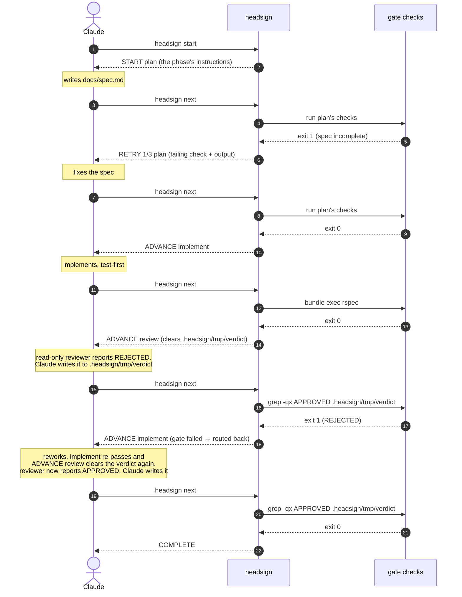
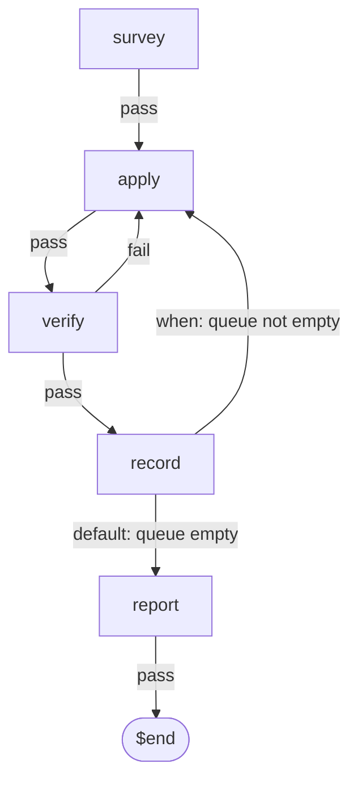

# Workflow reference

[日本語](workflow-reference.ja.md)

This page explains how to write a `.headsign/workflow.yaml` and what the CLI does with
it.

Read the [README](../README.md) before you adopt headsign. Keep this page open while
you write a workflow. The plugin includes the discipline that an agent
follows *during* a run, in [plugin/skills/workflow/SKILL.md](../plugin/skills/workflow/SKILL.md). The internals are in
[architecture.md](architecture.md), with the reasoning behind each decision in [the ADRs](adr/README.md).

This page explains to a person how to write and run a workflow. The plugin
does not include this page. It includes the excerpt that an agent reads when
it writes a workflow in the [`design-workflow` skill](../plugin/skills/design-workflow/SKILL.md) and its [schema reference](../plugin/skills/design-workflow/references/schema.md)
([ADR-0020](adr/0020-writing-the-workflow-as-its-own-skill.md)).

## Enabling the plugin for a whole repository

The two commands in the [README](../README.md#install) install the plugin for one person. A
repository can declare it for every user in a `.claude/settings.json` committed with
the code:

```json
{
  "extraKnownMarketplaces": {
    "headsign": {
      "source": { "source": "github", "repo": "meganemura/headsign" }
    }
  },
  "enabledPlugins": { "headsign@headsign": true }
}
```

In `extraKnownMarketplaces`, a repository names a plugin source that its members need.
The schema describes it as "Additional marketplaces to make available for
this repository. Typically used in repository .claude/settings.json to
ensure team members have required plugin sources". The key `headsign` is
the marketplace's name, from [`.claude-plugin/marketplace.json`](../.claude-plugin/marketplace.json), and its `source` gives
its location. `enabledPlugins` uses `plugin@marketplace` as its key. Thus,
`headsign@headsign` identifies the plugin named `headsign` inside the
marketplace named `headsign`. The plugin name comes from [`plugin/.claude-plugin/plugin.json`](../plugin/.claude-plugin/plugin.json).
Both names use the same word because this project ships one plugin. The
format does not require matching names.

Those two keys belong to Claude Code, so this section describes what the
file *declares*. Claude Code's documentation describes how Claude Code
handles that declaration. That documentation stays current when the schema
changes. This page ships nowhere, but the README remains in npm caches and
forks. Therefore, this page contains the parts that can change.

**Pinning.** A marketplace `source` also takes a `ref`, which
is a branch or a tag. A team can point it at a release tag to give every
member one version. If the team omits it, the source uses the default
branch:

```json
{
  "extraKnownMarketplaces": {
    "headsign": {
      "source": {
        "source": "github",
        "repo": "meganemura/headsign",
        "ref": "v0.4.0"
      }
    }
  },
  "enabledPlugins": { "headsign@headsign": true }
}
```

The pin gives the whole team one gate behaviour. The workflow schema is
pre-1.0 and rejects each key that it does not define ([ADR-0015](adr/0015-strict-schema-and-version-0-1.md)).
Without a pin, one copy can run a workflow that another copy refuses to
validate. That harness difference then becomes a work difference.

Someone must move the pin, and a stale pin is invisible. Nothing looks wrong
until a workflow uses something that the pinned version does not have. The
result appears as "headsign is broken" instead of "we are three releases
behind". The same entry also has an `autoUpdate` flag. A pin and an
auto-update answer the same question in opposite directions. A repository
should set one of them deliberately instead of inheriting its current value.

**Opting out.** Settings precedence is user < project < local. Thus, the
person's own `.claude/settings.local.json` in the same repository overrides a project
setting:

```json
{ "enabledPlugins": { "headsign@headsign": false } }
```

That file belongs to one person, while the repository commits the project
file. Thus, opting out is local and leaves the repository's declaration
unchanged. A project can declare the plugin, but it cannot make anyone keep
it. This is the same boundary as [headsign not forcing anyone to use it](../README.md#what-headsign-is-not), one layer down.

**Updates.** Declaring a version and having it are two separate events. The
distribution map in [maintenance.md](maintenance.md) describes the publishing side.
Third-party marketplaces disable auto-update by default, and users run the
update themselves. Thus, moving the `ref` in the committed file
starts the update but does not finish it.

Concluding it takes one command under Claude Code, and it wants the
qualified name:

```
claude plugin update headsign@headsign
```

Under Codex it takes two, and the first one is the one nobody guesses:

```
codex plugin marketplace upgrade
codex plugin add headsign@headsign
```

`codex plugin add` installs from a marketplace snapshot that Codex keeps on
disk. If you run it alone, it installs the version in that snapshot again.
It cannot see a release published after Codex created the snapshot. The
command then succeeds and changes nothing. `marketplace upgrade` refreshes the
snapshot, and `add` can then find the new version.

The bare `claude plugin update headsign` answers `Plugin "headsign" not found`. `update` resolves the
value that `claude plugin list` prints. The command prints the `plugin@marketplace`
pair. This is the form that [Enabling the plugin for a whole repository](#enabling-the-plugin-for-a-whole-repository) explains for `enabledPlugins`.
Inside a session, `/plugin` reaches the same operation through a menu.

In either case, the host does not use the fetched copy until it restarts.
Thus, applying an update is a third event after declaring and having the
update. Before the restart, `headsign version` still reports the older copy that
is running. The command reports the version for each host. Two hosts on one
machine can disagree until both restart.

**The version a project pins is not the version a run uses.** An installed
plugin copy is version-scoped: one directory per version, and
[maintenance.md](maintenance.md#live-patching-an-installed-plugin-local-testing)
gives the path. A project that moves to a new release does not change what an
older installed copy does until that copy updates. The committed
file says which version the team wants; the copy on the machine is what
`headsign next` on that machine actually runs. When a report comes in that a
fix is not there, or that a gate behaves differently for one person,
establish the version in play before reading the workflow file and before
reading the gate. `headsign version` — or `headsign --version`, which prints the same
thing — answers that from the copy that is actually running. The build bakes
the number into the bundle instead of reading it from `package.json`. A copy
cached from the plugin marketplace does not have that file above it.
[ADR-0002](adr/0002-single-question-and-output-contract.md) explains why and
how the build keeps the two values in step. Two older
answers are still worth having, because they answer a different question:
*where* the copy is and which channel it came from. That question tells two
installed copies apart. The version directory identifies an installed plugin
copy, and `npm ls headsign` reports a CLI installed from npm.

**What this repository does not do.** headsign itself has no committed
`.claude/settings.json` enabling the headsign plugin, deliberately. Working on
headsign means running the CLI you are editing — `node plugin/dist/headsign.mjs`, built from
`src/` — against this repository's own workflows in `.headsign/`.
Enabling the released plugin here would put the previous version in the
driver's seat while the next one is being written. Every surprise would then
have two candidate causes: the change just made, or the copy running the
gate. That is the distinction between a project that *uses* headsign and
the project that *is* headsign. The first wants a pinned, released version,
the same one for everyone, and everything above applies to it. For the
second, the absence of the file is the setting.

## Using without the plugin

The plugin is one headsign package for Claude Code. The CLI provides gate
judgment, state, `PENDING`, locking, and logging. You can use the CLI from
any agent or a terminal. The plugin adds exactly two things: the `workflow`
skill and the stop-boundary hook backstop. Both have plugin-free equivalents
below.

**Install the CLI.** The bundle is committed, so there is nothing to build:

```
npm install -D headsign
npx headsign --help
```

**Teach your agent the discipline.** The skill provides instructions, not
machinery. This one rule carries most of the discipline for Cursor, a custom
harness, or a `CLAUDE.md`:

> After you work on the current phase, run `npx headsign next`. Obey the
> first line of the answer. To look without judging, run
> `npx headsign status`. Never end the run on anything but `COMPLETE`. To stop
> deliberately, run `npx headsign abort <reason>`.

The full discipline is in
[plugin/skills/workflow/SKILL.md](../plugin/skills/workflow/SKILL.md). Copy
the parts you need into your agent's rules. You can also install it as a
standalone skill with the GitHub CLI. This preview `gh` feature lets you
select the agent for the installation:

```
gh skill install meganemura/headsign workflow
```

Claude Code users can also put it in `.claude/skills/` as a project skill.
A skill obtained through any of these methods runs outside the plugin. It
cannot find the bundled CLI. Install the package as described above, and the
skill falls back to `npx headsign`.

**Optional: the backstop without the plugin.** Add this to
`.claude/settings.json`:

```json
{ "hooks": {
  "Stop": [ { "hooks": [
    { "type": "command", "command": "HS=\"${CLAUDE_PROJECT_DIR}/node_modules/.bin/headsign\"; [ -x \"$HS\" ] || HS=$(command -v headsign) || exit 0; command -v node >/dev/null 2>&1 || exit 0; exec \"$HS\" stop-hook" }
  ] } ],
  "SubagentStop": [ { "hooks": [
    { "type": "command", "command": "HS=\"${CLAUDE_PROJECT_DIR}/node_modules/.bin/headsign\"; [ -x \"$HS\" ] || HS=$(command -v headsign) || exit 0; command -v node >/dev/null 2>&1 || exit 0; exec \"$HS\" subagent-stop-hook" }
  ] } ]
} }
```

`Stop` covers the session. `SubagentStop` covers an agent to which the
session delegated the run (see [Multiple sessions](#multiple-sessions)).
Register only the first hook if you never delegate a run. Without a
`headsign claim`, the second hook never acts.

Each line looks for the project-local installation first, then for one on
`PATH`, then for `node`. The line **exits 0 without output the moment
one of those is missing**. Thus, the same `settings.json` is safe when
headsign was never installed and after you uninstall it.

The hook checks the interpreter separately because finding the CLI does not
mean that the hook can run it. `node_modules/.bin/headsign` is a symlink to
a `#!/usr/bin/env node` script. A version manager can provide node through a
shim that only an interactive shell configures. In that case, the script is
present and executable, but it still exits 127.

The plugin's hooks use this guard for the same reason (see
[ADR-0005](adr/0005-distribution-and-toolchain.md)). Both accept that a
missing CLI silently removes the backstop. The run then relies on the
agent's own `headsign next` calls. `exec` carries the hook's exit 2 back to
Claude Code, so keep it.

## Writing a workflow

A workflow is one YAML file that you commit to your repository:

```yaml
# .headsign/workflow.yaml
version: 0.1
name: feature-dev
entry: plan

phases:
  plan:
    description: Write the spec to docs/spec.md, including acceptance criteria.
    gate:
      checks:
        - name: spec exists
          run: "test -s docs/spec.md"
        - name: acceptance criteria present
          run: "grep -q '## Acceptance' docs/spec.md"
    on_pass: implement
    max_attempts: 3

  implement:
    description: Implement per the spec, test-first.
    gate:
      checks:
        - name: unit tests
          run: "bundle exec rspec"
          timeout: 300
    on_pass: review
    max_attempts: 5

  review:
    description: >
      Have a read-only reviewer subagent report APPROVED or REJECTED, then
      write that verdict yourself to .headsign/tmp/verdict.
    clear: [.headsign/tmp/verdict]
    ready: "test -f .headsign/tmp/verdict"
    gate:
      checks:
        - name: review approved
          run: "grep -qx APPROVED .headsign/tmp/verdict"
    on_pass: $end
    on_fail: implement     # rejection loops back
    max_attempts: 3        # three rejections → escalate to the human

limits:
  max_total_iterations: 20
```

The `run:` commands above are examples. Replace `bundle exec rspec` with the
command that your project uses (`npm test`, `pytest`, `go test ./...`, …).
A check is a shell command that headsign judges by its exit code.

> **Trust:** a workflow's `run:` commands are shell commands.
> `headsign next` executes them on your machine. This behavior matches
> a `Makefile` target or an npm `postinstall` script. Treat a
> `.headsign/workflow.yaml` from a repository you did not write as
> executable code. Read it before you run
> `headsign start` or `headsign next`. Do not run headsign in a repository
> that you do not trust. Apply the same care to `.headsign/state.json` and
> `.headsign/lock`. A cloned repository can contain a committed state file
> or lock. Therefore, treat a `.headsign/` you did not create as
> untrusted input, like the workflow. This limit also applies to a team.
> A change to `.headsign/` arrives in a teammate's PR and runs automatically
> in your loop. Give it the same weight as a change to CI configuration.

Then ask Claude to start the workflow. Claude runs `headsign start` and
works on the phase. It continues to call `headsign next` until the answer is
`COMPLETE`, or until `ESCALATE` returns the decision to you.

Ready-made workflows for several roles live in
[example.headsign/](../example.headsign/). The roles include TDD features,
bug fixing, docs, and releases.
Compare them with a workflow you drafted to see how a
finished one handles the same phase.

### Run state, and where headsign looks for it

Run state lives in `.headsign/state.json` (auto-gitignored). All state is
external, so the loop survives context compaction. Run `headsign next` to
recover.

`headsign start`, `next`, and `abort` resolve `.headsign/` in the current
directory only. They never search parent directories. Run them from the repo
or git-worktree root. Each worktree then keeps its own independent run. The
stop-boundary hooks are the exceptions. They walk up to find the run's
`.headsign/`, within the worktree root. Thus, the backstop still fires when
a turn ends in a subdirectory. The walk only goes up. It stops at the first
enclosing `.git`, or at the filesystem root if none exists. The hook cannot
find a run from a directory *above* it, such as a monorepo root. It also
cannot find a run from *another checkout entirely*, such as a sibling clone
or a docs repository. The walk stops at that repository's root.

If the first walk finds nothing, the hook tries once more from Claude Code's
`CLAUDE_PROJECT_DIR`. The second walk has the same bounds. This variable
names the session's project root, regardless of where its cwd has moved. The
hook writes one line and lets the turn end only for a run that this session
last moved, or that nobody has moved yet. The turn is unheld but not
silent. `.headsign/log` gets an `unheld`
line marked `by=CLAUDE_PROJECT_DIR`. The `last stop:` line from
`headsign status` names the same reason. Its wording differs from Claude
Code's own already-continuing flag. This fallback handles a common problem.
The session started outside the run's git boundary or used `cd` to leave it.
However, it remained inside the project that Claude Code supplied.

The hook silently passes over a run that somebody *else* last moved. The
first walk would also pass over that run. An `unheld` line records a turn
end. A run has no use for a line from a session that never drove it.
[ADR-0027](adr/0027-recording-who-drove-a-run.md) stops giving bystanders
two types of `unheld` lines. This line is the second type. Without it, this
case looks like the fully silent case below. The `last moved:` line in
`headsign status` distinguishes them.

The fallback does not handle every case. `CLAUDE_PROJECT_DIR` names a root,
and the second walk only goes up from it. A run outside that upward path
remains unreached. The hook writes nothing at all: no log line and no
`last stop:`. This limit applies to a run *below* the root, such as a
package in a monorepo. It also applies to a run *beside* the root. One
example is a linked worktree outside the checkout, created with
`git worktree add ../wt-feature`. Neither run is upward from the root. The
hook also stays silent when the session's project has no run, regardless of
the session's location. Another case was never silent, and this change does
not alter it. The session can enter a checkout that runs its *own* headsign
workflow. The first walk then finds that run and gives a correctly formatted
nudge about the wrong run. `headsign status` cannot distinguish the two
runs. You must know where the session was standing.

Only some sessions can reach these locations. The `cwd` in the hook's
payload follows a `cd` made during a turn. This behavior was measured on
2026-08-01. Claude Code refuses a `cd` outside the session's **allowed
working directories**. The refusal names those directories. Thus, a session
confined to one directory cannot leave it. A session needs more than one
directory to reach another checkout. The user can add the second directory
at startup or later. This setup commonly lets one session work across a
project and a nearby notes repository. `CLAUDE_PROJECT_DIR` determines
whether the turn's evidence explains what happened. If the fallback reached
the run, `last stop:` says so. Otherwise, no evidence distinguishes this
case from an uninstalled backstop. However, `headsign status` in the run's
directory still shows the preceding stop. One nudge anywhere in the run
proves that the hook is wired. Keep the session in the workflow's directory
or below. If a turn ends unheld without an explanation, find where the
session stood when it ended. Then check which case `last stop:` names. The
fallback has limited scope. The reasons for this scope and for documenting
the behavior are in [ADR-0006](adr/0006-stop-hook-backstop.md)'s
bounded-walk-up section and [ADR-0026](adr/0026-a-second-place-to-look.md).

### What a run folds away, and what outlives it

A run has bounds. A workflow author must know these bounds when choosing
where to store data.

**Folded away when `start` runs.** `.headsign/tmp/` is run-scoped scratch:
`start` deletes all of it and creates an empty directory. This run cannot
read anything that a previous run left there. A phase's `clear:` removes its
listed files on every entry. Nothing else resets either location. Use `tmp/`
for anything that must be new in each run. For example, the entry phase can
create an identifier. The workflow does not need to make that identifier new
for each run.

**Kept, and growing.** Everything that a workflow writes outside `tmp/`
outlives the run that wrote it. This persistence makes the data an artifact
rather than scratch. `.headsign/log` also persists, and headsign only
appends to it. `start` does not clear it. Thus, a new run's first line
follows the old run's last line.

**Per run, not per tree.** `limits.max_total_iterations` counts this run's
laps. `start` sets the count to zero. A second run over the same tree gets a
fresh allowance. A phase's `max_attempts` also starts over. **headsign
supports many sequential workflow runs over one tree. It does not support
two concurrent runs over one tree.** headsign enforces the limit on
concurrent runs. `start` will not overwrite a `running` state. It exits 3
and tells you to use `next` or `abort` first. The next `start` overwrites an
ended run without complaint. No cumulative bound applies across runs. This
behavior is a decision rather than an omission. No ceiling counts across
runs, and nothing limits how many times you can start one. A ceiling bounds
one walk only. It never bounds all work in a directory.

To bound the whole job, make the workflow count it. A check can read a tally
from a location that the run cannot remove. The tally must be outside
`.headsign/tmp/`. For work that arrives in instalments, ask one question:
**does the next lap need to see the previous lap's attempt counts and
working files?** If yes, use a loop inside one run. The loop keeps one
budget, one log, and one set of round numbers. If each instalment can be
judged independently, start again to carry less state.

**What `abort` costs.** It ends the run. The current phase, attempt counts,
and graph position all disappear. No later command resumes the run. `abort`
costs nothing else. `state.json` is gitignored, so the repository's tracked
files stay exactly as they were. headsign appends the reason from
`headsign abort <reason>` to `.headsign/log`. The reason outlives the run.
headsign leaves existing artifacts untouched, and committed artifacts are
safe by definition. A later `headsign start` rewrites all of `state.json`
and begins at the entry phase. It inherits only the log from the aborted
run. Before you abort, ask *how much walking will it cost to get back here*.
The answer depends on the cost of passing the workflow's early gates again.
[The contract](#the-contract) explains why you should keep these gates
cheap.

### One worktree, one run

**One worktree, one run** defines all of headsign's worktree support. A
linked worktree keeps its `state.json`, lock, and log in its own
`.headsign/`. headsign writes nothing under the shared `.git` directory.
Thus, two worktrees from one repository can each drive a loop at their own
phase. Neither loop disturbs the other. Everything beyond this behavior is
out of scope. Worktrees never share run state. headsign does not coordinate
their runs or combine them into one view. A run belongs to its starting
directory.

### Fanning out, and joining back

You can use this property to build a fan-out on top of headsign, and
headsign gains no feature for it.
[example.headsign/fan-out.yaml](../example.headsign/fan-out.yaml) shows the
structure. A `split` phase has a `description` that tells the agent to
divide the work into independent items. The agent uses `git worktree add` to
create one worktree for each item. It runs `headsign start` inside each
worktree. A `gather` phase waits for those child runs. An `integrate` phase
merges the results and removes the worktrees.

headsign does less here than the structure suggests. It does not start the
child runs, create their worktrees, or wait for them. headsign never learns
that they exist. The fan-out occurs because the phase's `description` tells
the agent to create it. This description is an instruction like "use the
`/foo` skill" or "have a reviewer subagent check it", as described in
[Instructions vs. the gate](#instructions-vs-the-gate). The description is
the plan, and headsign enforces only the gate. The parent run still performs
exactly one phase at a time. Parallel work occurs one layer below it, where
headsign cannot see it. Only the parent's gate evaluations count toward the
parent's attempts and iteration ceiling. The agent creates and removes the
worktrees from the beginning to the end. headsign can work in a
worktree without *managing* worktrees.

headsign adds only the join. One shell command answers "are they all in?".
`gather` asks two separate questions, which is the part to copy. Its
`ready:` asks whether every child has reached a terminal state. While any
child is still `RUNNING`, `next` answers `PENDING` and spends no attempt.
Waiting costs nothing and does not indicate a failure. The gate then asks
whether every child is `COMPLETE`. If one is not, `on_fail: escalate` gives
the run to a person. A child already represents somebody's decision if it
escalated or was aborted. Both checks use `headsign status` to read the
children. Its first
line provides the documented `RUNNING` / `COMPLETE` / `ESCALATED` /
`ABORTED` contract. The checks do not read a child's `state.json`.

Orchestrators provide joining modes for all children, any child, or a quorum
of N. headsign does not need settings for these strategies. Each strategy
uses this loop with a different test. The comments in `fan-out.yaml` show
all three strategies. This is also why
[ADR-0003](adr/0003-workflow-yaml-vocabulary.md)'s refusal of `needs:` and
DAG parallelism still stands. One layer above headsign expresses what the
DAG would express, and keeping that expression there stops headsign from
growing into the orchestrator it declines to be.

## Instructions vs. the gate

A phase's `description` tells the agent what to do in that
phase. It can include "use the `/foo` skill" or "have a read-only
reviewer subagent check it". headsign gives it to Claude without changes.
A workflow *choreographs* skills and subagent work into a gated sequence.
It does not *orchestrate* them, and it never forces which skill the agent
uses. headsign
enforces only the gate. The checks' exit codes are the only verification
of the result. To require a skill, gate its output (e.g. `grep` the file
that skill produces). A review/soft-gate phase should list its verdict file
(e.g. `.headsign/tmp/verdict`) under that phase's `clear:`. This prevents a
verdict from a previous pass from becoming the current verdict. headsign
deletes the file on entry. Claude writes a new file after the read-only
reviewer subagent reports its verdict. **`clear:` removes files, not
directories.** An entry that turns out to be a directory stays where it is.
On entry, a `not cleared:` line names it and says so. Thus, a
phase that expected an empty tree learns about the directory the first time
it enters. The phase does not discover it several runs later.
`headsign validate` gives an earlier warning for an entry with a trailing
slash. This
is the only form of the mistake that `validate` can find without reading a
filesystem. A workflow can remove a directory as part of the phase's work.
The workflow can state this intent there. It does not use a field that
silently deletes the directory each time the phase starts. When judgment
must stay outside the working agent's control, make the check the judge.
For example,
`claude -p '… Reply exactly APPROVED or REJECTED.' | grep -qx APPROVED`
keeps the transition deterministic while the pen changes hands.
See the trade-offs in [ADR-0007](adr/0007-verdict-authorship.md).

A phase is only as meaningful as what its gate can check in shell. A test
gate proves that nothing broke. It does not prove that the feature is done.
A review gate judges whether the feature is done. The example workflow uses
both gates. A shell command cannot judge a design call or a UX decision.
Split such work into units that a check can verify, or use a review-style
soft gate. Size each phase to what the gate can check. Do not size it to the
natural divisions in the work. A review phase is the agent's own review
discipline. It does not replace a human review of the resulting PR.

## How a run flows

Three roles run the loop. The agent (Claude) does the work and drives.
**headsign** runs the current phase's gate and returns a token. The
**checks** use ordinary shell, so the verdict is deterministic. Each turn,
Claude obeys the token. `RETRY` means fix the reported failure and ask
again. `ADVANCE` means move to the printed phase. A fail-route
(`gate failed → routed to …`) sends the work back. `COMPLETE` ends the run.
One pass through the example workflow follows:



A shell exit code controls every arrow from headsign, never the LLM's own
say-so. The stop-boundary
hooks (not shown) provide the backstop. If the driver tries to stop while
the run is `running`, the hooks direct it to `headsign next`.

## The contract

The contract has six commands. A driving session routinely uses one:

| Command | Role |
|---|---|
| `headsign start [name] [--workflow path]` | initialize state, print the entry phase's instructions |
| `headsign next` | **the only question a driving session asks.** Run the current gate, transition, answer |
| `headsign abort [reason]` | record a human-directed stop |
| `headsign validate [name] [--workflow path]` | static check of the workflow file |
| `headsign status` | read-only view of the current run, for a session that isn't driving it — see [Multiple sessions](#multiple-sessions) |
| `headsign claim` | hand driver ownership to a delegated agent via the `SubagentStop` hook — for delegating who drives a run; see [Multiple sessions](#multiple-sessions) |

Two more commands sit outside that contract. They give information about the
tool, not a run. `headsign version` prints the running copy's version and
nothing else. `--version` prints the same information. `headsign help`
prints the usage text. `-h`, `--help`, and a bare `headsign` print the same
text.
Both commands always exit 0. Neither is ever a verdict, so neither can be
mistaken for one.

Multiple workflows can live as separate files under `.headsign/` (one
workflow per file). Select one with `headsign start <name>` (→
`.headsign/<name>.yaml`). You can also pass `--workflow <path>` for an
explicit path. Ready-made examples cover several roles: TDD features, bug
fixing, docs, and releases. They live in
[example.headsign/](../example.headsign/). This repository runs headsign on
itself from its own `.headsign/`. That directory is separate from the
examples because its workflows use this project's paths and tools.

A bare `headsign validate` (no name, no `--workflow`) checks whichever
workflow the current run uses. This rule applies when
`.headsign/state.json` exists, regardless of its status. The command
validates that run's own `workflow_path`, not a fixed default file. Thus, validating a run
started with `headsign start <name>` checks the correct
`.headsign/<name>.yaml` without requiring the name again. With no run
present, the command uses `.headsign/workflow.yaml`, as before. An explicit
`<name>` or `--workflow <path>` always overrides both choices.

`validate` separates errors from **warnings**. An error identifies a
workflow that headsign refuses to run (exit 3). A warning goes to stderr,
and the command still exits 0. An unreachable phase from `entry` causes a
warning.
Thus, a half-written phase or a temporarily disabled edge does not stop the
current run. `start` also prints each warning once, while the file's author
is still present. `next` does not print the warnings because the driver asks
it every turn.

The other warning concerns how a run stops. When a phase set can cycle on
**pass** edges alone and no `limits.max_total_iterations` is declared,
nothing bounds the run. `max_attempts` counts a phase's failures since its last pass. A
loop on pass edges clears that count every lap. A sweep such as
[example.headsign/sweep.yaml](../example.headsign/sweep.yaml) has this form,
so it declares a ceiling. headsign does not warn about cycles that close
through a *failure* edge. The failing phase's `max_attempts` bounds those
([ADR-0022](adr/0022-validate-checks-that-a-run-can-end.md)).

A key that the schema does not define is an error at every file level. A
phase can declare `max_atempts: 3`. headsign then stops and prints
`phase 'implement': unknown key 'max_atempts' (allowed: description, clear,
ready, gate, on_pass, on_fail, max_attempts)`. headsign does not run that
phase without an attempt budget. Otherwise, it would silently skip the typo. The message lists the keys that the level
accepts. It gives no did-you-mean guess. The same thinking governs
`version:`, which must be exactly `0.1`. The pre-1.0 schema keeps
changing. headsign stops a file written for an older schema until its fields have
been read against the current schema, rather than loading it with whatever
still happens to fit
([ADR-0015](adr/0015-strict-schema-and-version-0-1.md)).

`next` prints a machine-readable first line, followed by instructions:

| First line | Exit | Meaning |
|---|---|---|
| `ADVANCE <phase>` | 0 | gate passed (or fail-routed) — new phase instructions follow |
| `RETRY n[/max] <phase>` | 1 | gate failed — failing check + output tail follow |
| `PENDING <phase>` | 1 | the gate can't be judged yet (`ready:`) — attempt not counted; do the work, then `next` again |
| `COMPLETE` | 0 | terminus |
| `ESCALATE <reason>` | 2 | human judgment needed |
| `ABORT <reason>` | 2 | run was aborted |

**`next` writes progress to stderr while the gate runs.** One line, before
the first check starts, names how many checks the gate holds. One more line
follows each check that finishes, naming which way it went:

```
--- gate: 12 checks ---
--- check 1/12 passed: typecheck (2.1s) ---
--- check 2/12 passed: tests (48.3s) ---
--- check 3/12 failed: acceptance matrix (3.2s) ---
```

The gate stops at the first failure, so at most one line says anything but
`passed`, and that line is last. The word is `passed`, `failed`, or
`timed out`. A check killed at its `timeout:` uses the last word. It does
not look like an ordinary failure that took the same time.

**When the elapsed time a line shows has reached half the check's own limit,
the line names that limit too.** Every check has a limit. The author can set
the `timeout:`. Otherwise, headsign uses its default of 120 seconds. Below
half, the line stays exactly as shown. At or past half, it adds a second
number:

```
--- check 5/12 passed: acceptance matrix (60.4s of 120s) ---
```

Nothing fails at the half mark, and nothing is bounded by it. The limit is
the workflow's own `timeout:`. The mark only decides when a duration is
worth reading against that limit. The line rounds the duration to a tenth of a
second. headsign uses that printed number for the comparison, so readers can
check the rule from the line. A check can have a very small `timeout:` and
an elapsed time that rounds to `0s`. That check stays below the mark,
regardless of how much of its limit it used. A `timed out` line always
includes the second number. A killed check reached its limit by definition.
The elapsed time is only a measurement rounded to a tenth of a second. For a
`timeout:` under a tenth of a second, that elapsed time can be `0s`. The
value is then below the half mark.

A check that produces no exit code gets no line. headsign refuses the lap
without spending an attempt. The refusal names the check and the command
that could not run. A check that the gate never reaches also gets no line.
In that case, an earlier check failed and stopped the loop. No flag enables
these lines. They serve a reader who did not expect a slow gate
([ADR-0032](adr/0032-the-gate-says-how-far-it-got.md)).

**A `next` killed inside the gate has spent nothing.** `step()` adds the
attempt only after the gate returns. An interrupted lap writes no attempt
and moves no phase. The lock also stays safe. `acquireLock` replaces a lock
when its holder process is gone. Thus, a killed `next` leaves nothing to
clean up.

**A gate failure that answers `RETRY`, or routes onward through `on_fail`,
says which of its checks it never reached.** Checks run in order. The gate
stops at the first failure, so later checks do not run. A failed lap
examines the fewest checks. This block names the result:
`--- 2 of 3 checks ran; 1 not run: deferrals tracked ---`. The retry and
routed-fail lines in
`.headsign/log` store the same count as `ran=2/3`. This record keeps the
answer available after the run ends. Neither form appears when the last
check fails. **A failure that exhausts `max_attempts` is the exception**. It
ends the run with an `ESCALATE` line that contains only its reason. Thus, a
phase with `max_attempts: 1` never gets this block on stdout. The count and
reached index still go to stderr while the gate runs. This happens on that
lap as on any other lap. The workflow file is still needed for one narrower thing: the *names* of
the checks that got no turn. No progress line names such a check. This detail is
most important when a loop stops on a failed lap. A later check might never
run during the entire walk. Without the detail, "it passed" and "it never
ran" produce the same silence.

**A `RETRY` says when it is the same failure again.** From the second
identical failure onward, the block adds a line that gives the streak
length. An identical failure has the same check, command, exit code, and
output as the previous lap. The closing advice also changes. It does not
say "fix the failure above", because the failure might not be fixable. The
advice gives
the two remaining explanations. Something changed, but this check does not
read it. Or nothing changed, so decide whether this gate can pass before you
spend the remaining attempts. The exhaustion reason says the same
thing, so three attempts against a moving target and three against an
unchanged one no longer arrive in identical words.

This information does not claim that a gate is unpassable. Checks use
arbitrary shell, so headsign cannot make that decision. The streak records
only what already happened. Until someone reads the check, an unpassable
gate looks like a gate that still needs a fix.

**A passing check's output is discarded.** Only the failing branch keeps
output, so the table connects output only to `RETRY`. A check that exits 0
loses its stdout and stderr. Nothing records what it said. This rule matters
most for **a check that passes because it had nothing to examine.** "All
thirty-five subjects were correct" and "there were no subjects" have the
same exit code. The record also gives them the same line. Writing the count
to stdout does not help because headsign drops that output. If a check can
pass vacuously, make it write what it examined where a later check reads it.
Use a file under `.headsign/tmp/` for something this run uses. Use a tracked
artifact when the number is part of the run's result. The gate then checks
the count. It can fail when the check examined nothing.

Exit 3 is a configuration/usage error. This includes a check or a `ready:`
probe that **could not be run at all**. The command either never started, or
headsign had to kill it before completion. This event is not a gate failure.
headsign received no exit code, so it has no verdict. The lap moves nothing:
no attempt, no iteration, and no state written. Fix the command and ask
again
([ADR-0021](adr/0021-a-command-that-never-ran-is-not-an-answer.md)). A check
that runs and *times out* causes an ordinary failure instead. It ran past a
limit that you wrote. `next` is idempotent on finished runs. On a running
run, it judges the gate. It does not provide a read-only view. A gate
failure spends an attempt. If the phase's `ready:` probe has not passed,
the CLI answers `PENDING` before the gate runs. This result spends nothing.
Thus, the driving session has a two-command rule: **did work
→ `next`; want to look → `status`**. You can call `status` as often
as you like (see [Multiple sessions](#multiple-sessions)).

### Routing (workflow.yaml)

| Field | Values | Default |
|---|---|---|
| `on_pass` | phase name, `$end`, or a list of `when:`/`to:` routes — see [The router pattern](#the-router-pattern) | — (required) |
| `on_fail` | `retry`, phase name, `$end`, `escalate` | `retry` |
| `max_attempts` | positive int; counts failures of this phase since it last passed. Running out always answers `ESCALATE` | unlimited |
| `limits.max_total_iterations` | positive int; global runaway backstop. Reaching it answers `ESCALATE` but does **not** end the run — see below | none |

Checks use the familiar CI fields `- name:` / `run:` / `timeout:`.
headsign runs them with `/bin/sh -c`. The first failure stops the gate.
Every command that headsign runs inherits its environment. A check that needs a variable
sets it in its own `run:` string (`run: "FOO=bar npm test"`), the same way
you would at a prompt. headsign always sets one variable:
`HEADSIGN_WORKFLOW_FILE`, under
[Environment variables](#environment-variables) below. headsign deliberately
omits `needs:`, `${{ }}`, matrices, triggers,
and a per-phase `env:`. A route's `when:` is a shell command, not an `if:`
expression, so every routing decision is an exit code selecting one of the
destinations that you wrote.

The inherited environment has a trap on macOS. There, `/bin/sh` is bash
3.2. In this shell, a problem occurs when a non-ASCII character immediately
follows a variable in a `run:` string (`"$now→"`, not `"$now foo"`). The
variable expands to nothing. The shell also removes the leading byte of the
next character. The rest of the command then receives a corrupted string.
This problem does not apply only to Japanese text or full-width
punctuation. Any non-ASCII character after an unbraced variable can trigger
it, including accented letters, arrows, and emoji. Only that one character
is at risk. Non-ASCII text elsewhere in the string expands correctly. This
includes text immediately before the variable. The problem depends on the
shell and locale. `zsh` and `dash` expand the same input correctly, and
`LC_ALL=C` prevents the problem. The `LANG` under which you run headsign
therefore matters because checks inherit it with the rest of the
environment. Bracing the variable (`${now}`) avoids the problem in every
case tested (measured, 2026-08-01). headsign does not force a locale because
that would change how all check commands handle multi-byte output. The
change would not apply only to the command that has this problem.

A gate or budget cannot end a run as `ABORT`. A failure route can say
`escalate` (stop and ask a person), but it can never say "stop". Exhausting
`max_attempts` always escalates. `ABORT` comes from
`headsign abort <reason>`, which is a person's decision and records their
reason. Thus, a
person always ends an aborted run on purpose.

**Two of the four ways a run reaches `ESCALATE` end it; the ceiling and a
changed graph do not.** Two events mean that the agent cannot satisfy a
gate. They are exhausting a phase's `max_attempts` and taking an
`on_fail: escalate` route. Both events end the run permanently. The other
two events leave the run `running` and wait for an answer. One is a changed
graph
([The graph a run is walking under](#the-graph-a-run-is-walking-under)).
The other is the ceiling below. Reaching `limits.max_total_iterations`
means that the run is bigger than the number someone typed. The run can
still be correct. headsign answers `ESCALATE` (exit 2, a person is being
asked) but leaves the run `running`. Its message explains how to answer:

```
$ headsign next
ESCALATE build: max_total_iterations (15) reached — the run is still open: raise limits.max_total_iterations in .headsign/workflow.yaml and run `headsign next` to continue from this phase, or run `headsign abort <reason>` to end it
Human judgment needed. Report the situation to the user and ask for instructions.
```

Raise the number in the workflow file. Then `headsign next` resumes the run
at the same phase. It preserves the attempts and `.headsign/tmp/`. If the
run is not worth more laps, `headsign abort <reason>` ends it. The check
runs before the gate. Therefore, repeated requests at this wall spend no
iteration or attempt. The runaway protection stays unchanged, and
`headsign status` still reports `RUNNING`
([ADR-0017](adr/0017-three-budgets-and-the-recoverable-ceiling.md)).
The run is unfinished, so the stop-boundary hook nudges its driver back to
`headsign next`. Before an agent reports the ceiling and stops, it should
write its pause note (see [The backstop](#the-backstop)).

The three budgets have one property in common. headsign can count each one
inside one `next` without asking anyone. headsign cannot count tokens or
money. It never runs the model, so it never sees a turn's cost. This is a
layer boundary. Those numbers belong to your harness where they exist. A
check can read them if you connect it. This connection couples your
workflow to one vendor's interface. Wall-clock time is the one headsign *could* count, because `.headsign/log`
timestamps every transition, and it deliberately does not. A slow run is not a wrong run, and the loop spends laps.

Two `on_fail` values have different effects. `retry` keeps
the run in its current phase. The phase name sends the run out of the phase
and back into it. Re-entry runs all phase entry actions:

| | `on_fail: retry` | `on_fail: <this phase>` |
|---|---|---|
| Meaning | stay | leave, then re-enter |
| `clear:` | not run | runs |
| Answer token | `RETRY` | `ADVANCE` |

A self-route deletes the artifacts that the phase lists under `clear:`.
`retry` leaves them where the work left them. Use a self-route when the
phase must re-enter fresh, such as when it must discard a stale review
verdict. Use `retry` when the agent must continue work on the same failure.

### The router pattern

Some phases decide where the work should go. They read the request and send
it to the applicable phase.
Write that with a list-form `on_pass`. Each entry has a `when:` (a shell
command) and a `to:`. The last entry has no `when:` and is the default. A
complete one ships as
[example.headsign/router.yaml](../example.headsign/router.yaml); the shape
is:

```yaml
  classify:
    description: >
      Read the request and write exactly one of fix-bug, write-docs, or
      implement to .headsign/tmp/route.
    clear: [.headsign/tmp/route]
    ready: "test -s .headsign/tmp/route"
    gate:
      checks:
        - name: the route names a kind this workflow knows
          run: "grep -qx -e fix-bug -e write-docs -e implement .headsign/tmp/route"
    on_pass:
      - when: "grep -qx fix-bug .headsign/tmp/route"
        to: fix-bug
      - when: "grep -qx write-docs .headsign/tmp/route"
        to: write-docs
      - to: implement          # no when: — the default, and always last
```

The complete rules follow:

- Routes are resolved **after** the gate passes, and never on the failure
  path. A router phase whose own gate fails is an ordinary failing phase.
- The `when:` commands run in order, and the **first one to exit 0** wins.
  If none matches, the last entry's `to:` is used.
- `when:` takes an optional `timeout:` (seconds, default 120) and runs in
  headsign's own environment — the same treatment a check gets.
- `to:` names a phase or `$end`.
- `validate` rejects a list whose last entry has a `when:`, because the list
  would have no default. It also rejects a list whose earlier entry lacks
  one, because every entry after it would be unreachable.
- If a `when:` **can't be run at all** — it fails to spawn, or times out
  —
  headsign stops with exit 3 and makes no transition. It does not use the
  default. A non-zero exit answers "not this one." A command that never ran
  gives no answer about where the run goes next.

An `ADVANCE` reached this way gains one line that names the selected route.
For example, that line can be
`--- routed: when "grep -qx fix-bug .headsign/tmp/route" → fix-bug ---`
or
`--- routed: default → implement ---`. The transition's `.headsign/log`
entry records the same information. Thus, the run history explains the
route. A route to `$end` ends the run with the usual `COMPLETE`. A plain
string `on_pass` prints and logs exactly what it always did.

**The judgment is the agent's; the transition is headsign's.** The agent
decides by writing a file; headsign decides by running the commands you
wrote and reading their exit codes. headsign never takes a phase name from
the agent's output or that file. The agent's text can select only a
destination that the workflow file declares. It cannot name another
destination. Unexpected file content lands on the default, or fails the phase's gate
first if you check the file's shape there, as the example does.

**Keep `when:` a cheap predicate, and keep it free of side effects.**
Routes run on the success path — the fast path through your workflow —
and several routes can run before one matches. Put expensive or
consequential work in the gate. The gate runs once and reports what failed.
Routes should only read the cheap artifact that the gate already checked.

### Async review (when review takes a while)

A review phase's gate often depends on a slower task.
A reviewer subagent can still read the diff, or a human can inspect a PR.
Without `ready:`, calling `next` before the verdict exists spends a counted
attempt on a gate with nothing to judge. The phase's verdict file is also
listed under `clear:` (recommended above). Thus, the next re-entry after an
early call can discard a verdict that arrives moments later. This silently
loses a real review. Give the phase a `ready:` probe (e.g.
`test -f .headsign/tmp/verdict`). An early `next` then answers `PENDING`. It
spends no attempt, does not run `clear:`, and preserves the verdict for the
`next` that finds it.

### The backstop

Skills are instructions, not guarantees. Two stop-boundary hooks read
`.headsign/state.json`. While a run is `running`, the hook for the run's
**driver** blocks that turn from ending. It points the driver back to
`headsign next`. A turn that is not the driver's passes through. One exception
applies while a `claim` marker is armed. The first delegated agent that
stops and can name itself becomes the new driver (see
[Multiple sessions](#multiple-sessions)). Escalated, aborted, and completed
runs also pass through because those are correct endings.

Which turns those are depends on whether anyone has claimed the run, and
the two hooks answer an unclaimed one in opposite directions, on purpose.
`Stop` nudges the session that `last_drive` records. It does not use the
identity of the session that stopped in the run's directory. The recorded
session is held, and any other session passes. A run with no recorded
session nudges the session that stops. Missing the real driver is worse
than one stray reminder (see [Multiple sessions](#multiple-sessions) for
both halves). `SubagentStop` passes because most nearby delegated agents
are reviewers and workers with no role in the run. Holding one of them is
worse than a missed reminder.

After `headsign claim` seats a run's driver, headsign records an agent
identifier. `Stop` then passes every session because no session can be that
agent. `SubagentStop` holds only that agent. Before a run is claimed, `Stop`
makes one session-identifier comparison. If `last_drive` names a session,
it compares the payload's identifier and passes on a mismatch. See
[Multiple sessions](#multiple-sessions).

Two hooks handle the two ways that a turn can end. `Stop` fires when a
session's turn ends. `SubagentStop` fires when a delegated agent's turn
ends. A delegated agent never fires `Stop`. Without the second hook, it
would have no backstop. The run would also keep pushing the session that
only spawned it (see
[Multiple sessions](#multiple-sessions)).

**To pause deliberately**, write one line to `.headsign/tmp/stop-note`
naming what you are waiting for, and stop again. The hook passes immediately
and does not nudge. It leaves a `paused` line in `.headsign/log` to record
the pause.

**Naming the thing is the check.** You can answer "Why are you stopping" by
describing yourself. Such a note reports only the run's position and names
nothing that it waits for. It shows that the run could continue but stopped.
"What are you waiting for" requires a specific answer. Name a delegate, a
person, or a build. If you cannot name one, keep going. This answer also
makes the record readable because the log contains the note's first line. A
pause that names its blocker differs from one that does not. headsign
consumes (deletes) the note when it reads it. The working tree then returns
to exactly its previous state. Thus, the pause costs the run nothing and
preserves the phase's artifacts. The log receives the note's first line, cut
to 120 characters. It adds a trailing `…` when the cut version is not the
complete note. Thus, readers cannot mistake a truncated line for a complete
line. One note covers one turn end. A wait across several exchanges needs a
new note before each turn ends. Tomorrow, `headsign next` resumes the run at
the same phase and judges its gate, like any `next`. The other exit is
`headsign abort <reason>`. It is permanent, not a pause. The run cannot
resume. A fresh `headsign start` begins at the entry phase and replays every
phase's gate. headsign rewrites all of `state.json`, but it does not
rewrite `.headsign/log`. It keeps your reason and all earlier log entries
([reading the log](#reading-the-log) has the mechanism). Deliberately ending
a run costs the run, but it preserves the history. The workflow must make
that replay cheap; headsign does not do this for you. Write early phase
gates as fast, idempotent checks (does a file exist, does lint pass) rather
than checks with real side effects or long, unrepeatable work. A fresh start
after an abort then costs almost nothing. This property also helps every
turn because each `next` runs the gate again. Slow or non-idempotent early
gates make re-runs expensive. The workflow author must manage this cost by
writing cheap gates. headsign cannot absorb the cost.

The hook pushes back when the driver stops *without* a note. It fails open
after 5 consecutive nudges and never traps a session. Three events show
that someone is still steering and reset the count. They are a real
evaluation, a consumed note, and a sealed claim. Each nudge adds a `held`
line to `.headsign/log` with the count that it spent (`nudges=3`). The 5th
nudge writes a `stalled` line instead of that `held` line. Each turn end
therefore writes one line. The `stalled` line's `nudges=5` records both the
fifth hold and the point when the cap tripped. Each later stop passes
silently and writes nothing. The cap protects against a stuck or silently
departed agent. Use the note above as the normal pause method. To identify
an unattended stall from outside:
`headsign status` (read-only, safe to run from any session — see
[Multiple sessions](#multiple-sessions)) reports `RUNNING`, and
`.headsign/log`'s tail shows `stalled`, or `status`'s own `last stop:` line
reads `not held — the nudge cap is spent`. Either result, beside `RUNNING`,
means that the driving agent left without a note. Use these
results instead of `.headsign/state.json`. Every real `headsign next`
resets the counter behind the cap. Thus, the counter gives little
information for an active run. Re-drive the run with `headsign next` from
the session that is driving it.

A turn end also passes when Claude Code has **already resumed** the turn it
belongs to. When the hook holds a turn, Claude Code flags the continuation.
It sends `stop_hook_active` in the hook input when that turn ends. headsign
then stands down and never blocks the ending. It also spends no one-shot
item. Thus, a pause note and an armed `claim` marker both remain untouched.
A nudge therefore arrives approximately once per exchange instead of once
per turn end. The window lasts for one turn and closes when the turn ends.
This mechanism differs from the nudge cap, although both have the same
visible result. Their records identify the mechanism. A spent cap has a
`stalled` line. An overruled turn end leaves an `unheld` line in
`.headsign/log` and names the supplied field as `by=stop_hook_active`. It
also leaves a `last stop:` line in `headsign status`. Both writes are
best-effort. headsign skips them while the run's lock is held. Therefore, a
*missing* `unheld` line does not prove that the hook did not run. The
overruled hold also leaves its own line. Read an `unheld` line with the line
before it ([reading the log](#reading-the-log)).

### The graph a run is walking under

`next` reads the workflow file again on every lap. You can therefore edit it
during a run. You can raise a ceiling or improve an earlier phase. headsign
reports the change.

At `start`, a run records a fingerprint of the **rules** it is walking
under. These rules include every phase it can reach from its current
position, plus `limits`. The rules exclude instructions, so the fingerprint
deliberately leaves out a phase's `description`. Rewriting the agent's
instructions is therefore invisible to the fingerprint. It includes `gate`,
`ready`, `clear`, `on_pass`, `on_fail` and `max_attempts`. (`clear:` counts
as a rule because dropping it lets a stale `APPROVED` verdict pass a review
gate.) The fingerprint also ignores comments and formatting. It represents
the parsed file rather than its bytes.

**The pin ends at the file.** The rules include and pin a check's `run:`
string. They do not include anything that the string executes. A gate with
`run: "sh checks/coverage.sh"` pins those five words. If you edit
`checks/coverage.sh` to reverse its verdict, you change the gate's decision.
The fingerprint stays unchanged, so the next lap uses the new rule and
reports nothing. More effort cannot close this gap. `run:` is an arbitrary
shell string, so headsign cannot know what a command will read. A driver
must therefore account for this limit: **editing a script a gate calls,
mid-run, is changing the rules under the run**. Edits to the workflow file
get a report, but this edit gets none. To record that change, abort and
start again. A restart does not cost the artifacts already written (see
[what a run folds away](#what-a-run-folds-away-and-what-outlives-it)).

When a lap finds changed rules, it reports them once with an `ESCALATE`.
This report leaves the run `running`, spends no attempt or iteration, and
names the phases that moved. You then have two ways forward:

- **put the file back**. The next `next` matches the fingerprint again, says
  nothing, and costs nothing. Restoring is free;
- **run `headsign next --accept-graph-change`**. This command accepts the
  change and continues the run. headsign counts each accepted change, and
  `COMPLETE` gives the total. `.headsign/log` is gitignored and never
  reaches a pull request. The person who receives the report reads the final
  answer.

**`headsign status` answers for the file, not only for the record.** A
difference reaches `state.json` only after a lap reports it. Between an edit
and the next `headsign next`, the record has no information about the edit.
`status` closes this window. It hashes the rules on disk while reading them
and compares the hash with the pin. It prints a `graph:` line in the two
cases where the file says something the record does not:

```
graph: the file no longer matches the rules this run pinned — `headsign next` will report it before it runs the gate
graph: the file matches the rules this run pinned again — `headsign next` will clear the line above and cost nothing
```

The first line identifies an edit that no lap has seen. The second
identifies a restored file while a report remains. Only this case shows the
free, silent restore before you run anything. When the file and record
agree, neither line appears. The output remains byte-identical to its
previous form. The file differs from the pin exactly when one of two lines
appears. One line is `graph: the file no longer matches …`. The other is
`graph: changed since this run accepted it …` without
`graph: the file matches … again` below it. Also read the `--- phase: ---`
block. This block is absent when headsign cannot read the workflow. Without
a readable file, `status` has nothing to compare and does not guess. The
comparison runs no gate and starts no process. It also writes nothing and
takes no lock. Thus, `status` stays a look
([ADR-0029](adr/0029-status-answers-for-the-file.md)).

**A bare `next` never accepts, however many times it is asked.** It reports
the change again and counts nothing. It spends neither an attempt nor an
iteration. This limit prevents automatic acceptance. Acceptance and retrying
previously used the same command. A batch, loop, or wrapper could issue
`next` repeatedly without reading each result. It could then accept a rules
change before anyone saw the report. The flag does not claim that a human
ran the command, because headsign cannot know that. The flag gives
acceptance and retrying different inputs. Habitual use of the flag also
fails. Without an outstanding reported change, it exits 3 instead of acting
like a plain `next`.

headsign deliberately keeps two changes quiet. It does not report a change
to a phase that the run can no longer reach. The run does not depend on that
phase. headsign accepts a change to `limits` alone without a report. Thus,
raising the ceiling after reaching it takes one stop rather than two.
headsign still counts the change, so the run reports its extra room at the
end.

This mechanism is a guardrail rather than a lock. Anything that can edit the
workflow can also edit `.headsign/state.json`, and headsign does not report
that edit. The guardrail separates a loosened gate from the edits that the
documentation recommends. Those changes were previously the same act
([ADR-0023](adr/0023-pinning-the-graph-a-run-is-walking-under.md)).

## Multiple sessions

A repository often has more than one open Claude Code session. For example,
it can have a lead session with teammates. It can also have a subagent
beside its parent session. Only one session should run `headsign next` for a
given run. headsign calls that session the **driver**. Every other session
is an **observer**. This distinction matters because the stop-boundary hooks
push a driver back to `headsign next` when it tries to stop mid-run. A
session can obey a nudge intended for another session. It can then burn a
retry or advance a phase that it should not touch. Every blocked stop also
uses one unit from the same nudge cap, regardless of who stopped. See
[ADR-0008](adr/0008-multi-session-ownership.md) for the field feedback
behind the design. See [ADR-0013](adr/0013-claim-only-driver-identity.md)
for the narrower current design.

A run can learn about only one type of driver. That driver is a **delegated
agent** that ran `headsign claim` and then ended its turn (below). This
remains the only path to a driver. `start` and `next` now stamp `last_drive`
on every call. `last_drive` identifies the session that most recently ran
one of those commands. It does not identify a driver because that meaning
would conflict with the field
([ADR-0027](adr/0027-recording-who-drove-a-run.md)). Before a claim,
headsign does not know the driver. It can still distinguish a session that
moved the run from a session that never moved it. Some runs have no session
in `last_drive`. This group includes every run that predates this release.
It also includes runs driven outside Claude Code, where nothing identifies a
session for `start` or `next` to record. A state that a person edited by
hand also belongs to this group. For these runs, headsign uses its original
behavior. It nudges any session that stops in the run's directory. After a
session runs `start` or `next`, headsign holds only that session's turn
ends. Every other session stops without a message, and headsign never holds
a delegated agent in either case. After a claim, headsign holds only that
agent's turn ends. Every session can stop, and headsign does not read
`last_drive` for a claimed run.

These behaviors cover both ways to drive a run. A session does not need a
claim for its own run. `start` records that session as the mover when the
run begins. From its first turn, `last_drive` identifies it. headsign nudges
the session until another agent claims the run. This gives the session its
usual backstop. A delegated agent must claim a run handed to it. That agent
shares the spawning session's process, so headsign cannot otherwise
distinguish the two. This is the purpose of `headsign claim` (below).

headsign now distinguishes a session that moved a run from another session
in the same directory. Earlier versions deliberately treated both sessions
the same. A run still belongs to its directory: one worktree, one run. After
the first session runs `start` or `next`, headsign does not nudge a second
session that watches that directory. The second session stops silently, uses
nothing from the cap, and writes no line. A non-driving session gets the
same behavior on a claimed run. This rule also covers a session that no
person opened. A program can start Claude Code as a subprocess for any
reason. The new session starts in the caller's directory unless the program
specifies another directory. If another session has moved the run, the
subprocess stops silently. [ADR-0027](adr/0027-recording-who-drove-a-run.md)
addresses the earlier failure. The subprocess could not tell that another
session should receive the nudge. It tried to answer the nudge. Its caller
then received prose about headsign instead of the requested output. This
response also used one unit from the cap that the actual driver needed.

A gap remains for the other party. A session that picks up a run someone
else began is a **handover**. headsign does not nudge it from its first stop
through its first `next`. That session is the run's next driver, but it
loses the backstop during this period. To `Stop`, its mismatched stop looks
identical to a stop from a session that never touched the run. Nudging
either one would also nudge every bystander and provide no value for the
stamp. The gap affects discovery and the backstop. A session that opened a
repository with an existing run previously learned about the run through a
nudge. That discovery was a side effect of nudging every nearby session. It
was outside the backstop's purpose. `headsign status` replaces that
discovery method. The command is read-only and safe to run from anywhere.
`HEADSIGN_OBSERVER` (below) lets a session explicitly state that it only
observes. It does not have to depend on the behavior described here. This is
still headsign's only manual control for this case. Previously, it was the
only way to prevent a nudge to an observer. It is now a deliberate and more
certain opt-out. Most bystanders no longer need it to remain undisturbed.
Every session that does not drive should use `headsign status` instead of
`next`. This includes teammates, a subagent that did not receive the run,
and any session that never ran `headsign start`. A run moved by another
session no longer announces itself when a nearby session stops. Therefore,
`status` is the only remaining way to find that run.

### `headsign status`

This read-only command runs no gate, writes no state, and takes no lock. You
can safely run it from any session, at any time, as often as you like.

While a run is `RUNNING`, the output ends with the current phase's
instructions in the `--- phase: <name> ---` block. `start` and `next` print
the same block. This block provides the one way to reread the
phase instructions without a judgement. `next` would run the gate and can
spend an attempt. This block matters most for delegated work. An agent that
never runs headsign cannot see the gate's requirements. The delegating party
therefore hands over this block, with its original text instead of a summary
from memory. The block is absent if headsign cannot read the workflow file.
It is also absent if the file no longer defines the run's current phase. In
these cases, the output stays exactly as it was before.

```
$ headsign status
RUNNING implement (attempt 2/5)
workflow: feature-dev
--- last failure: unit tests (bundle exec rspec, exit 1 in 12.3s) ---
Failures:
  1) Billing::Invoice#total ...
driver: not delegated yet — no agent has claimed this run
```

```
$ headsign status
COMPLETE
workflow: feature-dev
```

```
$ headsign status
ESCALATED
workflow: feature-dev
reason: review rejected 3 times
```

```
$ headsign status
RUNNING decide (attempt 0/5)
workflow: design-grilling
driver: not delegated yet — no agent has claimed this run
last stop: not held — Claude Code had already resumed the turn (stop_hook_active) — at 2026-07-30T23:06:51+09:00
last moved: 2026-08-01T19:45:29+09:00 — turn ends from any other session pass without a nudge
observer: HEADSIGN_OBSERVER is set here — turn ends from this environment are never held
```

The first line is one of `RUNNING` / `COMPLETE` / `ESCALATED` / `ABORTED`.
It uses capitals like the tokens from `next`, but it is a *report*. It is
not a verdict. `status` never prints `ADVANCE`, `RETRY`, or `PENDING`,
because it never judges anything.

**That first line is the contract, and the rest of the output is not.** The
contract guarantees and versions two things. One is the first-line token
from `next` with its exit code. The other is the first line from `status`
with its exit-code rule. Everything else that any command prints can change
in any release, patch releases included. This output includes the `workflow:`,
`driver:`, `last stop:`, `last moved:`, `observer:` and `graph:` lines.
It also includes the `--- last failure: ---` and `--- phase: ---` blocks.
Their wording, order, and conditional presence can also change. Only a
changelog entry is required. **If you are writing a tool that reads this
output, pin the version you tested against. Match strings exactly rather
than by catch-all pattern. Fail loudly when a match stops matching.** A
reader that guesses at unfamiliar output can give a confident wrong answer.
No answer is better
([ADR-0030](adr/0030-the-token-line-is-the-contract-and-nothing-else-is.md)).
The `driver:` line appears only while `RUNNING` and has two readings.
Before delegation, it shows
`not delegated yet — no agent has claimed this run`. It shows
`a delegated agent` after a `headsign claim` handoff (below) is sealed.

The line says nothing about whether *you* are that agent. The identifier on
file comes from a hook. No command can resolve the caller's agent identity
and compare it with that identifier. This limit makes `claim` necessary. The
line confirms that a handoff took effect. `claim` takes two beats and can
fail quietly. After confirmation, the delegating session, user, or observer
can run `headsign status` to check that the run changed hands.

Three more lines can appear while a run is `RUNNING`. The last example shows
all three. They describe how turns *end* or how the run *moves*. They do not
describe where the run stands. `last stop:` appears after headsign processes
a stop that it can attribute to this run. It gives one of five readings
about what headsign did with that turn end:

- `held, and pointed back to headsign next` — the ordinary nudge. The same
  stop is a `held` line in `.headsign/log`.
- `paused by a note` — a `.headsign/tmp/stop-note` was consumed.
- `not held — the nudge cap is spent` — the backstop had already stopped
  nudging this run (see [the backstop](#the-backstop)).
- `not held — Claude Code had already resumed the turn (stop_hook_active)` —
  headsign was overruled at that turn end. The same stop is the `unheld`
  line in `.headsign/log`.
- `not held — the session was not standing in the run's tree
  (CLAUDE_PROJECT_DIR)` — the session's directory led the hook to no run.
  The walk from `CLAUDE_PROJECT_DIR` found one. The hook wrote and returned
  without holding (see
  [Run state, and where headsign looks for it](#run-state-and-where-headsign-looks-for-it)).
  The same stop is also an `unheld` line in `.headsign/log`. It has the
  mark `by=CLAUDE_PROJECT_DIR` instead of `by=stop_hook_active`. Both marks
  have one disposition, but different upstream facts cause them. This line
  is written only for the party that the ordinary path would have nudged. A
  run that `last_drive` credits to a different session withholds this line
  too, by the same test the ordinary path applies
  ([ADR-0027](adr/0027-recording-who-drove-a-run.md) §9). That stop
  falls into the fifth table row below. Nothing in `.headsign/log` shows it.

Each reading ends with ` — at <timestamp>`. Headsign prints the recorded
value exactly, including its offset. The wording says what headsign did with
the field it received. It makes no claim about the Claude Code documentation
for that field. Read the timestamp with the disposition. Headsign cannot
attribute a turn end from a bystander agent or an environment that opted
out.
Such a turn end leaves the earlier stop on the line instead of clearing it.
The disposition can therefore become stale. Use its timestamp to identify
this case.

`last moved:` appears after a run records a session in `last_drive`. It is
absent for a run that predates this release. It is also absent for a run
driven outside Claude Code or edited by hand. The line gives the time when a
session last **moved** this run. That session most recently ran `start` or
`next` against the run:

```
last moved: 2026-08-01T19:45:29+09:00 — turn ends from any other session pass without a nudge
```

`last stop:` and `last moved:` answer different questions. Each can become
stale independently. The first gives the last turn end *attributed* to this
run. The second gives the last time the run *moved*. Read both lines to
distinguish two situations. A fresh `last stop:` with a stale `last moved:`
means someone is present, but the run is not advancing. If both are stale,
nobody is present. Neither reading says whether *you* are the named session.
Headsign never prints the identifier. Like `driver:`, `status` has only the
environment to query. It cannot give an honest answer to "is it me".

The line can disappear. `start` and `next` record the session that ran them
when they can name it. An environment can name no session when a person
drives the run from a terminal. One use of either command from that
environment records no session and clears the earlier stamp. The run then
nudges each session that stops in its directory. Headsign intentionally
clears a stamp it can no longer support. An unstamped run nudges everyone
instead of nobody.

`entered:` gives the time when the run last *arrived* at its current phase.
This value is a third timestamp. It is not another reading of the first two:

```
entered: 2026-08-23T07:49:15+09:00 — when this run last entered the phase above
```

It changes exactly when the phase's `clear:` runs. The schema already uses
this boundary. `on_fail: retry` stays in the phase and clears nothing. The
stamp remains while the agent works on the same failure.
`on_fail: <this same phase>` leaves and re-enters the phase, so the stamp
changes. This behavior differs from `last moved:`. Every `start` and `next`
stamps that value for every answer. Read both lines. `entered:` shows how
long the current phase has continued. `last moved:` shows when anyone last
touched the run. A fresh `last moved:` under a stale `entered:` shows that
the phase is being retried. Two stale values show a run that nobody drives.
Subtract the timestamps to get an elapsed time. Headsign prints each
timestamp exactly as recorded and computes no duration
([ADR-0031](adr/0031-when-the-run-entered-the-phase.md)). A run started
before the field existed has no stamp and prints no line.

`observer:` appears when `HEADSIGN_OBSERVER` is set in the environment where
`status` runs. This environment normally belongs to the session, but it can
belong elsewhere. The process reads only its own environment. This
value is the only quiet-ending cause that a caller can determine about
*itself*, because no identifier can be resolved.

Conditional means conditional at the byte level. Consider a run with no
processed stop and no recorded `last_drive`. In an environment without the
switch, it prints the exact `status` output from before these three lines
existed. None of the lines is a judgement. `status` still runs no gate,
writes nothing, and takes no lock. The record holds only the most recent
stop, while `headsign next` resets the nudge counter. To learn how headsign
handled your last turn end, run `headsign status` **first** when you resume.
Run it before `next` and before any other work.

**If you are a delegated agent, end your turn and observe the result. If the
hook sends you back to `headsign next`, this run is yours to drive.**
`SubagentStop` holds an agent that matches the recorded driver. Otherwise,
it
holds an agent only to seal a claim. Read the opening words to identify the
message. Both messages name the workflow and phase. Both tell you to run
`headsign next`. Both end with the same pause and abort advice. Only the
opening always distinguishes them. A message that opens with
`headsign workflow '…' is still running` is the ordinary nudge. It
confirms
that you already drive the run. A message that opens with `Claim confirmed:`
means an armed marker just seated *you*. Another agent might have armed that
marker for itself. If you receive that message without running
`headsign claim`, you took another agent's requested seat. Report this event
and let that agent claim again.

The implication applies in one direction only. A quiet end does *not* prove
the reverse. Seven causes can end a turn quietly. Each requires different
evidence. Two causes were added after the first five. One applies when a
second directory walk finds a run that the first walk missed. The other
compares a stop with the session that last moved the run. That cause, alone
in the table, leaves nothing to look at in the log.

| a turn ended quietly because | how you tell |
| --- | --- |
| Claude Code had already resumed the turn | an `unheld` line in `.headsign/log`, detail `by=stop_hook_active`; the `last stop:` line in `headsign status` |
| the session's own directory led nowhere, but `CLAUDE_PROJECT_DIR` found the run | an `unheld` line in `.headsign/log`, detail `by=CLAUDE_PROJECT_DIR`; the `last stop:` line in `headsign status`, worded differently from the row above |
| a pause note was consumed | a `paused` line in the log |
| the nudge cap is spent | a `stalled` line in the log — and no such line means the cap is innocent |
| this run was last moved by a different session | nothing in the log — the only tell is the `last moved:` line in `headsign status`: if you haven't moved this run since that time, this is why |
| nobody has claimed the run, or the stopper is not the driver | `driver:` in `status`, which narrows rather than settles |
| `HEADSIGN_OBSERVER` is set | the `observer:` line in `status` |

The table omits an eighth cause because it leaves no evidence. The session's
directory leads nowhere, and `CLAUDE_PROJECT_DIR` is unset or also leads
nowhere. The backstop still cannot see this one case. See
[Run state, and where headsign looks for it](#run-state-and-where-headsign-looks-for-it).

Four essential caveats apply to that table.

**The fifth row alone leaves nothing in the log.** Every other row provides
evidence in the log or in `status`. Headsign intentionally writes nothing
for a stop from a session that did not last move the run. This row prevents
headsign from recording a bystander's turn end for a run it never drove
([ADR-0027](adr/0027-recording-who-drove-a-run.md)).
`last moved:` in `status` is the only trace. It names only a time and never
a session.

**`driver:` narrows the sixth row but does not settle it.** It reports
whether *some* delegated agent holds the run. It never reports whether the
reader is that agent. The log cannot settle this question because it spans
runs. A `claimed` line can belong to a run that ended days ago.

**A missing `unheld` line proves nothing.** The hook makes a best-effort
write and skips it while the run's lock is held. Therefore, an absent line
does not prove that the hook did not run.

**An `unheld` line marked `by=stop_hook_active` says that *some* stop hook
held the turn.** Headsign then stood down. The mark does not say that
headsign held the turn. A repository can install more than one stop hook.
**A line
marked `by=CLAUDE_PROJECT_DIR` says that no stop hook held this turn.** The
session's directory led the hook to no run. The hook found the run from
`CLAUDE_PROJECT_DIR`. Read the mark with the disposition to distinguish
these
cases.

A probe has a cost. An ordinary nudge back spends one unit from that cap. A
probe that passes while your pause note is armed consumes the note. A probe
that lands while *someone else's* claim marker is armed consumes the marker.
This event produces the `Claim confirmed` case. The other agent must claim
again. Use a probe deliberately instead of as a habit.

For a *session*, this test now proves more than before, but it still has
limits. `Stop` excludes a stop when a delegated agent holds the run. It also
excludes a stop when `last_drive` names a different session. A run with a
`last_drive` stamp holds only the named session. Stops from every other
session pass silently. A run with no stamp still nudges any session that
stops there, whether it is the driver or not. This behavior is unchanged. A
held turn now usually means that the run credits you with moving it. This
evidence is narrower than ownership and is not certain, because an unstamped
run nudges anyone.

The exit code contract intentionally differs from the contract for `next`.
`status` exits 0 whenever it can read `.headsign/state.json`. An `ESCALATED`
or `ABORTED` run is normal, informative output and does not cause a status
error. It exits 3 only when it has nothing to report. This case means
that no run exists here or that the state is unreadable. A script that wraps
`status` in `set -e` therefore never dies because the run it watches needs a
human. Read the run's own state from line 1, not from the exit code.

### Delegating who drives: `headsign claim`

A **delegated agent** can be an agent-teams teammate or a subagent.
It is the only driver that headsign can record and identify separately.
Such an agent shares its spawning session's process outright (same pid,
same environment). Its Bash tool cannot reach an identifier for the agent.
Therefore, its commands cannot identify it. Claude Code identifies the agent
to a hook only when that agent's turn ends.

If an agent skips the claim, the failure is quiet. An agent that starts with
`headsign next` records nothing, so the run stays unclaimed. Each nudge goes
to whichever *session* stops in the directory. This is typically the idle
session that waits for the delegated agent. Nothing holds the turns of the
agent that does the work. The backstop stays armed and points at the wrong
party. Neither agent's output reports this problem. The log also does not
report it. headsign writes an `unheld` line only for a stop that it can
attribute to the run. Thus, an unclaimed run records nothing when that
agent's turn ends. When you delegate a run, the agent must first run
`headsign claim`. It must never start with `headsign next`.

`headsign claim` lets a hook record the agent. Claude Code gives the hook
information that the agent environment does not have.
The handshake has two steps:

1. From the agent you want to drive the run, run `headsign claim`. It arms
   a one-shot marker and tells you to end your turn. The command records
   nothing itself.
2. End that turn. **That agent's own turn end is where the seal
   happens**. Claude Code fires a `SubagentStop` hook with an identifier for
   that agent. headsign writes the identifier into `driver_agent` in
   `.headsign/state.json`. It records a `claimed` line in `.headsign/log`
   and confirms the claim in the hook's message. Wait for that confirmation
   before you run `headsign next`. The confirmation shows that headsign
   seated the correct agent.

A typical delegation starts with "please drive this run". The delegated
agent runs `headsign claim` and ends its turn. After the confirmation
arrives, the agent proceeds with `headsign next`. Nothing can quietly
displace that agent afterwards. No command records a driver, and a session's
own stop never adopts a claim. Only another `headsign claim` arms the marker
again. The session that delegated the work cannot reclaim the seat by
stopping first or by running `next` itself.

The driver also gets the backstop. While the run is `running`, headsign
pushes that seated agent back to `headsign next` when its turn ends.
Pausing with a stop-note or ending with `headsign abort` works exactly as
it does for a session. headsign holds no agent except the recorded driver
and the first agent to name itself under an armed claim marker. A reviewer
subagent, or an agent working on something else, stops normally.

**A seat outlives the agent sitting in it, and that is the one part of a
handover nobody is told about.** Disk state lets a run survive when its
driver disappears. An API outage, an exhausted context, or a person can
stop the work. The phase, attempt count, and workflow file remain. A
successor can run `headsign status` once to find the run's position and
continue. Every gate reads the working tree instead of a session's memory.
Therefore, the interruption costs no attempt and changes no judgment. This
behavior is part of the design.

`driver_agent` also persists and can name an agent that no longer exists.
headsign cannot detect this condition. An agent id has meaning only inside
the process that received it. Thus, headsign cannot check whether the agent
is alive. The successor bears the consequence. While headsign records a
driver, `Stop` passes every session's turn end through. `SubagentStop` holds
only the agent with the matching id. It can also hold the first agent that
identifies itself under an armed marker. Therefore, **until the seat changes
hands, nothing holds the turns of whoever is actually driving.** The run
continues without the backstop.

A delegated agent that takes over a run should run `headsign claim` and end
its turn. A *session* cannot use this process and should not try. Sealing
happens only on `SubagentStop` (ADR-0010). A session's turn end does not
produce that event. `headsign claim` from a session also causes a risk. It
checks only that a run exists, so it leaves an armed marker. The next
delegated agent that ends a turn anywhere under that directory consumes the
marker. That agent can be a reviewer with no role in the run. The session
can drive because `next` asks nobody's permission. However, it drives
without a backstop. Two ways lead back to one, and no others: delegate the
driving to an agent that claims it, or end the run and start again.

This mechanism is only a handshake. It does not lock the claim. If another
delegated agent ends a turn while the marker is armed and can identify
itself, headsign adopts that agent instead. Run
`headsign claim` again from the correct agent. A new claim re-arms the
marker. That agent becomes a contender because its turn end fires the
sealing event. Another delegated agent can still take the marker by
identifying itself first. Re-claim until the confirmation names the agent
you intended. The full mechanism, its measurements, and the remaining race
are in
[ADR-0010](adr/0010-subagent-stop-identity.md).

### Environment variables

headsign reads these variables from its environment:

| Variable | Set by | Meaning |
|---|---|---|
| `HEADSIGN_OBSERVER` | you, explicitly | Set to any non-empty value (`=1` is the convention) to make a session's stops — and those of any agent it delegates to — pass the stop-boundary hooks unconditionally, regardless of who holds the run. The manual opt-out for a session you know is only observing, and the only control headsign offers over who gets nudged. It is equally the answer for a subprocess your own program starts Claude Code as: pass it in that subprocess's environment rather than moving its working directory outside the run, which can cost the subprocess access to files it still needs there. |
| `CLAUDE_CODE_SESSION_ID` | Claude Code | Read in exactly one place (`resolveDriveSession`), to stamp `last_drive` with whichever session ran `start` or `next`. That stamp is what lets the stop-boundary hooks stop nudging a bystander of a run nobody has claimed ([ADR-0027](adr/0027-recording-who-drove-a-run.md)). The value reaches `state.json` and stops there: `status` reports when the run was last moved, never by whom, and no command prints it. |
| `CLAUDE_PROJECT_DIR` | Claude Code | Read only by the stop-boundary hooks, and only on the branch that today writes nothing: a second, bounded walk from this project root, tried once the walk from the session's own directory finds no run. A run found there gets one `unheld` line, detail `by=CLAUDE_PROJECT_DIR`, when the stopping session is the one that last moved it or nobody has ([ADR-0027](adr/0027-recording-who-drove-a-run.md) §9), and the turn is never held on this path — see [Run state, and where headsign looks for it](#run-state-and-where-headsign-looks-for-it) and [ADR-0026](adr/0026-a-second-place-to-look.md). Not read anywhere else in headsign. |

Headsign reads one session identifier and no agent identifier. The session
identifier is `CLAUDE_CODE_SESSION_ID`. headsign reads it for `last_drive`
and never prints it. The environment provides no agent identity. A delegated
agent identifies itself when its turn ends during the claim handshake. The
hook gets the identity from the `SubagentStop` payload
([ADR-0010](adr/0010-subagent-stop-identity.md),
[ADR-0013](adr/0013-claim-only-driver-identity.md),
[ADR-0027](adr/0027-recording-who-drove-a-run.md)).

headsign also SETS a variable, `HEADSIGN_WORKFLOW_FILE`. It sets the
variable for a gate's checks, a phase's `ready:` probe, and an `on_pass`
route's `when:`. Its value is the workflow path that headsign recorded for
this run. It is the same string that `state.json` stores in `workflow_path`.
The string remains unnormalised and unresolved. It is relative when a name
starts the run. It is absolute when an absolute `--workflow` starts the
run. The variable lets a workflow check itself. For example, a gate can
confirm that somebody filled in the blanks in a distributed workflow. The
blanks exist only in the workflow file
([ADR-0033](adr/0033-the-one-variable-headsign-sets.md)).

**The rule:** use `headsign status` from a session that has not run
`headsign start` or received a request to drive the run. Never use
`headsign next` or `headsign abort` from that session.

## Nodes, edges, and state

A workflow file describes a **control graph**. It says where the work goes
next, and nothing else. It is not a knowledge graph: it holds no facts about
your domain. It also differs from an execution trace, because you write it
before the run. The run history goes to `.headsign/log`. If you
use graph terms, the vocabulary maps as follows:

| Graph term | In headsign |
|---|---|
| node | a phase |
| edge | `on_pass`, `on_fail` |
| conditional k-way branch | a list of `when:`/`to:` routes on `on_pass` |
| the condition an edge is taken under | the gate — shell exit codes |
| state kept outside the model | `.headsign/state.json` |
| bounded cycle | `max_attempts`, `limits.max_total_iterations` |
| handing the decision back to a person | `ESCALATE` |
| the path a run actually took | `.headsign/log` — every run in this directory, oldest first ([reading it](#reading-the-log)) |
| the version of the graph a run is running under | `graph_fingerprint` in `.headsign/state.json` — pinned, and a change reported once rather than forbidden (see [above](#the-graph-a-run-is-walking-under)) |

### Reading the log

`.headsign/log` holds every run that started in this directory. The oldest
run comes first. `start` never clears it. An aborted run's stated reason is
the only record there is of why someone stopped. The reason outlives the next run
([ADR-0024](adr/0024-the-log-survives-a-restart.md)). The file is gitignored
and disposable; delete it when you want a clean slate.

Each run starts with its own `start` line, so the log needs no separator.
A script can use that line as a marker. The event word is always the second
field. Free text such as an `abort` reason always follows `a=` and `i=`.
This command extracts the current run and follows it:

```sh
N=$(grep -n '^[^ ]* start ' .headsign/log | tail -1 | cut -d: -f1)
tail -n +"$N" -f .headsign/log
```

You must anchor the search on the second field. A plain
`grep ' start '` also matches `abort … reason="let's start over"`. It would
slice the log at somebody's sentence.

Five event words describe a turn end and do not describe run movement:
`held`, `paused`, `stalled`, `claimed`, and `unheld`.

```
2026-07-31T17:10:04+09:00 held implement a=0 i=48 nudges=3
2026-07-30T23:06:51+09:00 unheld decide a=0 i=21 by=stop_hook_active
```

The first line records a turn end that headsign pushed back to
`headsign next`. It includes the number of consecutive holds used so far.
`stalled` uses the `nudges=` key because it records the same quantity. The
second line records a turn end that Claude Code had already resumed. Thus,
headsign stood down, and the turn ended (see [the backstop](#the-backstop)
). The detail has no quotation marks because `stop_hook_active` is an
identifier. It names a field in the Claude Code hook payload. headsign does
not set this field. The log, the headsign source, and a printed payload all
use this one term. A *missing* `unheld` line proves nothing by itself. The
hook writes on a best-effort basis and skips writes while the run's lock is
held.

**The stop-boundary lines are complete now, so the line before an `unheld`
says what happened.** A preceding `held` means headsign nudged and was then
overruled. The hold and the pass are the two turn ends in one exchange. Therefore, approximately one nudge arrives during each
exchange. A preceding transition line, such as an `advance` or a `retry`,
means that the gate judged the work. A failed transition also includes
`dur=<seconds>`, which gives the actual duration of the failed check. A
timed-out `retry` or routed-fail `advance` also includes `dur=`. The
readable line for that failure already states the duration as
`timed out after Ns`.
For a `retry`, RETRY uses its `--- gate failed: … ---` line. For a
routed-fail, the ADVANCE block uses its
`--- gate failed: … → routed to … ---` line. It does not repeat `dur=`
in that readable line. A preceding `paused` means somebody stopped on
purpose.
A preceding `stalled` means that the run had already used the cap, and that
is the one silence left. Stops pass without their own lines after the run
reaches the cap. `stalled` has already recorded that the backstop
stopped nudging this run.

The count on a `held` line provides the denominator that `stalled` lacked.
Count the `held` lines after the last line that moved the run. The result
shows how much of the cap this stretch has used. The `stalled` that replaces
the fifth hold reports the same number as `nudges=5`. Unlike `unheld`, this
count remains complete while the run's lock is held. The counter and line
use one write. If headsign cannot record a nudge, it does not make the
nudge. It lets the turn end instead.

One shipped example,
[example.headsign/sweep.yaml](../example.headsign/sweep.yaml), applies a
mechanical change to one queued file during each lap. Its graph looks like
this. The sequence diagram in [How a run flows](#how-a-run-flows) shows one
trip around the loop. This graph shows the complete workflow shape, which
is fixed before the run starts.



A shell exit code decides every edge. The graph shows only edges that move
the run. Nearly every phase stays in place when its gate fails. `verify` is
the exception. Its failure routes back to `apply`, which is the rework edge.
`record` is the branch. Its `when:` check repeats the cycle while the queue
has entries. Its default route leaves for `report` when the queue is empty.
Thus, data supplies the stopping condition instead of a counter.
`limits.max_total_iterations` provides a backstop for the complete graph. It
escalates to a person if the queue never drains. A long queue can continue
to make progress. Therefore, that escalation leaves the run open instead
of ending it. Raise the number, and the sweep continues from its stopping
point.

This graph adds the following features to a loop that re-prompts until the
model reports completion:

- **Independent verification: yes, as far as your checks are independent.**
  Commands in the workflow file decide the transition. The working agent's
  report does not decide it. A review phase can let a read-only reviewer
  provide the verdict. [ADR-0007](adr/0007-verdict-authorship.md) explains
  the limit through hard, semi, and soft gates.
- **A human approval gate: yes.** `ESCALATE` hands the decision back to a
  person. A phase can use a gate that reads a decision file only a person
  writes. The phase holds the run until that person writes the file. The
  release workflow in [example.headsign/](../example.headsign/) uses this
  design.
- **Parallel branches: no, deliberately.** One active phase per run; a k-way
  branch chooses one destination and never fans out. The "What headsign is
  not" section explains how to compose parallelism outside a run in the
  [README](../README.md).

If your work follows a straight line, you do not need branching. A chain of
phases is a complete workflow. The graph still holds the stopping condition.
`$end`, `max_attempts`, and `limits.max_total_iterations` make a loop end
for a stated reason instead of a person's loss of interest.

### The graph the name comes from

This shape now has a name. *Graph engineering*, [as first written
down](https://www.drjoshcsimmons.com/writing/we-are-entering-the-graph-engineering-phase),
means "designing agentic systems as explicit graphs instead of implicit
loops". It distinguishes the older name with this statement: "Loop
engineering was the craft of what happens inside one context window. Graph
engineering is the craft of what happens between them." headsign manages
exactly what happens between context windows. It has no opinion about work
inside a phase. It does not know how agents do the work, how many turns they
use, or how many agents participate. It reads only a shell command's exit
code.

headsign does not satisfy one of the definition's three terms. The
definition calls state "an object with a schema, checkpointed every time you
cross an edge". In headsign, an edge carries nothing. Two things survive a
transition. The run's ledger in `.headsign/state.json` records its phase and
used attempts. The working tree carries the actual work, and describing it
is not headsign's job. An agent writes information for the next phase to a file. The
next phase's check reads that file. By convention, these files go in
`.headsign/tmp/`. headsign provides no typed payload and no schema for one.

On the other two terms, headsign is not short of the definition but inverted
against it, and that difference is worth naming. The definition makes the edge complex: "an edge is a typed
transition that carries state from one node to the next". It makes the node
simple: "A good node is boring. It does one thing, you can test it alone."
headsign makes the edge simple. It carries no state and has no type. Its
only content is an exit code that selects a route. The workflow file defines
that route before the run starts. You can read the edge in one line and test
it in a shell. headsign puts no constraints on a phase. A phase can delegate
to subagents, run work in parallel, ask a person a question, or take twenty
turns, and the workflow file neither knows nor cares. Boringness moved from
the node to the edge. The README makes the same claim about a harness that
needs to be clever: the cleverness is in the wrong place. Judgment belongs
inside a phase, and a transition is the one place it does not belong.

The definition also states: "Treat humans as nodes. Approval deserves the
same design attention as any other capability." headsign has no approval
feature and needs none, because a human node is already an ordinary phase. Its gate reads a
decision file that only a person writes. The `approve` phase in
[example.headsign/release.yaml](../example.headsign/release.yaml) uses this
design. `ready:` and `PENDING` implement the wait. The wait is not a failure
and spends no attempt. `ESCALATE` ends the wait and gives the decision to a
person. This process gives a deterministic transition, but it does not give
a wise one. A person's verdict remains an authored verdict. It is soft on
the scale in [ADR-0007](adr/0007-verdict-authorship.md), and the guarantee
stops at routing.
[ADR-0003](adr/0003-workflow-yaml-vocabulary.md) deferred a
dedicated `type: approval` to v2 "if real usage demands it". The ordinary
vocabulary above is why it is still deferred.
