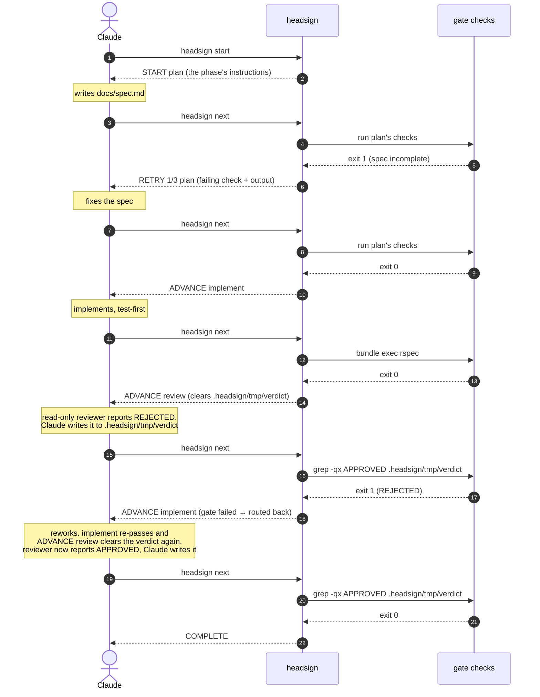

# Workflow reference

[日本語](workflow-reference.ja.md)

How to write a `.headsign/workflow.yaml`, and what the CLI does with it.

The [README](../README.md) is the page you read before adopting headsign;
this one is the page you read while writing a workflow. The discipline an
agent follows *during* a run ships with the plugin, in
[plugin/skills/workflow/SKILL.md](../plugin/skills/workflow/SKILL.md). The
internals are in [architecture.md](architecture.md), with the reasoning
behind each decision in [the ADRs](adr/README.md).

This page is the one written for a person, and it holds both halves — how to
write a workflow and how to run one — while the excerpt an agent reads at the
moment it writes one ships with the plugin instead, in the
[`design-workflow` skill](../plugin/skills/design-workflow/SKILL.md) and its
[schema reference](../plugin/skills/design-workflow/references/schema.md),
because this page ships nowhere
([ADR-0020](adr/0020-writing-the-workflow-as-its-own-skill.md)).

## Enabling the plugin for a whole repository

The two commands in the [README](../README.md#install) install the plugin for
one person. A repository can instead declare it for everyone who opens it, in a
`.claude/settings.json` committed with the code:

```json
{
  "extraKnownMarketplaces": {
    "headsign": {
      "source": { "source": "github", "repo": "meganemura/headsign" }
    }
  },
  "enabledPlugins": { "headsign@headsign": true }
}
```

`extraKnownMarketplaces` is where a repository names a plugin source its members
need — the schema's own description is "Additional marketplaces to make
available for this repository. Typically used in repository
.claude/settings.json to ensure team members have required plugin sources". The
key `headsign` is the marketplace's name, from
[`.claude-plugin/marketplace.json`](../.claude-plugin/marketplace.json), and its
`source` says where that marketplace lives. `enabledPlugins` is keyed
`plugin@marketplace`, so `headsign@headsign` is the plugin named `headsign` —
from [`plugin/.claude-plugin/plugin.json`](../plugin/.claude-plugin/plugin.json)
— inside the marketplace named `headsign`. Both names being the same word is
this project shipping one plugin, not a rule of the format.

Those two keys are Claude Code's rather than headsign's, so what follows
describes what the file *declares*. What a person's Claude Code does on meeting
that declaration is Claude Code's own documentation to describe, and that
documentation is also the copy that stays current when the schema moves; this
page ships nowhere, but the README freezes in npm caches and forks, which is why
the moving parts are down here.

**Pinning.** A marketplace `source` also takes a `ref` — a branch or a tag — so
a team that wants every member on one version points it at a release tag instead
of leaving it on the default branch:

```json
{
  "extraKnownMarketplaces": {
    "headsign": {
      "source": {
        "source": "github",
        "repo": "meganemura/headsign",
        "ref": "v0.4.0"
      }
    }
  },
  "enabledPlugins": { "headsign@headsign": true }
}
```

What that buys is one gate behaviour for the whole team. The workflow schema is
pre-1.0 and rejects any key it does not define
([ADR-0015](adr/0015-strict-schema-and-version-0-1.md)), so an unpinned team can
have one member's copy running a workflow that another member's copy refuses to
validate — a difference in the harness, arriving as a difference in the work.
What it costs is that somebody now has to move the pin, and a stale one is
invisible: nothing looks wrong until a workflow reaches for something the pinned
version does not have, and that reaches you as "headsign is broken" rather than
"we are three releases behind". The same entry also carries an `autoUpdate`
flag; a pin and an auto-update answer the same question in opposite directions,
so a repository is better off setting one of them deliberately than inheriting
whichever it gets.

**Opting out.** Settings precedence is user < project < local, so the file that
wins over a project setting is the person's own `.claude/settings.local.json` in
the same repository:

```json
{ "enabledPlugins": { "headsign@headsign": false } }
```

That is the per-person file rather than the committed one, so opting out is a
local act that leaves the repository's declaration alone. A project can declare
the plugin; it cannot make anyone keep it — which is the same boundary as
[headsign not forcing anyone to use it](../README.md#what-headsign-is-not), one
layer down.

**Updates.** Declaring a version and having it are two events, not one. The
publishing side of that is the distribution map in
[maintenance.md](maintenance.md), which records that third-party marketplaces
have auto-update off by default and that users run the update themselves. So
moving the `ref` in the committed file begins the update; it does not conclude
it.

**The version a project pins is not the version a run uses.** An installed
plugin copy is version-scoped — one directory per version, the path is in
[maintenance.md](maintenance.md#live-patching-an-installed-plugin-local-testing)
— so a project that has moved to a new release does not change what an older
installed copy does until that copy updates. The committed file says which
version the team wants; the copy on the machine is what `headsign next` on that
machine actually runs. When a report comes in that a fix is not there, or that a
gate behaves differently for one person, establish the version in play before
reading the workflow file and before reading the gate. `headsign version` — or
`headsign --version`, which prints the same thing — answers that from the copy
that is actually running. The number is baked into the bundle when it is built rather than read from
`package.json`, which a copy cached from the plugin marketplace does not have above
it (why, and what actually keeps the two in step, is
[ADR-0002](adr/0002-single-question-and-output-contract.md)). Two older answers are
still worth having, because they answer a different question, *where* the copy
is and which channel it came from, and that is how you tell two installed copies
apart: an installed plugin copy is identified by the version directory it sits
in, and a CLI installed from npm instead is whatever `npm ls headsign` reports.

**What this repository does not do.** headsign itself has no committed
`.claude/settings.json` enabling the headsign plugin, deliberately. Working on
headsign means running the CLI you are editing — `node plugin/dist/headsign.mjs`,
built from `src/` — against this repository's own workflows in `.headsign/`.
Enabling the released plugin here would put the previous version in the driver's
seat while the next one is being written, and every surprise would then have two
candidate causes: the change just made, or the copy running the gate. That is the
distinction between a project that *uses* headsign and the project that *is*
headsign. The first wants a pinned, released version, the same one for everyone,
and everything above applies to it. For the second, the absence of the file is
the setting.

## Using without the plugin

The plugin is just one way headsign ships, packaged for Claude Code. The
tool itself is the CLI: gate judgment, state, `PENDING`, locking, logging
all live in it, and it works from any agent — or by hand at a terminal. The
plugin adds exactly two things on top: the `workflow` skill and the
stop-boundary hook backstop. Both have plugin-free equivalents below.

**Install the CLI.** The bundle is committed, so there is nothing to build:

```
npm install -D headsign
npx headsign --help
```

**Teach your agent the discipline.** The skill is plain instructions, not
machinery. For Cursor, a custom harness, or a `CLAUDE.md`, this one rule
carries most of it:

> When you have done work on the current phase, run `npx headsign next` and
> obey the first line of the answer. To look without judging, run
> `npx headsign status`. Never end the run on anything but `COMPLETE`; to
> stop deliberately, run `npx headsign abort <reason>`.

The full discipline is in
[plugin/skills/workflow/SKILL.md](../plugin/skills/workflow/SKILL.md). Copy
what you need into your agent's rules, or install it as a standalone skill
with the GitHub CLI (a preview `gh` feature that lets you pick which agent
to install into):

```
gh skill install meganemura/headsign workflow
```

Claude Code users can also drop it into `.claude/skills/` as a project
skill. A skill obtained any of these ways runs outside the plugin and can't
find its bundled CLI, so install the package as above and it falls back to
`npx headsign`.

**Optional: the backstop without the plugin.** Add this to
`.claude/settings.json`:

```json
{ "hooks": {
  "Stop": [ { "hooks": [
    { "type": "command", "command": "npx", "args": ["headsign", "stop-hook"] }
  ] } ],
  "SubagentStop": [ { "hooks": [
    { "type": "command", "command": "npx", "args": ["headsign", "subagent-stop-hook"] }
  ] } ]
} }
```

`Stop` covers the session itself; `SubagentStop` covers an agent the
session delegated the run to (see [Multiple sessions](#multiple-sessions)).
Register just the first if you never delegate a run: with no `headsign
claim` in play, the second never acts.

## Writing a workflow

A workflow is one YAML file, committed to your repository:

```yaml
# .headsign/workflow.yaml
version: 0.1
name: feature-dev
entry: plan

phases:
  plan:
    description: Write the spec to docs/spec.md, including acceptance criteria.
    gate:
      checks:
        - name: spec exists
          run: "test -s docs/spec.md"
        - name: acceptance criteria present
          run: "grep -q '## Acceptance' docs/spec.md"
    on_pass: implement
    max_attempts: 3

  implement:
    description: Implement per the spec, test-first.
    gate:
      checks:
        - name: unit tests
          run: "bundle exec rspec"
          timeout: 300
    on_pass: review
    max_attempts: 5

  review:
    description: >
      Have a read-only reviewer subagent report APPROVED or REJECTED, then
      write that verdict yourself to .headsign/tmp/verdict.
    clear: [.headsign/tmp/verdict]
    ready: "test -f .headsign/tmp/verdict"
    gate:
      checks:
        - name: review approved
          run: "grep -qx APPROVED .headsign/tmp/verdict"
    on_pass: $end
    on_fail: implement     # rejection loops back
    max_attempts: 3        # three rejections → escalate to the human

limits:
  max_total_iterations: 20
```

The `run:` commands above are examples. Replace `bundle exec rspec` with whatever your project actually uses (`npm test`, `pytest`, `go test ./...`, …); a check is just a shell command judged by its exit code.

> **Trust:** a workflow's `run:` commands are shell that `headsign next` executes on your machine, exactly like a `Makefile` target or an npm `postinstall` script. Treat a `.headsign/workflow.yaml` from a repository you didn't write as you would any other executable code in it: read it before running `headsign start` or `headsign next`, and don't run headsign in a repository you don't trust. The same goes for `.headsign/state.json` and `.headsign/lock`: a cloned repository can contain a committed state file or lock, so a `.headsign/` you didn't create is untrusted input, just like the workflow. The same holds on a team: a change to `.headsign/` arrives on a teammate's PR and runs automatically in your loop, so weigh it as heavily as a change to CI configuration.

Then ask Claude to start the workflow. It runs `headsign start`, works the
phase, and keeps asking `headsign next` until the answer is `COMPLETE` — or
`ESCALATE`, which means the decision comes back to you.

Ready-made workflows for several roles — TDD features, bug fixing, docs,
releases — live in [example.headsign/](../example.headsign/). They are
worth reading against a workflow you have drafted yourself, to see how a
finished one handles the same phase.

### Run state, and where headsign looks for it

Run state lives in `.headsign/state.json` (auto-gitignored). Because all
state is external, the loop survives context compaction: recovery is just
`headsign next`.

`headsign start`, `next`, and `abort` resolve `.headsign/` in the current
directory only — they never search parent directories — so run them from the
repo or git-worktree root; each worktree then keeps its own independent run.
The exceptions are the stop-boundary hooks, which walk up to find the run's
`.headsign/` (bounded by the worktree root) so the backstop still fires when
the turn ended in a subdirectory. That walk only goes up, and it stops at the
first enclosing `.git` — or at the filesystem root if there is none. From a
directory *above* the run — a monorepo root, say — the hook won't find it.
Nor will it from *another checkout entirely* — a sibling clone, a docs
repository — where the walk stops at that repository's root.

When that first walk finds nothing, the hook tries once more, the same
bounded way, from Claude Code's `CLAUDE_PROJECT_DIR` — the project root the
session was given, independent of where its cwd has since wandered. Find a
run there that this session last moved — or that nobody has moved yet — and
the hook writes one line and lets the turn end, unheld but not silent:
`.headsign/log` gets an `unheld` line marked `by=CLAUDE_PROJECT_DIR`, and
`headsign status`'s `last stop:` line names the same reason — worded
differently from what Claude Code's own already-continuing flag produces.
This closes the ordinary shape of the problem: a session that `cd`'d, or was
started, outside the run's own git boundary while still inside the project
Claude Code told it about.

A run that somebody *else* last moved is passed over here in the same
silence the first walk would have given it, and for the same reason: that
line is a record of a turn end, and a run has no use for one from a session
that never drove it. It is the second of the two `unheld` lines
[ADR-0027](adr/0027-recording-who-drove-a-run.md) stops handing to
bystanders, and losing it leaves this shape looking exactly like the fully
silent one below — `last moved:` in `headsign status` is what tells them
apart.

It does not close all of them. `CLAUDE_PROJECT_DIR` names a root, and this
second walk, like the first, only goes up from it — so a run that is not on
the path upward from that root stays unreached, and the hook writes nothing
at all: no log line, no `last stop:`. That covers a run *below* the root (a
package in a monorepo) and one *beside* it (a linked worktree added outside
the checkout, `git worktree add ../wt-feature`) alike: neither is upward.
The same silence covers a session whose own project genuinely has no run to
find, wherever it is standing. And one shape was never silent to begin with,
and this change leaves it exactly as it was: if the checkout a session
drifted into runs its *own* headsign workflow, the first walk finds that run
and nudges about it — correctly formatted, and about the wrong run.
`headsign status` cannot tell the two apart for you; only knowing where the
session actually was standing can.

How a session comes to be standing there at all is narrower than it first
looks, and worth knowing because it tells you whether this can happen to you.
The `cwd` in the hook's payload does follow a `cd` made during a turn —
measured, 2026-08-01 — but Claude Code refuses a `cd` outside the session's
**allowed working directories**, naming them in the refusal. So a session
confined to one directory cannot drift out of it. Reaching another checkout
takes a session that has more than one: a second directory added at startup
or later, which is the ordinary arrangement when one session works across a
project and, say, a notes repository beside it. Whether that turn's own
evidence tells the story on its own now depends on `CLAUDE_PROJECT_DIR`:
when it reached the run, `last stop:` says so; when it did not, there is
still nothing to tell it apart from a backstop that was never installed —
though `headsign status` in the run's own directory still shows the stop
before it, and a single nudge anywhere in the run proves the hook is wired.
Keep the session at the workflow's directory or below, and if a turn ended
unheld and nothing explains it, ask where the session was standing when it
ended, and check `last stop:` for which of the two the hook is naming.
Why this is documented rather than signalled, and why the fallback narrows
this branch rather than closing it, is in
[ADR-0006](adr/0006-stop-hook-backstop.md)'s bounded-walk-up section and
[ADR-0026](adr/0026-a-second-place-to-look.md).

### What a run folds away, and what outlives it

A run is bounded, and knowing where those bounds fall is what lets a workflow
author decide which side of one to put something on.

**Folded away when `start` runs.** `.headsign/tmp/` is run-scoped scratch:
`start` deletes it whole and recreates it empty, so nothing a previous run left
there can be read as this run's. A phase's `clear:` folds its own listed files
away again on every entry. Nothing else resets either one. That makes `tmp/`
the place for anything that must be new each run — an identifier minted by the
entry phase is new in every run without the workflow having to arrange it.

**Kept, and growing.** Everything a workflow writes outside `tmp/` outlives the
run that wrote it; that is what makes it an artifact rather than scratch.
`.headsign/log` is kept too, and only ever appended to — `start` does not clear
it, so a new run's first line lands after the old run's last one.

**Per run, not per tree.** `limits.max_total_iterations` counts this run's
laps: `start` sets the count to zero. Starting a second run over the same tree
therefore gives that second run a fresh allowance, and a phase's
`max_attempts` starts over with it. **Running a workflow several times over one
tree is not refused, and the budgets do not span the runs** — so a ceiling
bounds one walk, never the total work done in a directory. If what you want
bounded is the whole job, the run that must not be restarted is the unit to
bound, and a loop inside one run — a route that goes back a phase — is what
keeps one budget, one log, and one set of round numbers across the laps.

**What `abort` costs.** It ends the run: the phase it was standing on, the
attempt counts, and the position in the graph all go, and no later command
resumes it. It costs nothing else. `state.json` is gitignored, so ending a run
leaves the repository's tracked files exactly as they were; the reason typed
into `headsign abort <reason>` is appended to `.headsign/log` and outlives the
run; artifacts already written are untouched, and committed ones are safe by
definition. A later `headsign start` rewrites `state.json` whole and begins at
the entry phase — it inherits nothing from the aborted run except that log.
So the question to ask before aborting is only ever *how much walking will it
cost to get back here*, and the answer is in how expensive the workflow's
early gates are to re-pass ([the contract](#the-contract) has the reasoning
about keeping them cheap).

### One worktree, one run

**One worktree, one run** is the whole of headsign's worktree support, and it
holds by construction: a linked worktree's `state.json`, lock, and log all
live in that worktree's own `.headsign/`, and headsign writes nothing under
the shared `.git` directory — so two worktrees of the same repository can each
drive a loop, at their own phase, without either one disturbing the other.
Anything past that is out of scope: worktrees never share run state, and
headsign neither coordinates the runs in them nor aggregates them into one
view. A run belongs to the directory it was started in.

### Fanning out, and joining back

That property is enough to build a fan-out on top of headsign without
headsign gaining a single feature.
[example.headsign/fan-out.yaml](../example.headsign/fan-out.yaml) writes the
shape out: a `split` phase whose `description` tells the agent to cut the
work into independent items, `git worktree add` a worktree per item, and run
`headsign start` inside each one; a `gather` phase that waits for those
child runs; and an `integrate` phase that merges the results and removes the
worktrees.

Read closely what headsign does there, because it is less than it looks. It
does not start the child runs, does not create their worktrees, and does not
wait for them — it never learns they exist. The fan-out happens because a
phase's `description` asked the agent for it, which is the same kind of
instruction as "use the `/foo` skill" or "have a reviewer subagent check it"
([Instructions vs. the gate](#instructions-vs-the-gate)): the description is
the plan, and only the gate is enforced. The parent run is still doing
exactly one phase at a time — the parallelism lives one layer below it,
where headsign cannot see it, and the parent's attempts and iteration
ceiling count the parent's own gate evaluations only. Making the worktrees
and taking them away again is the agent's job from beginning to end; not
*managing* worktrees isn't the same as not working in one.

What headsign adds is the join, and only the join: one shell command that
answers "are they all in?". `gather` asks that as two separate questions,
which is the part worth copying. Its `ready:` asks whether every child has
reached a terminal state — while any of them is still `RUNNING`, `next`
answers `PENDING` and spends no attempt, so waiting costs nothing and is not
a failure. Its gate then asks whether every child is `COMPLETE`, and
`on_fail: escalate` hands the run to a person when one of them isn't,
because a child that escalated or was aborted is already somebody's
decision. Both read the children with `headsign status`, whose first line is
the documented `RUNNING` / `COMPLETE` / `ESCALATED` / `ABORTED` contract,
rather than reading a child's `state.json`.

So the joining strategies orchestrators hand you as modes — all of them, any
of them, a quorum of N — are not settings headsign is missing. They are that
same loop with the test moved, and `fan-out.yaml` writes all three out in
its comments. It is also why
[ADR-0003](adr/0003-workflow-yaml-vocabulary.md)'s refusal of `needs:` and
DAG parallelism doesn't need revisiting: what the DAG would have expressed
is expressible one layer up, and keeping it up there is what stops headsign
from growing into the orchestrator it declines to be.

## Instructions vs. the gate

A phase's `description` is where you write what the agent should do in that
phase — including "use the `/foo` skill" or "have a read-only reviewer
subagent check it"; headsign hands it to Claude verbatim. A workflow
*choreographs* skills and subagent work into a gated sequence — it doesn't
*orchestrate* them, and it never forces which skill the agent uses. Only the
gate is enforced: the checks' exit codes are the sole thing that verifies the
result. To require a skill's use, gate its output (e.g. `grep` the file that
skill produces). A review/soft-gate phase should list its verdict file (e.g.
`.headsign/tmp/verdict`) under that phase's `clear:` so a verdict left over
from a previous pass can't be mistaken for the current one — headsign
deletes it on entry, and Claude writes a fresh one after the read-only
reviewer subagent reports its verdict. **`clear:` removes files, not
directories.** An entry that turns out to be a directory is left where it
is and named on entry by a `not cleared:` line that says so, so a phase
that expected a tree to be emptied finds that out the first time it is
entered rather than several runs later. `headsign validate` says the same
thing earlier, as a warning, for an entry written with a trailing slash —
the one form of the mistake `validate` can spot without reading a
filesystem. A workflow that does want a directory gone can remove it as
part of the phase's work, where the intent can be written down, rather than
in a field that would delete it silently every time the phase is entered.
And when the judgment itself must live outside the working agent's hands,
make the check the judge — e.g.
`claude -p '… Reply exactly APPROVED or REJECTED.' | grep -qx APPROVED`
keeps the transition deterministic while the pen changes hands; trade-offs
in [ADR-0007](adr/0007-verdict-authorship.md).

A phase is only as meaningful as what its gate can check in shell. A test
gate proves nothing broke, not that the feature is done — judging "done" is
what a review gate is for, which is why the example workflow above carries
both. Work a shell command can't judge — a design call, a UX
decision — needs either slicing into units a check can verify, or a
review-style soft gate to carry it. Size your phases to what the gate can
actually check, not to how the work naturally breaks down. And a review phase
is the agent's own review discipline, not a substitute for a human reviewing
the resulting PR.

## How a run flows

Three roles turn the loop: the agent (Claude) does the work and drives;
**headsign** runs the current phase's gate and answers with a token; the
**checks** are ordinary shell, so the verdict is deterministic. Each turn,
Claude obeys the token — `RETRY` means fix the reported failure and ask
again, `ADVANCE` means move to the printed phase, a fail-route (`gate failed
→ routed to …`) sends the work back, and `COMPLETE` ends the run. One pass
through the example workflow above:



Every arrow from headsign is driven by a shell exit code, never the LLM's
own say-so. The stop-boundary hooks (not shown) are the backstop: if the
run's driver tries to stop while the run is `running`, it's pointed back to
`headsign next`.

## The contract

Six commands; a driving session routinely uses one:

| Command | Role |
|---|---|
| `headsign start [name] [--workflow path]` | initialize state, print the entry phase's instructions |
| `headsign next` | **the only question a driving session asks.** Run the current gate, transition, answer |
| `headsign abort [reason]` | record a human-directed stop |
| `headsign validate [name] [--workflow path]` | static check of the workflow file |
| `headsign status` | read-only view of the current run, for a session that isn't driving it — see [Multiple sessions](#multiple-sessions) |
| `headsign claim` | hand driver ownership to a delegated agent via the `SubagentStop` hook — for delegating who drives a run; see [Multiple sessions](#multiple-sessions) |

Two more commands sit outside that contract, because they answer about the tool
rather than about a run: `headsign version` prints the version of the copy that
is running and nothing else (`--version` prints the same), and `headsign help`
prints the usage text (`-h`, `--help`, and a bare `headsign` print the same).
Both always exit 0 — neither is ever a verdict, so neither can be mistaken for
one.

Multiple workflows can live as separate files under `.headsign/` (one
workflow per file); pick one with `headsign start <name>` (→
`.headsign/<name>.yaml`), or pass `--workflow <path>` for an explicit path.
Ready-made examples for several roles — TDD features, bug fixing, docs,
releases — live in [example.headsign/](../example.headsign/). This
repository runs headsign on itself from its own `.headsign/`, kept separate
from the examples because those workflows read this project's paths and
tooling.

A bare `headsign validate` (no name, no `--workflow`) checks whichever
workflow the current run is actually using: if `.headsign/state.json`
exists — whatever its status — it validates that run's own
`workflow_path`, not just a fixed default file, so validating a run
started with `headsign start <name>` checks the right `.headsign/<name>.yaml`
without having to repeat the name. With no run present, it falls back to
`.headsign/workflow.yaml`, as before. An explicit `<name>` or
`--workflow <path>` always wins over both.

`validate` separates errors from **warnings**: an error is a workflow
headsign refuses to run (exit 3), while a warning is printed to stderr and
still exits 0. A phase that no route reaches from `entry` is a warning, so a
half-written phase or an edge you commented out for a minute doesn't stop
the run you were in the middle of. `start` prints the warnings too, once,
while the person who wrote the file is still there; `next` doesn't, because
it is asked every turn.

The other warning is about stopping rather than reaching. If a set of phases
can cycle on **pass** edges alone and no `limits.max_total_iterations` is
declared, nothing bounds the run: `max_attempts` counts a phase's failures
since it last passed, so a loop that turns on passes clears it every lap. A
sweep like [example.headsign/sweep.yaml](../example.headsign/sweep.yaml) is
exactly that shape, which is why it declares a ceiling. Cycles that close
through a *failure* edge are not warned about — the failing phase's
`max_attempts` really does bound those
([ADR-0022](adr/0022-validate-checks-that-a-run-can-end.md)).

A key the schema doesn't define is an error, at every level of the file. A
phase declaring `max_atempts: 3` stops with `phase 'implement': unknown key
'max_atempts' (allowed: description, clear, ready, gate, on_pass, on_fail,
max_attempts)` rather than running a phase that has no attempt budget at
all — the typo would otherwise have been skipped in silence. The message
lists the keys that level accepts and offers no did-you-mean guess. The same
thinking governs `version:`, which must be exactly `0.1`: while the schema
is pre-1.0 it keeps changing, so a file written for an older one is stopped
until its fields have been read against the current schema, rather than
loaded with whatever still happens to fit
([ADR-0015](adr/0015-strict-schema-and-version-0-1.md)).

`next` answers with a machine-readable first line, then instructions:

| First line | Exit | Meaning |
|---|---|---|
| `ADVANCE <phase>` | 0 | gate passed (or fail-routed) — new phase instructions follow |
| `RETRY n[/max] <phase>` | 1 | gate failed — failing check + output tail follow |
| `PENDING <phase>` | 1 | the gate can't be judged yet (`ready:`) — attempt not counted; do the work, then `next` again |
| `COMPLETE` | 0 | terminus |
| `ESCALATE <reason>` | 2 | human judgment needed |
| `ABORT <reason>` | 2 | run was aborted |

Exit 3 is a configuration/usage error — which includes a check or a `ready:`
probe that **could not be run at all** (the command never started, or headsign
had to kill it before it finished). That is not a gate failure: headsign got no
exit code, so it has no verdict, and the lap moves nothing — no attempt, no
iteration, no state written. Fix the command and ask again
([ADR-0021](adr/0021-a-command-that-never-ran-is-not-an-answer.md)). A check
that runs and *times out* is a different thing and still an ordinary failure:
it ran, and the limit it ran past is one you wrote. `next` is idempotent on
finished runs. On a running one it is a judgment rather than a peek: it runs the
phase's gate, and a failure spends an attempt (a phase whose `ready:` probe
hasn't passed yet answers `PENDING` before the gate runs, as above, and
spends nothing). Hence the driving session's two-command rule — **did work
→ `next`; want to look → `status`** — with `status` free to call as often
as you like (see [Multiple sessions](#multiple-sessions)).

### Routing (workflow.yaml)

| Field | Values | Default |
|---|---|---|
| `on_pass` | phase name, `$end`, or a list of `when:`/`to:` routes — see [The router pattern](#the-router-pattern) | — (required) |
| `on_fail` | `retry`, phase name, `$end`, `escalate` | `retry` |
| `max_attempts` | positive int; counts failures of this phase since it last passed. Running out always answers `ESCALATE` | unlimited |
| `limits.max_total_iterations` | positive int; global runaway backstop. Reaching it answers `ESCALATE` but does **not** end the run — see below | none |

Checks are CI-familiar `- name:` / `run:` / `timeout:` steps run with
`/bin/sh -c` (first failure stops the gate). Every command headsign runs
inherits headsign's own environment; a check that needs a variable sets it
in its own `run:` string (`run: "FOO=bar npm test"`), the same way you would
at a prompt. Deliberately absent: `needs:`, `${{ }}`, matrices, triggers,
and a per-phase `env:`. A route's `when:` is not `if:` in disguise either —
it is a shell command judged by its exit code, not an expression to
evaluate — so every routing decision is still an exit code choosing among
destinations you wrote down. That inherited environment has a trap on
macOS: `/bin/sh` there is bash 3.2, and in that shell a `run:` string
where a variable is immediately followed by a non-ASCII character
(`"$now→"`, not `"$now foo"`) doesn't just expand the variable to nothing
— it also eats the leading byte of the character right after it, so a
corrupted string reaches the rest of the command. This isn't a
Japanese-text or full-width-punctuation problem: any non-ASCII character
right after an unbraced variable can trigger it, including accented
letters, arrows, and emoji, and only that one character is at risk —
non-ASCII text elsewhere in the string, including right before the
variable, expands fine. It's shell- and locale-specific too: `zsh` and
`dash` expand the same input correctly, and `LC_ALL=C` sidesteps it, so
whichever `LANG` you're running headsign under is what matters, since
checks inherit it along with the rest of your environment. Bracing the
variable (`${now}`) avoids it in every case tested (measured, 2026-08-01);
headsign doesn't force a locale to paper over it, since that would change
how every check's shell commands handle multi-byte output, not just the one
that hits this.

Neither a gate nor a budget can end a run as `ABORT`: a failure route can
say `escalate` (stop and ask a person) but never "stop", and exhausting
`max_attempts` always escalates. `ABORT` comes from `headsign abort
<reason>`, which is a person's decision and records their reason — so an
aborted run is always one somebody ended on purpose.

**Two of the four ways a run reaches `ESCALATE` end it; the ceiling and a
changed graph do not.** Exhausting a phase's `max_attempts` and taking an
`on_fail: escalate` route both mean something is wrong — the agent can't
satisfy a gate — and both end the run for good. The other two leave the run
`running` and wait for an answer: a graph that changed under the run
([The graph a run is walking under](#the-graph-a-run-is-walking-under)), and
the ceiling below. Reaching `limits.max_total_iterations` means
something else: the run turned out to be bigger than the number someone
typed, which can be true of a run doing nothing wrong. So it answers
`ESCALATE` (exit 2, a person is being asked) while leaving the run
`running`, and its message says how to answer:

```
$ headsign next
ESCALATE build: max_total_iterations (15) reached — the run is still open: raise limits.max_total_iterations in .headsign/workflow.yaml and run `headsign next` to continue from this phase, or run `headsign abort <reason>` to end it
Human judgment needed. Report the situation to the user and ask for instructions.
```

Raise the number in the workflow file and `headsign next` picks the run up
at the same phase, with its attempts and its `.headsign/tmp/` intact; decide
it isn't worth more laps and `headsign abort <reason>` ends it. The check
runs before the gate, so a run standing at that wall spends no iteration and
no attempt however many times it is asked — the runaway protection is
unchanged, and `headsign status` still reports `RUNNING`
([ADR-0017](adr/0017-three-budgets-and-the-recoverable-ceiling.md)).
Because the run really is unfinished, the stop-boundary hook still nudges
its driver back to `headsign next`: an agent that reports the ceiling to you
and steps away should write its pause note first (see
[The backstop](#the-backstop)).

Those three budgets have one thing in common: headsign can count each of them
itself, inside one `next`, without asking anyone. Tokens and money it cannot —
it never runs the model, so it never sees what a turn cost. That is a layer
boundary rather than a gap, and where those numbers do exist they belong to
your harness; a check can go and read them if you wire it up, at the price of
coupling your workflow to one vendor's interface. Wall-clock time is the one
headsign *could* count — `.headsign/log` timestamps every transition — and
deliberately doesn't: a slow run is not a wrong run, and a lap is what the loop
spends.

Two of `on_fail`'s values look interchangeable and are not. `retry` keeps
the run where it is; naming the phase itself sends the run out of the phase
and back into it, which runs everything entering a phase runs:

| | `on_fail: retry` | `on_fail: <this phase>` |
|---|---|---|
| Meaning | stay | leave, then re-enter |
| `clear:` | not run | runs |
| Answer token | `RETRY` | `ADVANCE` |

So a self-route deletes the artifacts that phase lists under `clear:`,
while `retry` leaves them where the work left them. That is exactly what
you want when re-entering fresh is the point — throwing away a stale review
verdict, say — and exactly what you don't want when the agent should just
keep working on the same failure. Reach for `retry` in the second case.

### The router pattern

Some phases exist to decide where the work should go — read the request,
then send it to the phase that fits. Write that with a list-form `on_pass`:
each entry has a `when:` (a shell command) and a `to:`, and the last entry,
which carries no `when:`, is the default. A complete one ships as
[example.headsign/router.yaml](../example.headsign/router.yaml); the shape
is:

```yaml
  classify:
    description: >
      Read the request and write exactly one of fix-bug, write-docs, or
      implement to .headsign/tmp/route.
    clear: [.headsign/tmp/route]
    ready: "test -s .headsign/tmp/route"
    gate:
      checks:
        - name: the route names a kind this workflow knows
          run: "grep -qx -e fix-bug -e write-docs -e implement .headsign/tmp/route"
    on_pass:
      - when: "grep -qx fix-bug .headsign/tmp/route"
        to: fix-bug
      - when: "grep -qx write-docs .headsign/tmp/route"
        to: write-docs
      - to: implement          # no when: — the default, and always last
```

The rules, in full:

- Routes are resolved **after** the gate passes, and never on the failure
  path. A router phase whose own gate fails is an ordinary failing phase.
- The `when:` commands run in order, and the **first one to exit 0** wins.
  If none matches, the last entry's `to:` is used.
- `when:` takes an optional `timeout:` (seconds, default 120) and runs in
  headsign's own environment — the same treatment a check gets.
- `to:` names a phase or `$end`.
- `validate` rejects a list whose last entry has a `when:` (nothing would
  be the default) and one whose earlier entry lacks one (everything after
  it would be unreachable).
- If a `when:` **can't be run at all** — it fails to spawn, or times out —
  headsign stops with exit 3 and transitions nowhere, rather than falling
  through to the default. A non-zero exit is an answer ("not this one"); a
  command that never ran is not, and the thing being decided here is where
  the run goes next.

An `ADVANCE` reached this way gains one line naming the route that was taken
(`--- routed: when "grep -qx fix-bug .headsign/tmp/route" → fix-bug ---`, or
`--- routed: default → implement ---`), and that transition's `.headsign/log`
entry records the same, so a run's history says why it went this way rather
than that one. A route to `$end` ends the run with the usual `COMPLETE`, and
a plain string `on_pass` prints and logs exactly what it always did.

**The judgment is the agent's; the transition is headsign's.** The agent
decides by writing a file; headsign decides by running the commands you
wrote and reading their exit codes. It never takes a phase name out of the
agent's output or out of that file: what the agent writes can only pick
among the destinations the workflow file already declares, and cannot name
one that isn't there. Something unexpected in the file lands on the default,
or fails the phase's gate first if you check the file's shape there, as the
example above does.

**Keep `when:` a cheap predicate, and keep it free of side effects.** Routes
run on the success path — the fast path through your workflow — and several
of them can run before one matches. Expensive or consequential work belongs
in the gate, which runs once and reports what failed; the routes should do
no more than read the cheap artifact the gate already checked.

### Async review (when review takes a while)

A review phase's gate often depends on something slower than the loop
itself — a reviewer subagent still reading the diff, a human glancing at a
PR. Calling `next` before that verdict exists would, without `ready:`,
burn a counted attempt on a gate that had nothing to judge yet — and since
that phase's verdict file is also listed under `clear:` (recommended
above), a verdict that lands a moment later could be discarded by that
same early call's next re-entry, silently losing a real review. Give the
phase a `ready:` probe (e.g. `test -f .headsign/tmp/verdict`) and an early
`next` answers `PENDING` instead: no attempt spent, `clear:` not run,
verdict left intact for the `next` that actually finds it.

### The backstop

Skills are instructions, not guarantees. Two stop-boundary hooks read
`.headsign/state.json`; while a run is `running`, the hook that fires for
the run's **driver** blocks that turn from ending and points it back to
`headsign next`. A turn that isn't the driver's passes straight through
instead — except while a `claim` marker is armed, where the first delegated
agent to stop that can name itself is seated as the new driver (see
[Multiple sessions](#multiple-sessions)). Escalated, aborted, and completed
runs pass through too; those are correct endings.

Which turns those are depends on whether anyone has claimed the run, and
the two hooks answer an unclaimed one in opposite directions, on purpose.
`Stop` nudges, but which session it nudges turns on what `last_drive` has
on record rather than on who stopped in the run's own directory: a session
on record is held, any other passes, and a run with nothing on record
nudges whoever stops — missing the real driver is worse than one stray
reminder (see [Multiple sessions](#multiple-sessions) for both halves).
`SubagentStop` passes, because most delegated agents stopping nearby are
reviewers and workers with no role in the run at all, and holding one of
those hostage is worse than a missed reminder.

Once a run's driver *has* been seated by `headsign claim`, what's recorded
is an agent identifier, so `Stop` passes every session through
unconditionally — no session can be that agent — and `SubagentStop` holds
that one agent and no other. Before a run is claimed, `Stop` makes one
session-identifier comparison: when `last_drive` names a session, it checks
the payload's against it and passes on a mismatch. See
[Multiple sessions](#multiple-sessions).

Two hooks, because a turn can end in two ways: `Stop` fires when a
session's turn ends, `SubagentStop` when a delegated agent's does. A
delegated agent never fires `Stop` at all, so without the second hook it
would have no backstop — and, worse, the run would keep pushing the
session that merely spawned it (see
[Multiple sessions](#multiple-sessions)).

**To pause deliberately**, write one line explaining why to
`.headsign/tmp/stop-note` and stop again: the hook passes immediately, no
nudges needed, and leaves a `paused` line in `.headsign/log` so the pause
has a record. The note is consumed (deleted) the moment it's read, and the
working tree returns to exactly what it was before — net zero, so the pause
itself costs the run nothing and leaves the phase's artifacts where the
work left them. What lands in the log is the note's first line, cut to 120
characters, with a trailing `…` whenever that cut version isn't the whole
note, so a truncated line is never mistaken for a complete one. One note
covers one turn end, so a wait that runs over several exchanges needs the
note written again before each of them. Tomorrow, `headsign next` picks
the run up at the same phase and judges its gate, the way any `next`
does. `headsign abort
<reason>` is the other exit, and it is permanent, not a pause: the run
can't be resumed, and a fresh `headsign start` begins again from the entry
phase, replaying every phase's gate from scratch. `state.json` is rewritten
whole; `.headsign/log` is not, so the reason you type and everything logged
before it are kept ([reading the log](#reading-the-log) has the mechanism).
Ending a run deliberately costs the run, not its history. Keeping that replay cheap
is a design requirement on the workflow, not something headsign does for
you: write early phases' gates as fast, idempotent checks (does a file
exist, does lint pass) rather than ones with real side effects or long
unrepeatable work, and a fresh start after an abort costs almost nothing.
The same property pays off every turn, since each `next` runs the gate
again. A workflow whose early gates are slow or non-idempotent makes its
own re-runs expensive — that's the workflow author's cost to manage, by
writing cheap gates, not a cost headsign can absorb on its behalf.

Stopping *without* a note is pushed back — the hook fails open (never
traps a session) after 5 consecutive nudges with nothing in between that
shows someone is still steering: a real evaluation, a consumed note, or a
sealed claim all reset the count. Every nudge leaves a `held` line in
`.headsign/log` carrying the count it just spent (`nudges=3`), and the 5th
writes a `stalled` line in place of that `held` — one line per turn end
either way, so `stalled`'s own `nudges=5` is that fifth hold as well as the
moment the cap tripped. Every stop after that passes silently and writes
nothing at all. That cap is a safety net for a stuck or silently departed
agent, not the normal way to pause — the note above is. To spot an
unattended stall from the outside:
`headsign status` (read-only, safe to run from any session — see
[Multiple sessions](#multiple-sessions)) reports `RUNNING`, and
`.headsign/log`'s tail shows `stalled`, or `status`'s own `last stop:` line reads
`not held — the nudge cap is spent` — together they mean the driving agent has
walked away without a note. Read it off those two rather than out of
`.headsign/state.json`: the counter behind the cap is reset by every real
`headsign next`, so on a run being driven it tells you almost nothing.
Re-drive the run with `headsign next` from the session that's actually
driving it.

A turn end also passes when Claude Code has **already resumed** the turn it
belongs to. When the hook holds a turn, Claude Code flags the continuation —
`stop_hook_active` on the hook's input at that turn's own ending — and
headsign stands down there: the ending is never blocked, and nothing
one-shot is spent, so a pause note and an armed `claim` marker both survive
it untouched. That is why a nudge arrives roughly once per exchange rather
than once per turn end; the window is one turn wide and closes when the turn
ends. It is not the nudge cap above — a different mechanism with the same
visible outcome — and the two are now told apart by what they leave behind:
the spent cap has its `stalled` line, while an overruled turn end leaves an
`unheld` line in `.headsign/log` (naming the field it was told,
`by=stop_hook_active`) and a `last stop:` line in `headsign status`. Both
writes are best-effort and skipped while the run's lock is held, so a
*missing* `unheld` line does not prove the hook did not run. The hold that
was overruled leaves its own line too, which is how an `unheld` is read —
by the line before it ([reading the log](#reading-the-log)).

### The graph a run is walking under

`next` re-reads the workflow file every lap, so editing it mid-run works —
that is how you raise a ceiling and carry on, and how a run can improve the
phases it has already walked past. What headsign adds is that the change
doesn't happen in silence.

At `start`, a run records a fingerprint of the **rules** it is walking under:
every phase reachable from where it stands, plus `limits`. Rules, not
instructions — a phase's `description` is deliberately left out, so rewriting
what the agent is told to do is invisible to this, while `gate`, `ready`,
`clear`, `on_pass`, `on_fail` and `max_attempts` are not. (`clear:` counts as a
rule because dropping it is how a stale `APPROVED` verdict passes a review
gate.) Comments and formatting are invisible too: the fingerprint is of the
parsed file, not its bytes.

**The pin ends at the file.** A check's `run:` string is part of the rules and
is pinned; whatever that string goes on to execute is not. A gate written as
`run: "sh checks/coverage.sh"` pins those five words, and editing
`checks/coverage.sh` to reverse its verdict changes what the gate decides
while the fingerprint stays as it was — the next lap judges by the new rule and
reports nothing. This is not a gap that can be closed by trying harder: `run:`
is an arbitrary shell string, and there is no way to know from it what a
command will read. So it is stated instead, because the consequence is a
decision a driver has to make: **editing a script a gate calls, mid-run, is
changing the rules under the run** — with none of the reporting that editing
the workflow file gets. If you want that change on the record, abort and start
again; the artifacts already written are not what a restart costs (see [what a
run folds away](#what-a-run-folds-away-and-what-outlives-it)).

When a lap finds those rules changed, it says so once — an `ESCALATE` that
leaves the run `running`, spends no attempt and no iteration, and names the
phases that moved. You then have two ways forward:

- **put the file back**, and the next `next` matches the fingerprint again, says
  nothing, and costs nothing. Restoring is free;
- **run `headsign next` again**, which accepts the change and carries on. An
  accepted change is counted, and `COMPLETE` says how many a run accepted —
  because `.headsign/log` is gitignored and never reaches a pull request, while
  the final answer is read by whoever is being reported to.

Two things are deliberately quiet. A change to a phase this run can no longer
reach is not reported at all — the run doesn't depend on it. And a change to
`limits` alone is accepted without a report, so raising the ceiling after
hitting it stays one stop rather than two; it is still counted, so a run that
was given more room says so at the end.

This is a guardrail, not a lock. Anything that can edit the workflow can edit
`.headsign/state.json` too, and headsign says nothing about that. What it does
is separate a loosened gate from the edits the documentation recommends, which
until now were the same act
([ADR-0023](adr/0023-pinning-the-graph-a-run-is-walking-under.md)).

## Multiple sessions

A repository often has more than one Claude Code session open on it at
once — a lead session plus teammates, or a subagent working alongside the
session that spawned it. Only one of them should ever be answering
`headsign next` for a given run; headsign calls that one the **driver**.
Everyone else is an **observer**. The distinction matters because the
stop-boundary hooks (above) push a driver that tries to stop mid-run back
to `headsign next`: a session that obeys a nudge meant for someone else can
burn a retry or advance a phase it had no business touching, and every
blocked stop, whoever made it, spends one from the same nudge cap. See
[ADR-0008](adr/0008-multi-session-ownership.md) for the field feedback
that drove the design, and
[ADR-0013](adr/0013-claim-only-driver-identity.md) for what it has
since been narrowed to.

There is one way a run learns who drives it, and one kind of driver it can
learn about: a **delegated agent** that ran `headsign claim` and then ended
its turn (below). That is still the only path to a driver: `start` and
`next` now stamp something on every call, but what they stamp is
`last_drive`, the session that most recently ran one of them, not a driver —
reusing that word would say something the field isn't
([ADR-0027](adr/0027-recording-who-drove-a-run.md)). Until a run is
claimed, headsign still does not know who is driving it, but it can now
tell a session that has moved the run apart from one that never has. A run
with no session on record in `last_drive` — every run this release
predates, any run driven from outside Claude Code (nothing there names a
session, so `start` and `next` have none to record), and any state a person
edited by hand — falls back to what headsign has always
done: any session that stops in its directory gets nudged. Once some
session has run `start` or `next` against a run, only that session's turn
ends are held; every other session's stop passes without a word, and no
delegated agent is held either way. Once a run is claimed, that agent's
turn ends are the only ones held, and every session's stop passes —
`last_drive` is never even read for a claimed run.

Those two behaviors cover the two shapes a run takes. A session driving its
own run needs no claiming: `start` stamps it as the mover the moment the
run begins, so from its first turn on it is the one `last_drive` names, and
it is nudged for exactly as long as nobody else has claimed the run — the
same backstop it always wanted. A run handed to a delegated agent does need
claiming, because that agent shares its spawning session's process and
can't otherwise be told apart from it — that is what `headsign
claim` is for (below).

What this now does, that it deliberately did not do before, is tell a
session that has moved a run apart from a second session merely standing
in the same directory. A run still belongs to the directory it lives in —
one worktree, one run — but a second session watching that directory, once
the first has run `start` or `next`, is no longer nudged for it: its stop
passes silently, spending nothing from the cap and writing no line
anywhere, the same way a non-driving session's does on a claimed run. That
includes a session no person opened: a program that starts Claude Code as
a subprocess, for any reason, gets a session standing wherever the caller
was — the run's directory, unless it was given another — and once that run
has been moved by someone else, the subprocess's stop passes the same way.
This is the failure [ADR-0027](adr/0027-recording-who-drove-a-run.md)
exists to fix: before it, that subprocess had no way to know a nudge
wasn't meant for it, so it tried to answer, and what came back to whatever
called it was prose about headsign instead of the output it was started to
produce — spending, on the way, one from the cap the run's actual driver
needed.

A gap remains, and it falls on the opposite party. A session that picks up
a run someone else began — a **handover** — is not nudged either, from the
moment it first stops until its own first `next` stamps it in turn. It is
not a bystander; it is the run's next driver, and it still loses the
backstop for that stretch, because a mismatched stop and one from a
session that has simply never touched the run look identical to `Stop` —
nudging either would nudge every bystander too, and buy the stamp nothing.
What that costs is discovery as much as backstop: a session opening on a
repository that already has a run used to find out by being nudged, a side
effect of nudging everyone nearby rather than the backstop's actual job.
Its replacement is `headsign status`, read-only and safe to run from
anywhere.
`HEADSIGN_OBSERVER` (below) is how a session that knows it is only
observing opts out explicitly, rather than counting on the fix above to
spare it. It is still the only manual control headsign offers here, but it
has moved from the only way such a session could be spared a nudge to a
deliberate, more certain opt-out: most bystanders no longer need it to be
left alone. Every session that isn't driving — teammates, a subagent that
wasn't delegated the run, or any session that never ran `headsign start` —
should reach for `headsign status` instead of `next`, more than ever now: a
run someone else has already moved no longer announces itself to whoever
stops nearby, so `status` is the only way left to find one.

### `headsign status`

Read-only: no gate runs, no state is written, no lock is taken. Safe to run
from any session, at any time, as often as you like.

```
$ headsign status
RUNNING implement (attempt 2/5)
workflow: feature-dev
--- last failure: unit tests (bundle exec rspec, exit 1 in 12.3s) ---
Failures:
  1) Billing::Invoice#total ...
driver: not delegated yet — no agent has claimed this run
```

```
$ headsign status
COMPLETE
workflow: feature-dev
```

```
$ headsign status
ESCALATED
workflow: feature-dev
reason: review rejected 3 times
```

```
$ headsign status
RUNNING decide (attempt 0/5)
workflow: design-grilling
driver: not delegated yet — no agent has claimed this run
last stop: not held — Claude Code had already resumed the turn (stop_hook_active) — at 2026-07-30T23:06:51+09:00
last moved: 2026-08-01T19:45:29+09:00 — turn ends from any other session pass without a nudge
observer: HEADSIGN_OBSERVER is set here — turn ends from this environment are never held
```

The first line is one of `RUNNING` / `COMPLETE` / `ESCALATED` / `ABORTED` —
capitalized like `next`'s tokens, but it's a *report*, not a verdict:
`status` never prints `ADVANCE`, `RETRY`, or `PENDING`, because it never
judges anything. The `driver:` line (shown only while `RUNNING`) has two
readings: `not delegated yet — no agent has claimed this run`, and `a
delegated agent` once a `headsign claim` handoff (below) has been sealed.

It says nothing about whether *you* are that agent, and cannot: the
identifier on file comes from a hook, and no command can resolve the
caller's own agent identity to compare against it — the same gap that makes
`claim` necessary in the first place. What the line is for is confirming
that a handoff landed. `claim` takes two beats and can fail quietly, so one
`headsign status` after the confirmation is how anyone — the delegating
session, the user, a passing observer — checks that the run really did
change hands.

Three further lines can appear while a run is `RUNNING`, all three in the
last example above, and all three about how turns *end*, or the run
*moves*, rather than where it stands. `last stop:` appears once headsign
has processed one stop it could attribute to this run, and says what it did
with that turn end, in one of five readings:

- `held, and pointed back to headsign next` — the ordinary nudge, and the same
  stop is a `held` line in `.headsign/log`.
- `paused by a note` — a `.headsign/tmp/stop-note` was consumed.
- `not held — the nudge cap is spent` — the backstop had already given up on
  this run (see [the backstop](#the-backstop)).
- `not held — Claude Code had already resumed the turn (stop_hook_active)` —
  headsign was overruled at that turn end, and the same stop is the `unheld`
  line in `.headsign/log`.
- `not held — the session was not standing in the run's tree
  (CLAUDE_PROJECT_DIR)` — the session's own directory led the hook
  to no run at all; the walk from `CLAUDE_PROJECT_DIR` found one instead, and the
  hook wrote and returned without holding (see
  [Run state, and where headsign looks for it](#run-state-and-where-headsign-looks-for-it)).
  The same stop is also an `unheld` line in `.headsign/log`, marked
  `by=CLAUDE_PROJECT_DIR` rather than `by=stop_hook_active` — the two share
  a disposition and differ only in which upstream fact caused it.
  This line is written only for the party the ordinary path would have
  nudged: a run `last_drive` credits to a different session withholds it
  here too, the same test the ordinary path applies
  ([ADR-0027](adr/0027-recording-who-drove-a-run.md) §9) — that stop falls
  to the fifth row of the table below instead, with nothing in
  `.headsign/log` to show for it.

Each is followed by ` — at <timestamp>`, printed exactly as it was recorded,
offset and all. The wording says what headsign did with the field it was
handed, and claims nothing about what Claude Code's own documentation says
about that field. Read the timestamp along with the disposition: a turn end
headsign cannot attribute — a bystander agent's, or one from an environment
that opted out — leaves the line describing the earlier stop rather than
blanking it, so a stale disposition is possible and its timestamp is how you
catch one.

`last moved:` appears once a run has a session on record in `last_drive` —
absent for a run this release predates, one driven from outside Claude Code,
or one whose state a person edited by hand — and names when this run was
last **moved**, by whichever session most recently ran `start` or `next`
against it:

```
last moved: 2026-08-01T19:45:29+09:00 — turn ends from any other session pass without a nudge
```

`last stop:` and `last moved:` answer different questions, and each can go
stale on its own: the first is when a turn end was last *attributed* to this
run, the second is when the run was last *moved*. Read together, they tell
apart two situations that call for different reactions — a fresh `last
stop:` next to a stale `last moved:` means someone is here but the run isn't
advancing, while both stale means nobody is. Neither reading says whether
*you* are the session named: the identifier itself is never printed, and, for
the same reason `driver:` above cannot, `status` has only the environment to
ask with and cannot answer "is it me" honestly.

The line can also go away again. `start` and `next` record the session that
ran them whenever they can name one, so a single run of either from an
environment that names none — a person driving the run from a terminal —
records none and clears whatever was stamped before, and the run goes back
to nudging whoever stops in its directory. That is the safe direction on
purpose: headsign does not keep a stamp it can no longer vouch for, and an
unstamped run nudges everyone rather than no one.

`observer:` appears when `HEADSIGN_OBSERVER` is set in the environment
`status` itself runs in — normally the session's, but not necessarily, since
what is read is that one process's environment. It is the only quiet-ending
cause a caller can answer about *itself*, since there is no identifier to
resolve.

Conditional means byte-for-byte conditional: a run on which no stop has been
processed and no `last_drive` recorded, read in an environment without the
switch, prints exactly what `status` printed before any of these three
lines existed. None of the three is a judgement —
`status` still runs no gate, writes nothing, and takes no lock. And because
the record holds only the most recent stop, while `headsign next` resets the
nudge counter, `headsign status` is the right **first** command on resuming
when you want to know how your last turn end was handled: before `next`, and
before any other work.

**If you are a delegated agent, end your turn and watch what happens: being
pushed back to `headsign next` means this run is yours to drive.**
`SubagentStop` holds an agent when it matches the recorded driver, and
otherwise only to seal a claim — so read *which* message you got, starting
with its opening words. Both name the workflow and phase, both tell you to
run `headsign next`, and both end with the same pause and abort advice, so
the opening is the one part that always tells them apart. A message opening
`headsign workflow '…' is still running` is the ordinary nudge, and it
confirms you already drive the run. One opening `Claim confirmed:` means
something else entirely: an armed marker just seated *you*, possibly one
another agent armed for itself. If you get that message without having run
`headsign claim`, you have taken a seat someone else was asking for — say
so, and let them claim again.

The implication runs one way only. Ending quietly does *not* prove the
reverse: seven things end a turn quietly, and what you look at to tell them
apart differs for each one. Two of the seven were added after the other
five: one exists only because a second walk (above) found a run the first
one missed, and the other only because a stop is now compared against the
session that last moved the run — and that one, alone in the table, leaves
nothing to look at in the log.

| a turn ended quietly because | how you tell |
| --- | --- |
| Claude Code had already resumed the turn | an `unheld` line in `.headsign/log`, detail `by=stop_hook_active`; the `last stop:` line in `headsign status` |
| the session's own directory led nowhere, but `CLAUDE_PROJECT_DIR` found the run | an `unheld` line in `.headsign/log`, detail `by=CLAUDE_PROJECT_DIR`; the `last stop:` line in `headsign status`, worded differently from the row above |
| a pause note was consumed | a `paused` line in the log |
| the nudge cap is spent | a `stalled` line in the log — and no such line means the cap is innocent |
| this run was last moved by a different session | nothing in the log — the only tell is the `last moved:` line in `headsign status`: if you haven't moved this run since that time, this is why |
| nobody has claimed the run, or the stopper is not the driver | `driver:` in `status`, which narrows rather than settles |
| `HEADSIGN_OBSERVER` is set | the `observer:` line in `status` |

An eighth way is not in the table because there is nothing to look at: the
session's own directory led nowhere *and* `CLAUDE_PROJECT_DIR` either was
not set or led nowhere either. That is the one case the backstop still
cannot see — see
[Run state, and where headsign looks for it](#run-state-and-where-headsign-looks-for-it),
above.

Four caveats go with that table, and each one is load-bearing.

**The fifth row alone leaves nothing in the log.** Every other row has
something to read there, or in `status`; a stop from a session other than
the one that last moved the run gets nothing written anywhere, on purpose —
recording a bystander's turn end on a run it never drove is exactly what
this row exists to stop doing ([ADR-0027](adr/0027-recording-who-drove-a-run.md)).
`last moved:` in `status` is the only trace, and it names a time, never a
session.

**`driver:` narrows the sixth row rather than settling it.** It reports
whether *some* delegated agent holds the run, never whether the reader is
that agent (above). Reading the log instead does not rescue it: the log
spans runs, so a `claimed` line may belong to a run that ended days ago.

**A missing `unheld` line proves nothing.** The hook's writes are
best-effort and skipped while the run's lock is held, so the absence of a
line does not prove the hook did not run.

**An `unheld` line marked `by=stop_hook_active` says that *some* stop hook
held the turn** and that headsign then stood down — not that headsign was
the hook that held it. A repository may install more than one. **One marked
`by=CLAUDE_PROJECT_DIR` says something different: no stop hook held this
turn at all** — the session's own directory led the hook to no run, and it
found the run from `CLAUDE_PROJECT_DIR` instead. Reading the mark, not only
the disposition, is what tells the two apart.

And a probe is not free. An ordinary nudge back spends one off that cap; a
probe that passes while your own pause note is armed consumes the note
instead; and a probe that lands while *someone else's* claim marker is armed
consumes the marker — that is the `Claim confirmed` case above, and the other
agent has to claim again. Spend the probe deliberately rather than
habitually.

For a *session*, the same test now proves more than it used to, though
still not everything. `Stop` excludes a stop when a delegated agent holds
the run, or when the run has a `last_drive` stamp naming a different
session — so a run `last_drive` names holds only the session it names, and
every other session's stop passes silently, while a run with no stamp on
record still nudges whichever session stops there, driver or not, exactly
as before. Being held there now usually means the run currently credits you
with having moved it — narrower than owning it, and still not certain,
since an unstamped run nudges anyone.

Exit code follows a deliberately different contract from `next`'s: `status`
exits 0 whenever `.headsign/state.json` could be read at all — an
`ESCALATED` or `ABORTED` run is normal, informative output, not a status
error — and exits 3 only when there's nothing to report (no run here, or
state unreadable). A script that wraps `status` in `set -e` therefore never
dies just because the run it's watching happens to need a human; read the
run's own state from line 1, not from the exit code.

### Delegating who drives: `headsign claim`

A **delegated agent** — a teammate under Claude Code's agent-teams
feature, or a subagent — is the one driver headsign can record, and the
only one it can tell apart from anybody else. Such an agent shares its
spawning session's process outright (same pid, same environment) and
carries no identifier of its own anywhere its Bash tool can reach, so no
command it runs can say who it is. The one moment it *can* be named is its
own turn end, which Claude Code reports to a hook with an identifier for
that agent specifically.

Skipping the claim fails quietly rather than loudly. An agent that just
starts calling `headsign next` records nothing, so the run stays unclaimed:
every nudge it produces goes to whichever *session* stops in the
directory — typically the one sitting idle, waiting on the delegation —
while nothing holds the turns of the agent actually doing the work. The backstop
stays armed and points at the wrong party, and nothing in either one's
output says so — not even the log: an `unheld` line is written only for a stop
headsign can attribute to the run, so an unclaimed run records nothing for that
agent's turn ends either. So when you hand a run to a delegated agent, that
agent's first headsign command is `headsign claim`, never `headsign next`.

`headsign claim` fixes that by letting a hook do the recording, because
Claude Code tells the hook what the agent's own environment cannot. Two
beats:

1. From the agent you want driving the run, run `headsign claim`. It arms
   a one-shot marker and tells you to end your turn — it records nothing
   itself.
2. End that turn. **That agent's own turn end is where the seal
   happens** (Claude Code fires a `SubagentStop` hook for it, carrying an
   identifier for that agent specifically): headsign writes it into
   `driver_agent` in `.headsign/state.json`, records a `claimed` line in
   `.headsign/log`, and confirms it in the hook's message. Wait for that
   confirmation before running `headsign next` — it is how you know the
   right agent got seated.

A typical delegation: "please drive this run" → the delegated agent runs
`headsign claim` and ends its turn → the confirmation arrives → it
proceeds with `headsign next`. Nothing can quietly displace that agent
afterwards: no command records a driver, a session's own stop never adopts
a claim, and only another `headsign claim` arms the marker again. So the
session that handed the work off cannot take the seat back by stopping
first, or by running `next` itself.

Being the driver also brings the backstop with it: once seated, that
agent's own turn endings are pushed back to `headsign next` while the run
is `running`, and pausing with a stop-note or ending with `headsign
abort` works from there exactly as it does for a session. An agent that is
neither the recorded driver nor the first to name itself under an armed claim
marker is never held — a reviewer subagent, or an agent working on
something else entirely, stops normally.

**A seat outlives the agent sitting in it, and that is the one part of a
handover nobody is told about.** State on disk is what lets a run survive its
driver disappearing — an API outage, a context running out, a person stopping
the work. The phase, the attempt count and the workflow file are all still
there, so a successor establishes where the run stands with one `headsign
status` and carries on; and because every gate reads the working tree rather
than a session's memory, the interruption costs no attempt and changes no
judgment. That much is the design working.

What also persists is `driver_agent`, holding the name of an agent that may no
longer exist. headsign cannot tell: an agent id is meaningful only inside the
process that was given it, so liveness is not a question this tool can ask. The
consequence falls on the successor. While a driver is recorded, `Stop` passes
every session's turn end through, and `SubagentStop` holds only the agent whose
id matches, or the first to name itself under an armed marker — so **until the
seat changes hands, nothing holds the turns of whoever is actually driving.** The
run continues; the backstop does not.

So a delegated agent taking over a run should run `headsign claim` and end its
turn, exactly as the first one did. A *session* taking over cannot, and should not try:
sealing happens on `SubagentStop` alone (ADR-0010), which is not an event a
session's turn end produces. `headsign claim` from a session is not a harmless
no-op either — it checks only that a run exists, so it leaves a live armed marker
that the next delegated agent to end a turn anywhere under that directory will
consume, quite possibly a reviewer with no role in the run at all. That session
can drive perfectly well — `next` asks nobody's permission — but it drives
without a backstop, and the only ways back to one are to delegate the driving to
an agent that claims it, or to end the run and start again.

This is a handshake, not a lock: if some *other* delegated agent ends a
turn while the marker is armed and can name itself, it gets adopted
instead. Run `headsign claim` again from the right one: a new claim
re-arms the marker, and that agent is now a real contender for it, because
its own turn end is guaranteed to fire the event that seals. It is still a
contender and not a winner — another delegated agent naming itself first
can take this marker too — so re-claim until the confirmation names the
agent you meant. The full mechanism, the measurements behind it, and the
race that remains are in
[ADR-0010](adr/0010-subagent-stop-identity.md).

### Environment variables

| Variable | Set by | Meaning |
|---|---|---|
| `HEADSIGN_OBSERVER` | you, explicitly | Set to any non-empty value (`=1` is the convention) to make a session's stops — and those of any agent it delegates to — pass the stop-boundary hooks unconditionally, regardless of who holds the run. The manual opt-out for a session you know is only observing, and the only control headsign offers over who gets nudged. It is equally the answer for a subprocess your own program starts Claude Code as: pass it in that subprocess's environment rather than moving its working directory outside the run, which can cost the subprocess access to files it still needs there. |
| `CLAUDE_PROJECT_DIR` | Claude Code | Read only by the stop-boundary hooks, and only on the branch that today writes nothing: a second, bounded walk from this project root, tried once the walk from the session's own directory finds no run. A run found there gets one `unheld` line, detail `by=CLAUDE_PROJECT_DIR`, when the stopping session is the one that last moved it or nobody has ([ADR-0027](adr/0027-recording-who-drove-a-run.md) §9), and the turn is never held on this path — see [Run state, and where headsign looks for it](#run-state-and-where-headsign-looks-for-it) and [ADR-0026](adr/0026-a-second-place-to-look.md). Not read anywhere else in headsign. |

Headsign reads no session or agent identifier from the environment: neither
variable above names one, and nothing there could — see
[ADR-0013](adr/0013-claim-only-driver-identity.md), which retired the
two variables that used to appear here.

**The rule:** a session that hasn't run `headsign start` and hasn't been
asked to drive the run should reach for `headsign status`, never `headsign
next` or `headsign abort`.

## Nodes, edges, and state

A workflow file describes a **control graph**: it says where the work goes
next, and nothing else. It is not a knowledge graph — it holds no facts
about your domain — and not an execution trace, since it is written before
the run and the run's own history goes to `.headsign/log`. If you already
think in graph terms, the vocabulary maps over like this:

| Graph term | In headsign |
|---|---|
| node | a phase |
| edge | `on_pass`, `on_fail` |
| conditional k-way branch | a list of `when:`/`to:` routes on `on_pass` |
| the condition an edge is taken under | the gate — shell exit codes |
| state kept outside the model | `.headsign/state.json` |
| bounded cycle | `max_attempts`, `limits.max_total_iterations` |
| handing the decision back to a person | `ESCALATE` |
| the path a run actually took | `.headsign/log` — every run in this directory, oldest first ([reading it](#reading-the-log)) |
| the version of the graph a run is running under | `graph_fingerprint` in `.headsign/state.json` — pinned, and a change reported once rather than forbidden (see [above](#the-graph-a-run-is-walking-under)) |

### Reading the log

`.headsign/log` holds every run started in this directory, oldest first, and
`start` never clears it — an aborted run's stated reason is the only record
there is of why someone stopped, and it outlives the run that follows it
([ADR-0024](adr/0024-the-log-survives-a-restart.md)). The file is gitignored
and disposable; delete it when you want a clean slate.

Nothing separates one run from the next, because a run already opens with its
own `start` line. That line is a marker a script can trust: the event word is
always the second field, and free text like an `abort` reason always comes
after `a=` and `i=`. So this pulls out the current run, and follows it:

```sh
N=$(grep -n '^[^ ]* start ' .headsign/log | tail -1 | cut -d: -f1)
tail -n +"$N" -f .headsign/log
```

Anchoring on the second field is the part that matters. A plain
`grep ' start '` also matches `abort … reason="let's start over"`, and would
slice the log at somebody's sentence.

Five of the event words are not about the run moving at all, but about a turn
end: `held`, `paused`, `stalled`, `claimed`, and `unheld`.

```
2026-07-31T17:10:04+09:00 held implement a=0 i=48 nudges=3
2026-07-30T23:06:51+09:00 unheld decide a=0 i=21 by=stop_hook_active
```

The first is a turn end headsign pushed back to `headsign next`, carrying the
number of consecutive holds spent so far — `nudges=` is the key `stalled`
uses, because it is the same quantity. The second is a turn end Claude Code
had already resumed, so headsign stood down and the turn ended (see [the
backstop](#the-backstop)). Its detail is bare rather than quoted because
`stop_hook_active` is an identifier — and it is the name of a field on the
hook's payload from Claude Code, not anything headsign sets. It is in the line
so that the log, headsign's source, and the payload a person can print for
themselves all use the one word. A *missing* `unheld` line proves nothing on
its own: the hook's writes are best-effort and skipped while the run's lock is
held.

**The stop-boundary lines are complete now, so the line before an `unheld`
says what happened.** A `held` before it means headsign nudged and was then
overruled: the hold and the pass are the two turn ends of one exchange, which
is why a nudge arrives about once per exchange. A transition line before it —
an `advance`, a `retry` — means the work was judged (a failing one also
carries `dur=<seconds>`, how long the failing check actually ran). A `retry`
or a routed-fail `advance` whose check timed out carries `dur=` too, even
though the human-readable line for that same failure — RETRY's own
`--- gate failed: … ---` line for a `retry`, the ADVANCE block's
`--- gate failed: … → routed to … ---` line for a routed-fail — already
states the duration a different way, as `timed out after Ns`, and does not
repeat it there.
A `paused` before it means somebody stopped on purpose. A `stalled` before it
means the cap was already spent, and that is the one silence left: the stops
after the cap trips pass without a line of their own, because `stalled` has
already recorded that the backstop gave up on this run.

The count on a `held` line is also the denominator `stalled` never had. Count
the `held` lines since the last line that moved the run and you have how much
of the cap this stretch has spent; the `stalled` that eventually takes the
fifth hold's place says the same number back as `nudges=5`. Unlike `unheld`,
that count does not go missing while the run's lock is held: the counter and
the line are one write, and a nudge headsign cannot record is one it does not
make either — it lets the turn end instead.

One of the shipped examples,
[example.headsign/sweep.yaml](../example.headsign/sweep.yaml), applies a
mechanical change to a queue of files one item per lap; drawn as its graph,
it looks like this. This is a different picture from the sequence diagram in
[How a run flows](#how-a-run-flows): that one is a single trip around the
loop, this one is the shape of the whole workflow, fixed before the run
starts.


Every edge in it is decided by a shell exit code. Only edges that move the
run are drawn: a phase whose gate fails simply stays where it is, which is
true of nearly all of them. `verify` is the exception — its failure routes
back to `apply` instead of staying, and that is the rework edge — and `record` is the branch: its `when:` check
turns the cycle for as long as the queue still has entries, and its default
route leaves for `report` once it doesn't. So the stopping condition here is
the data rather than a counter, and `limits.max_total_iterations` sits above
the whole thing as the backstop that escalates to a person if the queue
never drains. A long queue is not a stuck one, which is why that escalation
leaves the run open rather than ending it: raise the number and the sweep
carries on from where it stopped.

Being a graph is not itself an achievement, so here is a plain scorecard of
what it adds over a loop that just re-prompts until the model says it's
done:

- **Independent verification: yes, as far as your checks are independent.**
  The transition is decided by commands in the workflow file, not by the
  working agent's own report, and a review phase can put the verdict in a
  read-only reviewer's hands instead. How far that goes — hard, semi, and
  soft gates — is [ADR-0007](adr/0007-verdict-authorship.md).
- **A human approval gate: yes.** `ESCALATE` hands the decision back to a
  person, and a phase whose gate reads a decision file only a person writes
  holds the run until they write it (the release workflow in
  [example.headsign/](../example.headsign/) is exactly that).
- **Parallel branches: no, deliberately.** One active phase per run; a k-way
  branch chooses one destination and never fans out. Composing parallelism
  outside a run is covered under "What headsign is not" in the
  [README](../README.md).

If your work is a straight line, you don't need branching, and adding it
buys nothing — a chain of phases is a complete workflow. What the graph is
still doing for you there is holding the stopping condition: `$end`,
`max_attempts`, and `limits.max_total_iterations` are what make a loop end
for a stated reason rather than when someone gets bored of it.

### The graph the name comes from

The shape has a name now. *Graph engineering*, [as first written
down](https://www.drjoshcsimmons.com/writing/we-are-entering-the-graph-engineering-phase),
is "designing agentic systems as explicit graphs instead of implicit loops",
and it draws its line against the older name this way: "Loop engineering was
the craft of what happens inside one context window. Graph engineering is
the craft of what happens between them." What headsign holds is exactly the
between. It has no opinion about what happens inside a phase — how the work
is done, over how many turns, by how many agents — and it learns nothing
about it either. The only thing it reads of that work is what a shell
command exits with.

Of that definition's three terms, one headsign plainly does not satisfy.
State there is "an object with a schema, checkpointed every time you cross
an edge", and here an edge carries nothing at all. What survives a
transition is the run's ledger — `.headsign/state.json`: which phase the run
stands on, how many attempts it has spent — and the working tree itself,
which is the real carrier and is not headsign's to describe. Anything a
phase wants to hand the next one, its agent writes to a file and the next
phase's check reads it; `.headsign/tmp/` is where those files go by
convention. There is no typed payload, and no schema for one.

On the other two, headsign is not short of the definition but inverted
against it, and that is the difference worth naming. There, the edge is the
clever part — "an edge is a typed transition that carries state from one
node to the next" — and the node is meant to be dull: "A good node is
boring. It does one thing, you can test it alone." Here the boring one is
the edge. It carries no state and has no type; its whole content is an exit
code selecting a route that was written in the file before the run started,
so it can be read in a line and tested in a shell. The node is where nothing
is constrained: a phase may delegate to subagents, run work in parallel, ask
a person something, or take twenty turns, and the workflow file neither
knows nor cares. Boringness moved from the node to the edge. That is the
same claim the README makes about a harness that needs to be clever having
the cleverness in the wrong place — judgment belongs inside a phase, and a
transition is the one place it does not belong.

The same definition asks for one more thing: "Treat humans as nodes.
Approval deserves the same design attention as any other capability."
headsign has no approval feature and needs none, because a human node is
already an ordinary phase — one whose gate reads a decision file that only a
person writes, which is what the `approve` phase in
[example.headsign/release.yaml](../example.headsign/release.yaml) is. The
waiting is `ready:` and `PENDING`, which is not a failure and spends no
attempt; the way back out is `ESCALATE`, which hands the decision to a
person. What that buys is a deterministic transition, not a wise one: a
verdict a person types is still an authored verdict, soft on
[ADR-0007](adr/0007-verdict-authorship.md)'s scale, and the guarantee stops
at the routing. [ADR-0003](adr/0003-workflow-yaml-vocabulary.md) deferred a
dedicated `type: approval` to v2 "if real usage demands it". The ordinary
vocabulary above is why it is still deferred.
