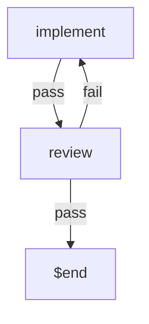
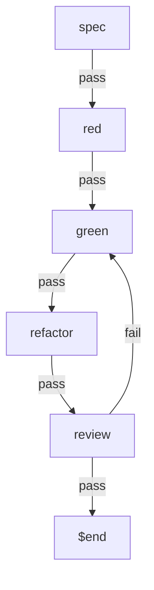
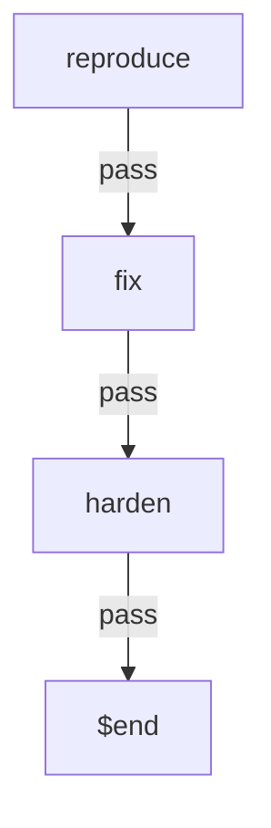
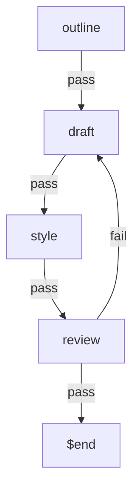
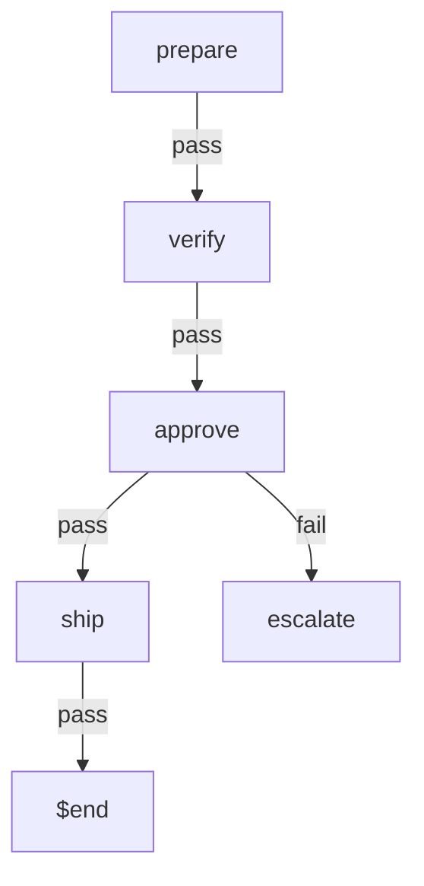
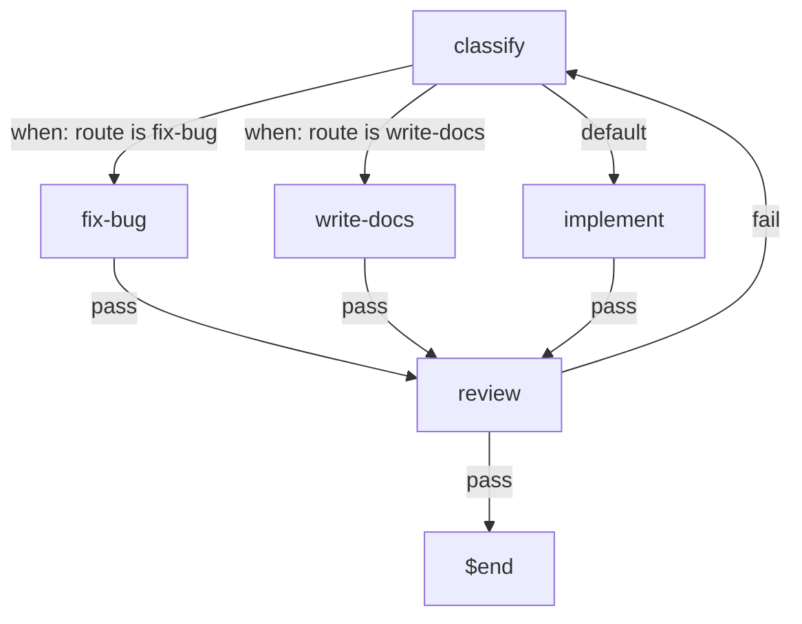
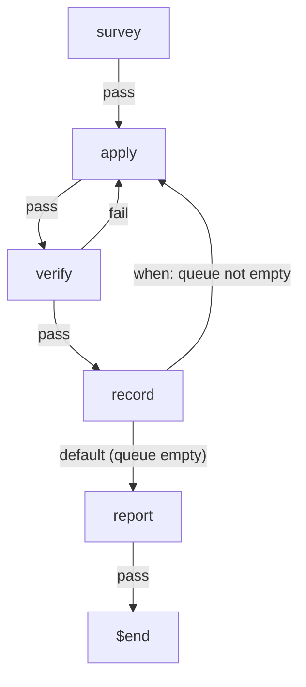
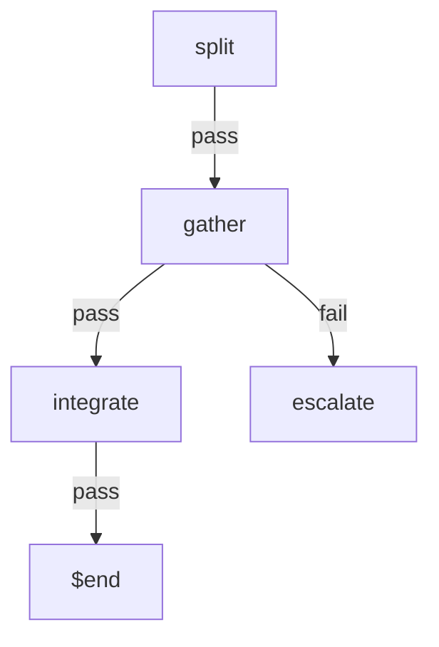

# Example workflows

Ready-made workflow files, all validated against the shipped CLI: a minimal
one under the default file name, and one per common role, each written by
that role's discipline. Copy the ones you want into your repository's
`.headsign/` directory (one workflow per file), adapt the `run:` commands to
your project's tooling (marked with swap-me / SWAP comments), and start one
with:

```
headsign start              # .headsign/workflow.yaml
headsign start tdd-feature  # .headsign/tdd-feature.yaml
```

| File | Role | Shape |
|---|---|---|
| [workflow.yaml](workflow.yaml) | the smallest useful workflow, under the default file name | implement (typecheck + tests) → review soft gate |
| [tdd-feature.yaml](tdd-feature.yaml) | test-first feature developer | spec → red (test must exist AND fail) → green → refactor → review |
| [bugfix.yaml](bugfix.yaml) | on-call bug fixer | reproduce (failing regression test, path recorded) → fix (repro + full suite) → harden (root-cause note) |
| [docs.yaml](docs.yaml) | technical writer | outline (audience named) → draft → style (mechanical lint) → reader review |
| [release.yaml](release.yaml) | release engineer | prepare (versions/changelog/clean tree) → verify (CI mirror) → approve (human GO file) → ship (tag at HEAD) |
| [router.yaml](router.yaml) | request intake that dispatches one of three kinds of work | classify (agent writes one word) → fix-bug / write-docs / implement → review (rejection re-enters classify) |
| [sweep.yaml](sweep.yaml) | one mechanical change applied across many files (codemod, migration) | survey (build the work queue) → apply one item → verify → record (round again while the queue has work) → report |
| [fan-out.yaml](fan-out.yaml) | work cut into independent items, each run in its own worktree, then joined back | split (the agent starts a child run per item) → gather (`ready:` all children finished, gate all COMPLETE) → integrate (merge, then no worktree left behind) |

Things these examples demonstrate beyond the Quick start:

- expressing "this test must FAIL" honestly with `!` (tdd-feature `red`,
  bugfix `reproduce`)
- a human go/no-go gate the agent must not self-satisfy (release `approve`)
- the async-review trio `clear:` + `ready:` + a verdict grep (every review
  phase)
- why some loop-backs are deliberately not wired, with the reasoning kept
  in comments (bugfix `fix`)
- branching a pass three ways with a list-form `on_pass`, where the agent
  writes down its judgment and the `when:` predicates pick an edge that was
  declared in the file (router)
- turning a cycle with data rather than a counter (sweep `record`): the
  branch sends the run back to `apply` while the queue still has items and
  leaves for `report` when it doesn't, so the loop ends because the work
  ran out, not because a limit was hit
- fanning out and joining back without an orchestrator (fan-out): the agent
  starts a child run per worktree because a `description` told it to, and
  headsign — still one phase at a time, still waiting for nothing — adds
  only the join, where `ready:` asks whether the children have finished and
  the gate asks whether they passed, and all_of / any_of / quorum are three
  shell one-liners rather than three settings

These files are the ones headsign ships for you to copy. The workflows this
repository actually runs on itself live separately, in `.headsign/` at the
repo root — they read this project's own paths and tooling, which is exactly
what makes them the wrong thing to hand anyone else.

## The shapes, drawn

One flowchart per file in the table above: the phases are the nodes, and
the routes each phase declares are the edges. Read them for where a run
can go — straight on, back, around, or out.

Two things are deliberately left out, because they are true of nearly
every node and would bury the shape. Staying put: `on_fail: retry` (the
default) keeps the run in the phase it is already in. Giving up:
exhausting `max_attempts` always hands the run to a human. So every edge
drawn below is one that moves the run — including `release.yaml`'s
`on_fail: escalate`, where handing the decision to a person IS the route.

**workflow.yaml** — the smallest loop: review sends work back.



**tdd-feature.yaml** — a straight line whose loop-back lands on green.



**bugfix.yaml** — no loop-backs at all, and its comments say why.



**docs.yaml** — a rejected doc re-enters drafting, not outlining.



**release.yaml** — the human gate: a NO-GO ends in a person's hands.



**router.yaml** — the branch: `when:` picks one of three kinds of work.



**sweep.yaml** — the loop: it turns while the queue still has items.



**fan-out.yaml** — the join: a child that didn't finish is a person's call.
The child runs are not on this chart, because they are not on this run.


